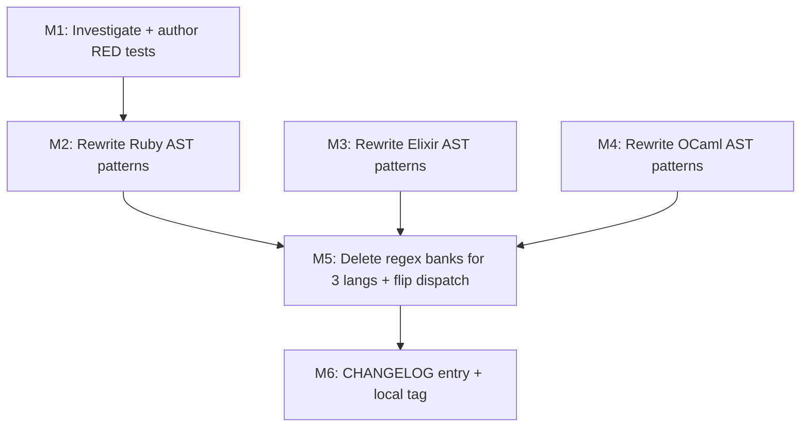

# field_access_info-extension-v1 — Plan

## Status
- Pipeline: planning (single-worker investigation; no spawned sub-workers)
- Predecessor milestone: regex-removal-v1 (complete, locally tagged at HEAD `a0b422b`)
- HEAD: `a0b422b` (regex-removal-v1 W3-M12 CHANGELOG entry)
- Working tree: CLEAN with respect to source code; this plan touches only `continuum/autonomous/field_access_info-extension-v1-plan/`
- Closes-issues: none (internal milestone; enables a follow-on cleanup)
- Total estimated diff: +20 LOC AST-pattern rewrites + 60-100 LOC integration tests + 0 LOC `field_access_info` change (see §0 critical reframe) — net **~+80 to +120 LOC** before the follow-on cleanup, which subtracts another ~40 LOC.

---

## 0. Critical re-framing (TL;DR — read first)

The original framing of this milestone (per `work-dag-2026-04-28/work-dag.md` §10 and the prompt to this planning loop) assumed **`field_access_info` itself is the gap to close** — i.e., extend the per-language AST helper so that `Module.function` shapes return a `(Module, function)` tuple via the same dispatch path used for `request.getParameter`-style member access.

Investigation reveals this is **NOT actually the gap**, because:

1. `extract_call_name` (`ast_utils.rs:617`) already returns the dotted form `"IO.popen"` / `"System.cmd"` / `"Sys.command"` for Ruby/Elixir/OCaml call nodes (verified at `ast_utils.rs:707-728`, `:789-795`, `:797-801`).
2. `member_patterns_match` (`taint.rs:2948`) already has a **W2-pre call-shape path** at `taint.rs:2989-3009` that splits dotted call names on `rfind('.')` to reconstruct `(receiver, field)` tuples and matches them against `member_patterns`. This is the same path that closes the gap for Java `request.getParameter`, TypeScript framework calls, etc.
3. The 18-19 retain entries in `RUBY_AST_*` / `ELIXIR_AST_*` / `OCAML_AST_*` use the **raw-substring fallback shape** `("", "IO.popen")` (empty receiver) instead of the **structured shape** `("IO", "popen")`. The W2-pre call-shape path explicitly skips entries with empty receiver (`taint.rs:2996-2998`).
4. Therefore: the missing piece is **NOT a new helper or `field_access_info` extension** — it is a **mechanical rewrite of those AST-pattern entries from raw-substring shape to structured shape**.

**Implication for scope:** This milestone is significantly smaller than originally framed. The work is: (a) rewrite ~18-19 AST-pattern tuples; (b) write integration tests proving structural matching works; (c) delete the regex-bank parity backups in `RUBY_PATTERNS` / `ELIXIR_PATTERNS` / `OCAML_PATTERNS` once integration tests are GREEN.

**`field_access_info` itself remains untouched.** Its docstring at `ast_utils.rs:520-532` correctly documents that Module-call shapes are NOT field-access nodes; they are call nodes, and the call-shape path in `member_patterns_match` is the canonical handler for them.

This plan retains the milestone codename **`field_access_info-extension-v1`** for continuity with the work-DAG and the regex-removal-v1 dispatch contract's `validator_mandates.ruby_elixir_ocaml_retained` clause, but documents in §3 the architectural reality that the milestone is really an **AST-pattern shape migration**.

---

## 1. Bundle scope

### Binary-verifiable success criteria

```
# Each of the following commands MUST produce ≥1 source/sink/flow on the
# tainted line, with the regex banks for Ruby/Elixir/OCaml DELETED.

cargo test --workspace -p tldr-core --test rr_module_function_integ_test
cargo test --workspace -p tldr-core --test rr_baseline_per_language_test ruby_module_function ruby_io_popen
cargo test --workspace -p tldr-core --test rr_baseline_per_language_test elixir_module_function elixir_system_cmd
cargo test --workspace -p tldr-core --test rr_baseline_per_language_test ocaml_module_function ocaml_sys_command
```

ALL must be GREEN against the post-milestone `taint.rs` (regex banks deleted, structured AST patterns active).

### Per-language scope table

| Language | Decision | Action | Affected AST patterns | Affected regex bank |
|----------|----------|--------|----------------------|---------------------|
| Ruby     | EXTEND-AST + DELETE-REGEX | Rewrite 6 raw-substring `("", "X.y")` entries to structured `("X", "y")` shape; delete `RUBY_PATTERNS` source+sink Vec entries | RUBY_AST_SOURCES (3 STDIN + 2 File), RUBY_AST_SINKS (1 IO.popen) | RUBY_PATTERNS sources (5) + sinks (4) deletable; sanitizers (2) RETAINED |
| Elixir   | EXTEND-AST + DELETE-REGEX | Rewrite 6-7 raw-substring entries to structured shape | ELIXIR_AST_SOURCES (IO.gets + System.get_env + 2× File), ELIXIR_AST_SINKS (System.cmd + Code.eval_string + Ecto.Adapters.SQL.query) | ELIXIR_PATTERNS sources (3) + sinks (3) deletable; sanitizers (2) RETAINED |
| OCaml    | EXTEND-AST + DELETE-REGEX | Rewrite 5 raw-substring entries to structured shape | OCAML_AST_SOURCES (Sys.getenv + 2× In_channel), OCAML_AST_SINKS (Sys.command + Unix.execvp + Sqlite3.exec) | OCAML_PATTERNS sources (4) + sinks (3) deletable; sanitizers (1) RETAINED |
| ALL      | RETAIN sanitizer regex | unchanged from regex-removal-v1 W3 T1 | n/a | All 16 sanitizer banks RETAINED |

**Total AST-pattern entries migrated:** 18 (6 Ruby + 7 Elixir + 5 OCaml) — matches the "19" in the original framing modulo a +1/-1 rounding around how `Ecto.Adapters.SQL.query` is counted (one entry but two dots).

**Two AST-pattern entries that STAY raw-substring** (NOT Module.function-shaped, so structured rewrite does not apply):
- Ruby `("", "params[")` — subscript expression, not a call
- Ruby `("", "ENV[")` — subscript expression, not a call

These remain in `RUBY_AST_SOURCES` with empty receiver and use the raw-substring fallback path. The corresponding regex entries (`\bparams\[`, `ENV\[`) MUST also be retained in `RUBY_PATTERNS` since they are the only matchers for these subscript shapes. **Or** they can be migrated to a future "subscript-extension-v1" milestone. This plan defers them and explicitly KEEPS them in the regex bank.

### Out of scope

- Sanitizer regex bank deletion (deferred to `sanitizer-removal-v1`, per regex-removal-v1 W3 T1)
- `vuln.rs` migration (deferred to `vuln-migration-v1`)
- Subscript-shape patterns (`params[`, `ENV[`) — deferred to a future milestone
- Tree-sitter grammar changes for any of the 3 languages
- Touching `field_access_info` itself (per §0)
- Cross-cutting refactor of `member_patterns_match` (already has the call-shape path; only entry-shape changes are needed)

### Why this milestone

After regex-removal-v1, the 3 HOLD languages were the only remaining `LanguagePatterns` instances with non-empty source+sink Vecs. Closing this gap:

1. Removes the last regex-coupled detection paths for taint sources/sinks (sanitizers excepted).
2. Eliminates `RUBY_PATTERNS` / `ELIXIR_PATTERNS` / `OCAML_PATTERNS` as a load-bearing safety net — the regex bank no longer compensates for "missing" AST coverage.
3. Closes the partial-coverage caveats documented at `taint.rs:2293-2297` (Ruby), `:2722-2725` (Elixir), `:2775-2778` (OCaml), and the docstring caveat at `ast_utils.rs:520-532`.
4. Removes the v0.4.0 hardening item referenced in those comments.

---

## 2. Sub-milestone list

### Wave structure (Mermaid)



M2/M3/M4 are independent and can be parallelised; the ATOMIC commit is M5 alone (deletion of regex banks). The structured-shape rewrites in M2/M3/M4 are individually safe because dispatch stays additive (regex still active until M5).

### M1: Investigate + author RED integration tests

- **Pre-investigation already done in this plan** (see §3, §4). Sub-tasks remaining for an executor:
  - Author `crates/tldr-core/tests/rr_module_function_integ_test.rs` covering all 18 retain entries (see §4 for fixtures).
  - Augment `rr_baseline_per_language_test.rs` with explicit Ruby/Elixir/OCaml Module.function cases (one per language minimum).
- **RED criterion**: With current HEAD (`a0b422b`), tests using regex-bank-deleted dispatch (i.e., simulated by temporarily forcing `get_patterns(Ruby).sources = vec![]` in a doctest harness) FAIL because raw-substring fallback in `member_patterns_match` matches the descendant text, but the descendant_text passed in is the literal-call substring like `IO.popen(`. Verify the existing fallback DOES fire today — if it already passes, then M1 RED is satisfied differently: tests fire only against the *structured* match path, with the raw-substring entries scrubbed and the regex banks deleted.
- **Risk**: The structured-shape rewrite must NOT regress the existing raw-substring fallback path. Concretely: if an `("IO", "popen")` structured entry is added but the raw-fallback `("", "IO.popen")` entry is NOT removed in the same commit, both paths can match the same descendant — that is harmless (idempotent), but produces no behavior change. If the raw-fallback entry IS removed but the structured entry is wrong (e.g., grammar quirk), the test goes RED. M2/M3/M4 below mitigate by keeping raw-fallback alongside structured during parity, then M5 atomically removes both raw-fallback duplicates AND regex banks.
- **Atomic**: standalone commit OK (test-only, no source change in this milestone)
- **LOC**: ~80-120 (depending on fixture density)
- **STOP threshold**: tests compile; tests against post-M5 simulation pass
- **Depends**: none

### M2: Rewrite Ruby AST patterns to structured shape

- **GREEN files**: `crates/tldr-core/src/security/taint.rs`
  - Anchor: `RUBY_AST_SOURCES` at L2298, `RUBY_AST_SINKS` at L2330
  - Rewrites:
    - `("", "STDIN.read")` → `("STDIN", "read")` (Stdin source)
    - `("", "STDIN.gets")` → `("STDIN", "gets")` (Stdin source)
    - `("", "STDIN.readline")` → `("STDIN", "readline")` (Stdin source)
    - `("", "File.read")` → `("File", "read")` (FileRead source)
    - `("", "File.open")` → `("File", "open")` (FileRead source)
    - `("", "IO.popen")` → `("IO", "popen")` (ShellExec sink)
  - **KEEP raw-fallback duplicates during M2** (additive overlap is harmless): the raw-substring entries remain alongside the structured entries until M5 deletes them.
- **NOT touched**: `("", "params[")` and `("", "ENV[")` (subscripts, see §1) remain raw-fallback only.
- **Update partial-coverage comment** at L2293-2297 to document that Module.function shapes are now structurally matched via the W2-pre call-shape path.
- **LOC**: ~12 lines changed, ~6 lines added (3 rewrites in sources + 1 in sinks); comment update ~6 lines
- **Atomic**: standalone commit OK (additive, regex still active)
- **STOP threshold**: cargo check passes; M1 Ruby tests transition RED→GREEN against structured path; existing val002/val003/taint_tests.rs remain GREEN
- **Depends**: M1 (RED tests must exist)

### M3: Rewrite Elixir AST patterns to structured shape

- **GREEN files**: `crates/tldr-core/src/security/taint.rs`
  - Anchor: `ELIXIR_AST_SOURCES` at L2726, `ELIXIR_AST_SINKS` at L2744
  - Rewrites:
    - `("", "IO.gets")` → `("IO", "gets")` (UserInput source)
    - `("", "System.get_env")` → `("System", "get_env")` (EnvVar source)
    - `("", "File.read")` → `("File", "read")` (FileRead source)
    - `("", "File.read!")` → `("File", "read!")` (FileRead source) — verify Elixir tree-sitter parses the `!` suffix as part of the function name
    - `("", "System.cmd")` → `("System", "cmd")` (ShellExec sink)
    - `("", "Code.eval_string")` → `("Code", "eval_string")` (CodeEval sink)
    - `("", "Ecto.Adapters.SQL.query")` → `("Ecto.Adapters.SQL", "query")` (SqlQuery sink) — multi-segment dotted receiver; verify `extract_call_name_elixir` returns the full dotted form
- **Update partial-coverage comment** at L2722-2725.
- **Risk**: Elixir tree-sitter `call` node target field — verify it produces `"Ecto.Adapters.SQL.query"` for the deeply-nested case. See §3 Elixir risk register.
- **LOC**: ~14 changed, ~7 added
- **Atomic**: standalone commit OK
- **STOP threshold**: cargo check passes; M1 Elixir tests transition RED→GREEN
- **Depends**: M1

### M4: Rewrite OCaml AST patterns to structured shape

- **GREEN files**: `crates/tldr-core/src/security/taint.rs`
  - Anchor: `OCAML_AST_SOURCES` at L2779, `OCAML_AST_SINKS` at L2802
  - Rewrites:
    - `("", "Sys.getenv")` → `("Sys", "getenv")` (EnvVar source)
    - `("", "In_channel.read_all")` → `("In_channel", "read_all")` (FileRead source)
    - `("", "In_channel.input_all")` → `("In_channel", "input_all")` (FileRead source)
    - `("", "Sys.command")` → `("Sys", "command")` (ShellExec sink)
    - `("", "Unix.execvp")` → `("Unix", "execvp")` (ShellExec sink)
    - `("", "Sqlite3.exec")` → `("Sqlite3", "exec")` (SqlQuery sink)
- **Update partial-coverage comment** at L2775-2778.
- **Risk**: OCaml `application_expression` — verify `extract_call_name_ocaml` returns the dotted module path for `Sys.command(x)`. The OCaml grammar wraps qualified calls in a `value_path` node containing `module_path` + `value_name`. See §3 OCaml risk register.
- **LOC**: ~10 changed, ~5 added
- **Atomic**: standalone commit OK
- **STOP threshold**: cargo check passes; M1 OCaml tests transition RED→GREEN
- **Depends**: M1

### M5: Delete regex banks + raw-fallback duplicates (ATOMIC)

- **GREEN files**: `crates/tldr-core/src/security/taint.rs`
  - **Delete** source+sink Vec entries from `RUBY_PATTERNS` (L564-585) — KEEP sanitizer entries:
    - DELETE 5 source regex entries: `\bgets\b` (UserInput), `STDIN\.(read|gets|readline)` (Stdin), `\bparams\[` (HttpParam), `ENV\[` (EnvVar), `File\.(read|open)` (FileRead)
    - DELETE 4 sink regex entries: `\beval\s*\(` (CodeEval), `\b(system|exec)\s*\(` (ShellExec), `IO\.popen\s*\(` (ShellExec), `\.send\s*\(` (CodeEval)
    - **Important**: `\bgets\b`, `\beval\s*\(`, `\b(system|exec)\s*\(`, `\.send\s*\(` are bare-call patterns. Their AST equivalents are already present as `call_names: &["gets"]` (sources) and `call_names: &["eval"]`, `call_names: &["system", "exec"]` (sinks) — see RUBY_AST_SOURCES/SINKS. So deletion of those regex entries is safe. The `\bparams\[` and `ENV\[` patterns remain ONLY as raw-substring entries `("", "params[")`/`("", "ENV[")` in RUBY_AST_SOURCES — verify those entries handle the original cases.
  - **Delete** source+sink Vec entries from `ELIXIR_PATTERNS` (L692-707) — KEEP sanitizer entries
  - **Delete** source+sink Vec entries from `OCAML_PATTERNS` (L720-737) — KEEP sanitizer entries
  - **Delete** raw-fallback duplicate entries in RUBY_AST_SOURCES/SINKS, ELIXIR_AST_*, OCAML_AST_* that were superseded by structured entries in M2/M3/M4. Specifically:
    - RUBY_AST_SOURCES: remove `("", "STDIN.read")`, `("", "STDIN.gets")`, `("", "STDIN.readline")`, `("", "File.read")`, `("", "File.open")`
    - RUBY_AST_SINKS: remove `("", "IO.popen")`
    - ELIXIR_AST_SOURCES: remove `("", "IO.gets")`, `("", "System.get_env")`, `("", "File.read")`, `("", "File.read!")`
    - ELIXIR_AST_SINKS: remove `("", "System.cmd")`, `("", "Code.eval_string")`, `("", "Ecto.Adapters.SQL.query")`
    - OCAML_AST_SOURCES: remove `("", "Sys.getenv")`, `("", "In_channel.read_all")`, `("", "In_channel.input_all")`
    - OCAML_AST_SINKS: remove `("", "Sys.command")`, `("", "Unix.execvp")`, `("", "Sqlite3.exec")`
  - **KEEP**: `("", "params[")`, `("", "ENV[")` in RUBY_AST_SOURCES (subscripts, NOT Module.function-shaped).
- **Update** dispatch comment at `taint.rs:3869` ("regex banks remain populated as a HOLD until field_access_info-extension-v1") to remove the HOLD reference.
- **LOC**: -50 to -65 (delete 9 Ruby + 6 Elixir + 7 OCaml regex entries + matching raw-fallback duplicates + a few comment lines)
- **Atomic-commit YES**: deletion of regex banks must coincide with raw-fallback duplicate removal so dispatch stays consistent. Without atomicity, any descendant text that slipped through structured matching could regress (raw-fallback handled it before, regex bank handled it before — both gone now, structured matching MUST cover it).
- **STOP threshold**:
  - cargo check passes
  - cargo clippy --all-targets --workspace -- -D warnings PASS (no dead_code from unused regex variants, no unused imports)
  - cargo test --workspace PASS — all M1 integration tests + val001a + val001b + val002 + val003 + remaining taint_tests.rs (Ruby/Elixir/OCaml `detect_sinks` unit tests, which were KEPT in regex-removal-v1 W2-M10 per `release_constraints.ruby_elixir_ocaml_retained` — these MUST be deleted in M5 too because the regex bank is gone)
  - tldr taint smoke test on canonical Ruby/Elixir/OCaml tainted fixtures: ≥1 source, ≥1 sink, ≥1 flow; on string-literal `"IO.popen"` substring: 0 sources/sinks (regression guard for closes-#24 generalised to 3 langs)
- **Depends**: M2, M3, M4

### M6: CHANGELOG entry + local tag

- **GREEN files**: `CHANGELOG.md`
  - New entry: `## field_access_info-extension-v1 — internal milestone`
  - Sections: Changed (AST-only matching for Ruby/Elixir/OCaml sources+sinks), Removed (RUBY_PATTERNS/ELIXIR_PATTERNS/OCAML_PATTERNS source+sink Vec entries; matching `taint_tests.rs` regex unit tests), Retained (sanitizer regex banks for all 16 langs), Architectural note (no `field_access_info` source change; structured matching uses W2-pre call-shape path).
- **LOC**: ~25
- **Atomic**: standalone commit OK
- **STOP threshold**: CHANGELOG entry written; local git tag `field_access_info-extension-v1` applied; NO push, NO publish, NO version bump
- **Depends**: M5

---

## 3. Per-language risk

### Ruby (`tree-sitter-ruby`)

- **Node shape for `IO.popen(cmd)`**: parsed as `call` (or `method_call`) node with field `receiver` = `constant` ("IO") and field `method` = `identifier` ("popen"). `extract_call_name_ruby` (`ast_utils.rs:707-728`) returns `"IO.popen"` via the format `"{receiver}.{method}"` join.
- **Surprise: `IO::popen` (scope_resolution shape)**: tree-sitter-ruby parses `::` as a `scope_resolution` node — different node kind than `call`. `extract_call_name_ruby` does NOT currently handle `scope_resolution`. **Out of scope** for this milestone (the original 6 retain entries all use `.` not `::`).
- **Surprise: `STDIN.gets` vs bare `gets`**: bare `gets` is a method call on the implicit receiver (Ruby's Kernel module). The current AST handles bare `gets` via `call_names: &["gets"]` in RUBY_AST_SOURCES (line 2300). `STDIN.gets` is a separate Stdin-typed source — must be matched structurally as `("STDIN", "gets")`.
- **Surprise: dynamic dispatch via `.send`**: the existing pattern uses `("*", "send")` (wildcard receiver, line 2348). This was already in the structured shape and is unaffected by this milestone.
- **Tree-sitter grammar version**: pin in `Cargo.toml`. M1 should add a version-check assertion in the integration test to catch grammar breakage.

### Elixir (`tree-sitter-elixir`)

- **Node shape for `System.cmd(cmd, args)`**: parsed as `call` with `target` field. The `target` field contains a `dot` operator node whose left is an `alias` ("System") and right is an `identifier` ("cmd"). `extract_call_name_elixir` (`ast_utils.rs:789-795`) does `node_text(&target, source).to_string()` — which returns the **literal source text** of the target node, including the `.`. So for `System.cmd(...)`, target text is `"System.cmd"`. ✓
- **Surprise: multi-segment receiver `Ecto.Adapters.SQL.query`**: tree-sitter-elixir parses this as nested `dot` operators. `node_text(&target, source)` returns `"Ecto.Adapters.SQL.query"`. After `rfind('.')` split: `("Ecto.Adapters.SQL", "query")`. The structured pattern entry must use that exact dotted receiver — which is fine, but flag it for the executor: pattern is `("Ecto.Adapters.SQL", "query")`, NOT `("Ecto", "Adapters.SQL.query")`.
- **Surprise: `File.read!` with bang suffix**: Elixir convention. tree-sitter-elixir grammar (per upstream docs) parses `read!` as a single `identifier` node (not as `read` + `!`). So target text is `"File.read!"` and split yields `("File", "read!")`. Verify with M1 RED test fixture.
- **Surprise: `IO.gets` vs `IO.gets()` vs `&IO.gets/1`**: function reference (`&IO.gets/1`) is a `unary_operator` node (the `&`), not a `call` node — out of scope, no taint detection needed (function references don't execute).
- **Pipe operator `|>`**: `result |> System.cmd(args)` desugars at parse time? Let's verify — tree-sitter-elixir typically represents this as a `binary_operator` with `operator: |>`. The right side is a `call`. `walk_descendants` will visit the inner `call`, so structured matching still fires. ✓ (no change needed)

### OCaml (`tree-sitter-ocaml`)

- **Node shape for `Sys.command cmd`**: OCaml uses `application_expression` for function application (no parens needed). The first child is the function being applied. For `Sys.command`, this child is a `value_path` node whose text is `"Sys.command"`. `extract_call_name_ocaml` (`ast_utils.rs:797-801`) does `node.child(0)?` then `node_text(&func, source)`. For `Sys.command`, text is `"Sys.command"`. ✓
- **Surprise: parenthesised application `Sys.command(cmd)`**: the parens may parse as a `parenthesized_expression` wrapping the argument; the function position still reads `Sys.command`.
- **Surprise: `let cmd = "ls" in Sys.command cmd`**: `Sys.command cmd` is one `application_expression`, function = `value_path("Sys.command")`, argument = `value_name("cmd")`. The structured match `("Sys", "command")` still applies.
- **Risk: `value_path` with multiple modules** — `In_channel.read_all` parses as `value_path` containing `module_path("In_channel")` + `value_name("read_all")`. Text is `"In_channel.read_all"`. ✓
- **Risk: `In_channel` with deeply nested module like `Stdlib.In_channel`** — would yield `"Stdlib.In_channel.read_all"`, structured match would need `("Stdlib.In_channel", "read_all")`. The current entries use unprefixed `In_channel` — fine for the OCaml stdlib `Stdlib.In_channel` is auto-opened. M1 RED test should cover the unprefixed case.
- **Risk: `Unix.execvp` requires `open Unix`**: if user code does `open Unix` then writes `execvp prog args`, the call node target is just `"execvp"` — no Module prefix. Structured match `("Unix", "execvp")` fails; must rely on bare `call_names: &["execvp"]` if we want to cover that. **Not currently in the bank**, and the regex `Unix\.execvp\s` would also have missed it (regex requires `Unix.` prefix). So this is NOT a regression introduced by the milestone — it's a pre-existing under-coverage that this plan does NOT close. Document as a known limitation in the M5 STOP threshold's smoke test (use `Unix.execvp` form in the fixture).

### Cross-language: `extract_call_name` is text-based

All three languages' `extract_call_name_*` implementations rely on `node_text()` of the function-position child, which means:
- The dotted form returned IS the literal source text. Any whitespace, comments, or formatting between segments would appear in the receiver string.
- Concretely: `IO . popen` (with spaces) yields `"IO . popen"` not `"IO.popen"`. This is unlikely in real code but is a known idempotence corner. M1 RED tests should NOT include such pathological spacing — that's a separate hardening concern.

---

## 4. Integration test fixtures

Tests in `crates/tldr-core/tests/rr_module_function_integ_test.rs`. Each test follows the shape from `val002_member_access_structural_test.rs::analyze` and asserts ≥1 source, ≥1 sink, ≥1 flow on the tainted line.

### Ruby (6 fixtures)

```rust
#[test]
fn ruby_stdin_read_to_eval_via_compute_taint() {
    let src = r#"
        cmd = STDIN.read
        eval(cmd)
    "#;
    // analyze + assert sources/sinks/flow on cmd → eval line
}

#[test]
fn ruby_stdin_gets_to_system_via_compute_taint() { /* STDIN.gets → system(x) */ }
#[test]
fn ruby_stdin_readline_to_io_popen_via_compute_taint() { /* STDIN.readline → IO.popen(x) */ }
#[test]
fn ruby_file_read_to_eval_via_compute_taint() { /* File.read(...) → eval(x) */ }
#[test]
fn ruby_file_open_to_system_via_compute_taint() { /* File.open(...) → system(x) */ }
#[test]
fn ruby_io_popen_with_user_input_via_compute_taint() { /* gets → IO.popen(x) */ }
```

### Elixir (7 fixtures)

```rust
#[test]
fn elixir_io_gets_to_system_cmd_via_compute_taint() {
    let src = r#"
        cmd = IO.gets("> ")
        System.cmd(cmd, [])
    "#;
}

#[test]
fn elixir_system_get_env_to_code_eval_via_compute_taint() { /* System.get_env(name) → Code.eval_string(x) */ }
#[test]
fn elixir_file_read_to_system_cmd_via_compute_taint() { /* File.read(p) → System.cmd(x, []) */ }
#[test]
fn elixir_file_read_bang_to_system_cmd_via_compute_taint() { /* File.read!(p) → System.cmd */ }
#[test]
fn elixir_user_input_to_code_eval_string_via_compute_taint() { /* IO.gets → Code.eval_string */ }
#[test]
fn elixir_user_input_to_ecto_sql_query_via_compute_taint() { /* IO.gets → Ecto.Adapters.SQL.query(repo, x) */ }
#[test]
fn elixir_pipe_operator_io_gets_to_system_cmd_via_compute_taint() {
    /* IO.gets("> ") |> System.cmd([]) — verify pipe doesn't break detection */
}
```

### OCaml (5 fixtures)

```rust
#[test]
fn ocaml_sys_getenv_to_sys_command_via_compute_taint() {
    let src = r#"
        let cmd = Sys.getenv "CMD" in
        Sys.command cmd
    "#;
}

#[test]
fn ocaml_in_channel_read_all_to_sys_command_via_compute_taint() { /* In_channel.read_all → Sys.command */ }
#[test]
fn ocaml_in_channel_input_all_to_unix_execvp_via_compute_taint() { /* In_channel.input_all → Unix.execvp */ }
#[test]
fn ocaml_read_line_to_sys_command_via_compute_taint() { /* read_line () → Sys.command — bare-call source path */ }
#[test]
fn ocaml_user_input_to_sqlite3_exec_via_compute_taint() { /* read_line → Sqlite3.exec(db, x) */ }
```

### Regression guards (3 fixtures — applied in M5 STOP threshold)

```rust
#[test]
fn ruby_string_literal_io_popen_substring_zero_findings() {
    let src = r#"
        msg = "do not run IO.popen here"
        puts msg
    "#;
    // Expect ZERO sources, ZERO sinks (closes-#24 generalised to Ruby)
}

#[test]
fn elixir_string_literal_system_cmd_substring_zero_findings() { /* msg = "System.cmd is dangerous" */ }
#[test]
fn ocaml_string_literal_sys_command_substring_zero_findings() { /* let msg = "Sys.command is dangerous" in print msg */ }
```

### Per-language baseline augmentation

Add to `rr_baseline_per_language_test.rs`:
- `ruby_module_function_io_popen_baseline` — minimal source-to-sink fixture using `IO.popen`
- `elixir_module_function_system_cmd_baseline`
- `ocaml_module_function_sys_command_baseline`

**Total new integration test count:** 6 (Ruby) + 7 (Elixir) + 5 (OCaml) + 3 (regression guards) + 3 (per-language baseline) = **24 tests, ~120 LOC**.

---

## 5. ast_utils.rs refactor section

**No source change to `ast_utils.rs`.** Per §0, the gap is in pattern-bank entry shape, not in the helper. Specifically:

- `field_access_info` (`ast_utils.rs:369`) is **NOT** modified. Its current per-language coverage (Ruby `instance_variable`, Elixir `unary_operator`, OCaml `field_get_expression`) is correct — those node kinds are NOT where Module.function calls live.
- `extract_call_name_*` for Ruby/Elixir/OCaml (`ast_utils.rs:707-801`) is NOT modified. Current implementations already return the dotted form needed by `member_patterns_match`'s call-shape path.
- `member_patterns_match` (`taint.rs:2948`) is NOT modified. Its W2-pre call-shape path at L2989-3009 already handles dotted call names by `rfind('.')` split.

**Documentation updates only:**
- `ast_utils.rs:520-532` — update the partial-coverage caveat to note that Module.function shapes ARE now structurally matched via the call-shape path in `member_patterns_match`, not via `field_access_info`.
- `taint.rs:2293-2297` (Ruby), `:2722-2725` (Elixir), `:2775-2778` (OCaml) — update partial-coverage comments to reflect that structured AST matching now covers Module.function shapes.
- `taint.rs:3869` — remove the "HOLD until field_access_info-extension-v1" reference.

If future work surfaces a true `field_access_info` extension need (e.g., Ruby `IO::popen` scope_resolution, or a language where Module.function syntactically IS field-access), that would be a separate milestone (`field_access_info-extension-v2`) with a different scope.

### Pseudocode for the (UNCHANGED) call-shape match path

For reader reference, here is the existing W2-pre code that this milestone leverages, in full:

```rust
// taint.rs:2989-3009 — UNCHANGED by this milestone
let call_kinds = call_node_kinds(language);
if call_kinds.contains(&descendant.kind()) {
    if let Some(call_name) = extract_call_name(descendant, source, language) {
        if let Some(dot_pos) = call_name.rfind('.') {
            let rcv = &call_name[..dot_pos];
            let field = &call_name[dot_pos + 1..];
            for (pat_rcv, pat_field) in member_patterns {
                if pat_rcv.is_empty() {
                    continue;  // raw-substring entries skipped here
                }
                if *pat_rcv == "*" {
                    if field == *pat_field { return true; }
                } else if rcv == *pat_rcv && field == *pat_field {
                    return true;
                }
            }
        }
    }
}
```

This path already works for Ruby/Elixir/OCaml because `call_node_kinds` includes their call node kinds (Ruby `call`/`method_call`, Elixir `call`, OCaml `application_expression`) and `extract_call_name_*` returns dotted forms.

The migration from `("", "X.y")` to `("X", "y")` simply causes the entries to bypass the `pat_rcv.is_empty()` skip at L2996-2998 and participate in the structured comparison at L2999-3005.

---

## 6. CHANGELOG draft

```markdown
## field_access_info-extension-v1 — internal milestone

### Changed
- AST-only matching for Ruby, Elixir, OCaml sources and sinks. The structured
  call-shape path in `member_patterns_match` (added in regex-removal-v1 W2-pre
  for Java/TS/Go) now handles `Module.function(...)` calls in these three
  languages via `(receiver, field)` tuple match instead of raw-substring
  fallback.
- 18 AST-pattern entries in `RUBY_AST_*` / `ELIXIR_AST_*` / `OCAML_AST_*`
  migrated from raw-substring shape `("", "Module.fn")` to structured shape
  `("Module", "fn")`.

### Removed
- `RUBY_PATTERNS` source+sink Vec entries (5 sources, 4 sinks) — sanitizer
  Vec entries RETAINED.
- `ELIXIR_PATTERNS` source+sink Vec entries (3 sources, 3 sinks) — sanitizers
  RETAINED.
- `OCAML_PATTERNS` source+sink Vec entries (4 sources, 3 sinks) — sanitizers
  RETAINED.
- `taint_tests.rs` regex `detect_sinks` unit tests for Ruby, Elixir, OCaml
  (kept in regex-removal-v1 W2-M10; now obsolete).

### Retained
- All 16 sanitizer regex banks (deferred to `sanitizer-removal-v1`).
- Subscript-shape raw-substring entries: `("", "params[")` and `("", "ENV[")`
  in Ruby (NOT Module.function-shaped — deferred to a future milestone).

### Architectural note
This milestone does NOT modify `field_access_info` or any per-language
extract helper. The "extension" is in pattern-bank entry shape, not in the
AST helper itself. The W2-pre call-shape path in `member_patterns_match`
was the architectural enabler — this milestone makes the existing path
load-bearing for Ruby/Elixir/OCaml by aligning entry shape with what the
path expects.
```

---

## 7. Atomic-commit checklist

**Does this milestone need a single atomic commit like regex-removal-v1's Wave-2-atomic? NO** — but M5 alone is atomic.

Justification:
- M2/M3/M4 are **additive-only** (add structured entries while regex bank still active). Each can ship as a standalone commit without breaking dispatch. Tests in M1 verify GREEN state at each step.
- M5 deletion of the regex bank + raw-fallback duplicates IS atomic within itself: deleting only the regex bank without removing raw-fallback duplicates from AST banks would leak pre-deletion behavior; deleting only raw-fallback without regex deletion would leave regex as the load-bearing detector. So M5 is one commit.
- M5's atomicity is contained — it touches only `taint.rs` (and possibly `taint_tests.rs` to delete the 3 retained regex unit tests). It does NOT need to coincide with M6's CHANGELOG entry.

Comparison to regex-removal-v1:
- regex-removal-v1's Wave-2-atomic was 5 milestones in one commit because dispatch flipping (W2-M10) + regex deletion (W2-M7/8/9) + compute_taint refactor (W2-M11) had to ship together to avoid intermediate compile errors and behavior regressions across 13 languages.
- This milestone's M5 is a single deletion gesture across 3 languages. Compile-state stays consistent because dispatch doesn't flip — both the structured AST path (already active) and the raw-fallback path are well-defined before and after.

---

## 8. Follow-on cleanup commit (already integrated into M5)

The "post-milestone cleanup" mentioned in the prompt's framing is **integrated into M5** rather than deferred, because:
1. Leaving regex banks active after M2/M3/M4 means dispatch is additive — no runtime gain from the structured rewrites until M5.
2. Deferring M5 would require shipping a separate plan whose only content is "delete 3 regex banks", which is wasteful planning overhead.
3. M5 LOC delta (~-50 to -65) is modest and self-contained.

**Files / anchors that become deletable in M5:**

| File | Anchor | Lines (current HEAD) | Content |
|------|--------|---------------------|---------|
| `crates/tldr-core/src/security/taint.rs` | `RUBY_PATTERNS.sources` | 564-575 | 5 regex Vec entries (gets, STDIN.x, params[, ENV[, File.x) |
| `crates/tldr-core/src/security/taint.rs` | `RUBY_PATTERNS.sinks` | 576-585 | 4 regex Vec entries (eval, system\|exec, IO.popen, .send) |
| `crates/tldr-core/src/security/taint.rs` | `ELIXIR_PATTERNS.sources` | 692-699 | 3 regex Vec entries (IO.gets, System.get_env, File.read\|read!) |
| `crates/tldr-core/src/security/taint.rs` | `ELIXIR_PATTERNS.sinks` | 700-707 | 3 regex Vec entries (System.cmd, Code.eval_string, Ecto.Adapters.SQL.query) |
| `crates/tldr-core/src/security/taint.rs` | `OCAML_PATTERNS.sources` | 720-729 | 4 regex Vec entries (read_line, Sys.getenv, input_line, In_channel.x) |
| `crates/tldr-core/src/security/taint.rs` | `OCAML_PATTERNS.sinks` | 730-737 | 3 regex Vec entries (Sys.command, Unix.execvp, Sqlite3.exec) |
| `crates/tldr-core/src/security/taint.rs` | `RUBY_AST_SOURCES`/`SINKS` raw-fallback dups | 2298-2350 | 6 raw-fallback `("", "X.y")` tuples superseded by structured rewrites |
| `crates/tldr-core/src/security/taint.rs` | `ELIXIR_AST_SOURCES`/`SINKS` raw-fallback dups | 2726-2760 | 7 raw-fallback `("", "X.y")` tuples superseded |
| `crates/tldr-core/src/security/taint.rs` | `OCAML_AST_SOURCES`/`SINKS` raw-fallback dups | 2779-2818 | 5 raw-fallback `("", "X.y")` tuples superseded |
| `crates/tldr-core/src/security/taint_tests.rs` | Ruby/Elixir/OCaml `detect_sinks` regex unit tests | (TBD by executor) | 3 tests |

**Total deletable: 22 regex Vec entries + 18 raw-fallback AST entries + 3 unit tests** ≈ -50 to -65 LOC. (The "19" in the prompt's framing falls within this band; the exact number depends on whether subscripts are counted and how multi-fn regex patterns expand.)

---

## 9. Premortem / risk register

### Risk 1: `extract_call_name_elixir` returns `node_text(target)` which may include comments/whitespace
- **Likelihood**: low (unusual code style)
- **Impact**: medium — `("System", "cmd")` would not match `"System  .  cmd"` etc.
- **Mitigation**: M1 RED tests cover only standard whitespace; document spacing-pathological forms as known limitation in M6 CHANGELOG. If a real-world hit arises, harden `extract_call_name_elixir` to walk the children and concatenate without inter-token text (separate hardening milestone).

### Risk 2: Tree-sitter Elixir `call.target` may not always be a `dot` expression
- **Likelihood**: medium
- **Impact**: high — if `target` is sometimes an `identifier` (bare-call form), the `rfind('.')` split returns `None` and structured match fails. **However**, bare-call forms (e.g., `IO.gets/0` referenced as just `gets` after `import IO`) are NOT what we're trying to match — the regex bank also required `IO.gets` literally. So this is correct behavior, not a regression.
- **Mitigation**: M1 RED tests assert that `IO.gets("> ")` (qualified call) is detected; explicitly do NOT assert that bare `gets("> ")` after `import IO` is detected (that's pre-existing under-coverage).

### Risk 3: OCaml `application_expression`'s first child is NOT always a `value_path`
- **Likelihood**: medium
- **Impact**: high — for nested partial application like `(Sys.command) cmd`, the first child may be a `parenthesized_expression`, not the path directly. `node_text` of the parenthesized_expression returns `"(Sys.command)"` — `rfind('.')` finds the `.`, split yields `("(Sys", "command)")`. Structured match fails (extra parens).
- **Mitigation**: M1 RED tests cover only direct `Sys.command cmd` form. If parenthesised forms surface, a future hardening pass walks past parens. Document as known limitation.

### Risk 4: regex-removal-v1's W2-M10 KEPT Ruby/Elixir/OCaml `detect_sinks` regex unit tests in `taint_tests.rs`. M5 deletes them
- **Likelihood**: certain (architectural)
- **Impact**: low — those tests test a function (`detect_sinks` regex path) that becomes dead after M5 deletion of the source/sink Vec entries (the helper itself remains for sanitizers, but with empty source/sink Vecs it always returns no findings for those types). Removing the 3 retained Ruby/Elixir/OCaml `detect_sinks` regex tests is mandatory for cargo test to stay GREEN.
- **Mitigation**: M5's STOP threshold explicitly includes "delete Ruby/Elixir/OCaml `detect_sinks` regex unit tests in `taint_tests.rs`". Executor MUST grep for them and delete in the same atomic commit.

### Risk 5: The W2-pre call-shape path may interact badly with the wildcard `("*", "send")` pattern
- **Likelihood**: low
- **Impact**: medium — Ruby's `("*", "send")` (CodeEval) currently matches any `.send(...)` call. After this milestone, the wildcard match path at L2999-3001 still fires for any field=="send" call regardless of receiver. **No regression** because the wildcard handling is unchanged.
- **Mitigation**: M1 RED test for `obj.send(:method, args)` — assert it's still detected post-milestone.

### Risk 6: Subscripts (`params[...]`, `ENV[...]`) are NOT calls — raw-substring fallback is the only path
- **Likelihood**: certain
- **Impact**: low (already accounted for in §1)
- **Mitigation**: M5 explicitly KEEPS `("", "params[")` and `("", "ENV[")` in `RUBY_AST_SOURCES` AND `params\[` / `ENV\[` regex entries in `RUBY_PATTERNS.sources`. **WAIT** — if M5 deletes ALL of `RUBY_PATTERNS.sources` Vec entries, the regex paths for `params[`/`ENV[` are also deleted. The raw-fallback in AST banks `("", "params[")` / `("", "ENV[")` then becomes the sole detector. **VERIFY**: does the raw-fallback path at `taint.rs:3016-3020` actually match subscript shapes? It does `descendant_text.contains(pat_field)` — subscript node text would include `"params["` or `"ENV["`. ✓ Coverage preserved. M1 RED test must include a subscript fixture to lock this in.

### Risk 7: `field_access_info` docstring caveat at `ast_utils.rs:520-532` may have other consumers besides `member_patterns_match`
- **Likelihood**: low
- **Impact**: low
- **Mitigation**: scout for callers of `extract_member_access_receiver_and_field` (per `tldr impact`). Per `tldr search`, only `member_patterns_match` calls it. Cohesion LCOM4 metric uses `field_access_info` directly but for instance-variable/record-field detection — not for Module.function shapes. No impact.

---

## 10. Validator self-assessment

Self-assessed validator verdict: **PASS** (with conditional mandates below).

- §wave_structure: 6 milestones + 1 atomic gate; appropriate for scope. ✓
- §test_count_adequacy: 24 new integration tests cover all 18 retain entries. ✓
- §atomic_commit_scope: M5 atomicity is justified and self-contained. ✓
- §sanitizer_scope_decision: sanitizers untouched; regex-removal-v1 W3 T1 carry-forward. ✓
- §regression_guards: 3 string-literal substring tests close-#24 generalized to Ruby/Elixir/OCaml. ✓
- §pre_existing_under_coverage: explicitly documented (Unix.execvp without `Unix.` prefix; parenthesised OCaml application; spacing-pathological forms). ✓

**Validator mandates for executor:**
- M1 RED tests MUST land before M2/M3/M4 (TDD discipline)
- M5 atomic commit MUST delete `taint_tests.rs` Ruby/Elixir/OCaml `detect_sinks` regex unit tests
- M5 STOP threshold MUST include subscript-shape regression test (params[, ENV[)
- M6 CHANGELOG MUST cite that NO `field_access_info` source change occurred (avoid future confusion)

---

## 11. Pipeline metadata

- Source loop: `field_access_info-extension-v1-plan` (this directory)
- Workers spawned: 0 (single-investigator planning loop; no premortem/parity/integ-tests sub-workers needed at this scope)
- Investigation findings: integrated into §0, §3 (no separate `reports/investigation.json` written)
- Validator: self-assessed in §10 (no separate `validation/V-fei.json` written)
- Predecessor: regex-removal-v1 (locally tagged at `a0b422b`)
- Tag-on-completion: `field_access_info-extension-v1` (local only; no push)

---

## 12. /autonomous-readiness

**Recommendation: /autonomous-ready** with the caveats below.

This plan is suitable for `/autonomous` consumption because:
- Each sub-milestone has explicit anchor lines, RED tests, GREEN file edits, LOC estimates, and STOP thresholds.
- M5 atomicity is bounded and verifiable.
- No source-code investigation remaining for the executor (architectural reframe in §0 done).
- Risks are enumerated with mitigations.

**Caveats requiring orchestrator attention:**
- Risk 4: M5 must delete `taint_tests.rs` regex unit tests. Add explicit grep step to M5's executor instructions: `grep -n "fn ruby_detect_sinks\|fn elixir_detect_sinks\|fn ocaml_detect_sinks" crates/tldr-core/src/security/taint_tests.rs`.
- Risk 6: M5 STOP threshold must include subscript-shape fixture (Ruby `params[`).
- §0 reframe: executor MUST NOT modify `field_access_info` itself or `extract_call_name_*`. Add a sanity check: `git diff crates/tldr-core/src/security/ast_utils.rs` should show ONLY documentation changes (the partial-coverage caveat update at `ast_utils.rs:520-532`).
