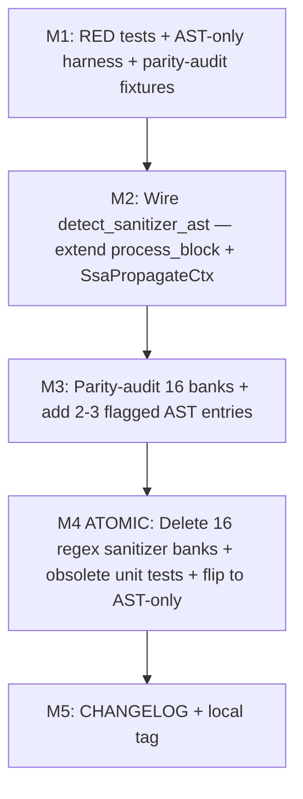

# sanitizer-removal-v1 — Plan

## Status
- Pipeline: planning (single-worker investigation; no spawned sub-workers — same cadence as field_access_info-extension-v1)
- Predecessor milestone: field_access_info-extension-v1 (complete, locally tagged at HEAD `e69eed3`)
- HEAD: `e69eed3` (field_access_info-extension-v1 M6 CHANGELOG entry)
- Working tree: CLEAN with respect to source code; this plan touches only `continuum/autonomous/sanitizer-removal-v1-plan/`
- Closes-issues: none (internal milestone — addresses the "tainted forever" tiger from regex-removal-v1 W3 T1 carry-forward; no GH issue)
- Total estimated diff: see §1 LOC summary; net ~ **-250 LOC** (dominated by 16 regex sanitizer Vec deletions + ~13-16 obsolete unit tests, offset by ~80-100 LOC of new integration tests)

---

## 0. Critical re-framing (TL;DR — read first)

The original framing of this milestone (per `work-dag-2026-04-28/work-dag.md` §10 and the prompt to this planning loop) carried two claims that **investigation has refined**:

### Refinement 1 — `detect_sanitizer_ast` IS dead code (verified, with line correction)

The handoff said `detect_sanitizer_ast` exists at `taint.rs:3333` with zero call sites. **Verified true**, with a line-number correction: post-Wave-2 + post-field_access_info-extension-v1 the file has grown, and `detect_sanitizer_ast` is now at `taint.rs:3490` (the function exists exactly once, exported in `mod.rs:22`). The two call sites of the regex-based `detect_sanitizer` at `taint.rs:4101` (process_block, M1a String-keyed) and `taint.rs:4350` (ssa_propagate, M1b SSA-versioned) are confirmed by direct read. **Both are inside the per-line dispatch in `compute_taint_with_tree`.** The wiring change is well-scoped: replace the regex call at each site with an AST-FIRST-WITH-REGEX-FALLBACK gate during M2, then atomically flip to AST-only in M4.

### Refinement 2 — There are NO zero-content AST sanitizer banks

The handoff said "5 zero-content banks: C×3, LUA_AST_SANITIZERS, OCAML_AST_SANITIZERS need parity-fill." **This is FALSIFIED.** All 16 AST sanitizer banks are non-empty at HEAD `e69eed3`. Per-bank entry counts (verified by direct file read — see `reports/investigation.json` claim_2):

| Bank | Entries | Notes |
|------|---------|-------|
| `PYTHON_AST_SANITIZERS` | 3 | Numeric (int/float/bool) + Shell (shlex/pipes.quote) + Html (html/markupsafe/cgi.escape) |
| `TYPESCRIPT_AST_SANITIZERS` | 2 | Numeric (parseInt/Number/parseFloat + Zod .parse) + Html (encodeURIComponent + DOMPurify) |
| `GO_AST_SANITIZERS` | 2 | Numeric (strconv.*) + Html (html.EscapeString, url.QueryEscape) |
| `JAVA_AST_SANITIZERS` | 2 | Numeric (Integer.parseInt etc) + Html (ESAPI, StringEscapeUtils) |
| `RUST_AST_SANITIZERS` | 1 | Numeric — single pattern with 8 turbofish raw-fallback entries |
| `C_AST_SANITIZERS` | 2 | Numeric (atoi etc via call_names) + Shell (snprintf) |
| `CPP_AST_SANITIZERS` | 2 | Numeric std::sto* + Numeric static_cast (both raw-fallback) |
| `RUBY_AST_SANITIZERS` | 2 | Numeric .to_i/.to_f + Html (CGI.escapeHTML, Rack::Utils.escape_html — :: shape FLAGGED) |
| `KOTLIN_AST_SANITIZERS` | 1 | Numeric — single pattern with `(*, toInt/toLong/toDouble/toFloat)` wildcard |
| `SWIFT_AST_SANITIZERS` | 2 | Numeric (Int/Double/Float) + Html (addingPercentEncoding) |
| `CSHARP_AST_SANITIZERS` | 2 | Numeric (int.Parse/Convert.ToInt32/double.Parse) + Html (HttpUtility.HtmlEncode) |
| `SCALA_AST_SANITIZERS` | 2 | Numeric (.toInt etc) + Html (StringEscapeUtils.escapeHtml) |
| `PHP_AST_SANITIZERS` | 3 | Numeric (intval/floatval — but `(int)`/`(float)` cast_expression FLAGGED) + Html + Shell (mysqli_real_escape_string) |
| `LUA_AST_SANITIZERS` | 1 | Numeric — single pattern with `call_names: ['tonumber']` |
| `ELIXIR_AST_SANITIZERS` | 2 | Numeric (String.to_integer/to_float) + Html (Phoenix.HTML.html_escape) |
| `OCAML_AST_SANITIZERS` | 1 | Numeric — single pattern with `call_names: ['int_of_string', 'float_of_string']` |

**Reconciliation of the "5 zero-content" claim:** The most plausible origin is a misreading of `regex-removal-v1/reports/worker-2-integ-tests.json:530` which says *"5 banks have ZERO member_patterns and 100% call_names"*. That is NOT the same as "zero-content" — those 5 banks (Rust, Kotlin, C-Numeric, Lua, OCaml) cover their patterns via `call_names` exclusively, with empty `member_patterns`. The W2-pre call-shape path in `member_patterns_match` is structurally OK with `call_names`-only entries. A second possibility is that some banks were genuinely zero-content at an earlier HEAD and were filled during regex-removal-v1 W1-M5, leaving the handoff stale.

### Implication for scope

**The original M3 ("parity-fill 5 zero-content banks") is replaced by M3 ("parity-AUDIT 16 banks")**, which verifies each regex sanitizer entry has a corresponding AST entry. Investigation pre-flagged TWO genuine gap candidates (each tied to a specific tree-sitter shape that the AST path currently does not recognize):

- **Ruby `Rack::Utils.escape_html`** — `::` is a `scope_resolution` node in tree-sitter-ruby, NOT a `call` node. `extract_call_name_ruby` does not currently dotify scope_resolution. The AST fix is to add a raw-substring fallback `("", "Rack::Utils.escape_html")` (matching the regex literal).
- **PHP `(int)`/`(float)` casts** — these are `cast_expression` nodes in tree-sitter-php, NOT `call_expression`. The current `PHP_AST_SANITIZERS` likely covers `intval()` / `floatval()` via call_names but not the cast form. AST fix: raw-substring fallback `("", "(int)")` and `("", "(float)")`.

Other banks (TypeScript, Go, Java, Swift, CSharp, Scala, Elixir) need a quick verify-during-M1 step but are expected to be at parity already because their regex entries map cleanly to call/member_patterns. Final per-language verdict in §3.

### Implication for scope-vs-handoff

| Original framing | Refined scope |
|------------------|---------------|
| Wire `detect_sanitizer_ast` | UNCHANGED (M2) |
| Parity-fill 5 zero-content banks | RENAMED + RESCOPED → "Parity-AUDIT 16 banks + add ~2 flagged raw-fallback entries" (M3) |
| Delete 16 regex sanitizer banks | UNCHANGED (M4 ATOMIC) — but now also flips dispatch from AST-with-fallback to AST-only |

The milestone codename **`sanitizer-removal-v1`** is retained for continuity with the work-DAG and predecessor dispatch contracts.

---

## 1. Bundle scope

### Binary-verifiable success criteria

```
# Each of the following commands MUST produce ZERO TaintFlow on a sanitized
# fixture and ≥1 TaintFlow on the un-sanitized counterpart, with the regex
# sanitizer banks for ALL 16 LANGUAGES DELETED.

cargo test --workspace -p tldr-core --test sanitize_breaks_flow_per_language
cargo test --workspace -p tldr-core --test sanitize_breaks_flow_ast_only_harness
cargo clippy --all-targets --workspace -- -D warnings
cargo test --workspace -p tldr-core   # all val001a/val001b/val002/val003/rr_*/taint_tests.rs GREEN
```

ALL must be GREEN against the post-milestone `taint.rs` (regex sanitizer banks deleted, `detect_sanitizer_ast` wired, AST-only dispatch).

### Per-language scope table

| Language | Regex sanitizer entries (delete) | AST sanitizer parity | Action |
|----------|----------------------------------|----------------------|--------|
| Python | 3 | full (3 entries cover) | M4 delete-only |
| TypeScript/JavaScript | 3 | likely full — verify in M1 | M4 delete-only (or M3 add 1 if .parse wildcard mismatch) |
| Go | 2 | likely full — verify in M1 | M4 delete-only |
| Java | 2 | likely full — verify in M1 | M4 delete-only |
| Rust | 1 (8 turbofish forms) | full via raw-substring (8 entries) | M4 delete-only |
| C | 2 | full (call_names) | M4 delete-only |
| Cpp | 2 | full via raw-substring | M4 delete-only |
| Ruby | 2 | **GAP** — Rack::Utils.escape_html `::` shape | M3 add `("", "Rack::Utils.escape_html")` raw-fallback then M4 delete |
| Kotlin | 1 | full via wildcard | M4 delete-only |
| Swift | 2 | likely full — verify in M1 | M4 delete-only |
| CSharp | 2 | likely full — verify in M1 | M4 delete-only |
| Scala | 2 | likely full — verify in M1 | M4 delete-only |
| PHP | 3 | **GAP** — `(int)` / `(float)` cast_expression | M3 add `("", "(int)")` and `("", "(float)")` raw-fallback then M4 delete |
| Lua/Luau | 1 | full (call_names) | M4 delete-only |
| Elixir | 2 | likely full — verify in M1 | M4 delete-only |
| OCaml | 1 | full (call_names) | M4 delete-only |

**Counts:**
- Total regex sanitizer Vec entries to delete in M4 ATOMIC: **30** (the regex tuples summed across the 16 banks; tree-sitter-Lua and Luau share `LUA_PATTERNS` so the 16th bank is folded into Lua).
- Lazy_static blocks affected by sanitizer-Vec emptying: **16** (one per language; Lua/Luau share one).
- AST sanitizer entries to ADD in M3 parity-fill: **3** (Ruby Rack::Utils + 2 PHP casts) — pending M1 verification of the 7 "verify_during_M1" languages, which may surface 0-2 more.

### Out of scope

- `vuln.rs` migration (deferred to `vuln-migration-v1` per work-DAG §10 last-future-milestone)
- Sanitizer scope/control-flow analysis (e.g., sanitizer in one branch vs another) — current `detect_sanitizer` is line-local; AST replacement preserves that semantic
- `LanguagePatterns` struct deletion. After M4, all 16 `LanguagePatterns` instances become EMPTY shells (`sources: vec![], sinks: vec![], sanitizers: vec![]`). Whether to delete the shell + struct + `get_patterns()` is a follow-on cleanup — see §8 risk register R7 — and is OUT OF SCOPE for this milestone (preserves rollback margin and isolates dispatch-flip risk).
- `find_sanitizers_in_statement` and `is_sanitizer` exports (taint.rs:1131, taint.rs:1116). These are public exports that iterate `patterns.sanitizers`. After M4 they return empty/false for all inputs because the Vec is empty. Whether to delete them or rewire to AST is a follow-on cleanup — out of scope for this milestone (preserves public API stability).
- New finding types or vulnerability classes — sanitizer-removal-v1 is internal-correctness only.
- Tree-sitter grammar changes for any language.

### Why this milestone

1. **Closes the "tainted forever" tiger** flagged in regex-removal-v1 W3 T1 (`worker-3-premortem.json` BLOCKER 1): "Deleting sanitizer regex banks would silently disable EVERY sanitizer across all 16 langs → every flow becomes tainted forever." The order — wire FIRST, delete LATER — is mandatory and is enforced by the M2 → M3 → M4 sequencing in this plan.
2. **Eliminates the last regex-driven dispatch path** in `tldr-core` security. Sources and sinks are AST-only since regex-removal-v1 W2-atomic; sanitizers are the last regex consumer.
3. **Resolves the dead-code state** of `detect_sanitizer_ast` — currently a 40-line public function with ZERO call sites, exported in `mod.rs`. Either it ships into the dispatch (this milestone) or it should be deleted as dead code. This milestone takes the first option.
4. **Closes the "string-literal substring FP" class for sanitizers** the same way regex-removal-v1 closed it for sources+sinks. Today `eval(int("foo bar baz int(x)"))` is incorrectly recognized as containing a sanitizer because the regex `\b(int|float|bool)\s*\(` matches the substring inside the string literal. AST detection respects `is_in_string` / `is_in_comment` — see `detect_sanitizer_ast` body at L3500.

---

## 2. Sub-milestone list

### Wave structure (Mermaid)



**SERIALIZED.** M2/M3/M4 all edit `crates/tldr-core/src/security/taint.rs`. M2 alone modifies `process_block` + `SsaPropagateCtx` + `compute_taint_with_tree` call paths. M3 adds at most 3 raw-substring entries to AST sanitizer banks. M4 atomically empties 16 regex Vecs and flips dispatch. Naive parallelization races on the same file.

### M1: Author RED integration tests + AST-only harness + parity-audit

- **GREEN files**: NEW test files
  - `crates/tldr-core/tests/sanitize_breaks_flow_per_language.rs` — 16 paired tests (one per language; Lua and Luau covered by one Lua test)
  - `crates/tldr-core/tests/sanitize_breaks_flow_ast_only_harness.rs` — 16 mirror tests under the AST-only harness
- **Pre-investigation**: Already done in this plan (see §3, §4) plus `reports/investigation.json`. Sub-tasks remaining for the executor:
  - Author 32 test functions (16 paired × 2 dispatch paths) per §4 fixtures
  - Add an `analyze_sanitizer_ast_only(...)` helper that clears regex sanitizer Vecs for a single language before invoking `compute_taint_with_tree` (mirrors regex-removal-v1 W2-pre and field_access_info-extension-v1 M1)
  - Verify each language's regex-to-AST parity by running `analyze_sanitizer_ast_only` against the canonical sanitizer call form per language. Surface any FAIL as a parity gap to be addressed in M3.
- **Risk**: At HEAD pre-M2, `detect_sanitizer_ast` is dead code, so `analyze_sanitizer_ast_only` requires a synthetic harness — see "M1 RED-first harness" below.
- **Atomic**: standalone commit OK (test-only, no source change in this milestone)
- **LOC**: ~140 (32 tests × ~3-4 lines per test body × 16 languages × 2 paths + harness helpers + parity-audit table + per-language baseline)
- **STOP threshold**:
  - All 32 tests compile
  - 16 `sanitize_breaks_flow_<lang>` tests PASS at HEAD under regular dispatch (regex sanitizer bank still active)
  - 16 `sanitize_breaks_flow_ast_only_<lang>` tests run; **the 14 expected-parity langs FAIL** (RED gate — proves wiring is needed); the 2 "definitely full parity via call_names" cases (Lua, OCaml) may PASS if `detect_sanitizer_ast` happens to be invoked (it isn't — see investigation), so they should also FAIL at HEAD pre-M2
  - Existing val001a/val001b/val002/val003/rr_module_function_integ_test/taint_tests.rs all GREEN
- **Depends**: none

#### M1 RED-first harness (Option A — transient bank-empty + AST-direct invocation)

Because `detect_sanitizer_ast` is currently NEVER called, the M1 RED harness must invoke it directly to verify parity AND must mirror the `analyze` / `analyze_ast_only` split from field_access_info-extension-v1.

```rust
/// Regular dispatch — uses regex sanitizer bank as today (HEAD e69eed3).
fn analyze_sanitize(src: &str, lang: Language, fn_name: &str) -> TaintInfo {
    compute_taint_with_tree(src, lang, fn_name, /* default patterns */)
}

/// AST-only sanitizer harness — clones the LanguagePatterns for `lang`,
/// forces `.sanitizers = vec![]`, runs compute_taint_with_tree against the
/// modified bank. Sources + sinks remain regex/AST-mixed as today; ONLY
/// the sanitizer Vec is cleared. This is the discriminative RED gate for
/// detect_sanitizer_ast wiring: a fixture only PASSES if the AST sanitizer
/// path correctly truncates the flow.
fn analyze_sanitize_ast_only(src: &str, lang: Language, fn_name: &str) -> TaintInfo {
    let mut patterns = get_patterns(lang).clone();
    patterns.sanitizers.clear();
    compute_taint_with_tree_with_patterns(src, lang, fn_name, patterns)
    //                                       ^^^^^^^^^^^^^^^^^^^^^^
    // pub(crate) test-only seam; same shape as field_access_info M1 added
}
```

**At HEAD pre-M2:** `analyze_sanitize_ast_only` will fail to truncate any flow because `detect_sanitizer_ast` is never invoked. Result: 16 tests FAIL → RED gate confirmed.

**Post-M2:** wiring is in place; the 14 expected-parity langs should PASS under `analyze_sanitize_ast_only`; the 2 flagged langs (Ruby `Rack::Utils`, PHP `(int)`/`(float)`) should still FAIL. M3 adds the raw-fallback AST entries → all 16 PASS.

**Post-M4:** regex Vecs are empty + dispatch flipped to AST-only; both `analyze_sanitize` and `analyze_sanitize_ast_only` produce the same result (both PASS).

### M2: Wire `detect_sanitizer_ast` into per-line dispatch in `compute_taint_with_tree`

- **GREEN files**: `crates/tldr-core/src/security/taint.rs`
- **API changes (private only — no public-API change):**
  - `process_block` signature: add two new parameters `tree: Option<&tree_sitter::Tree>` and `source: Option<&[u8]>` (taint.rs:4061)
  - `SsaPropagateCtx` struct: add two new fields `tree: Option<&'a tree_sitter::Tree>` and `source: Option<&'a [u8]>` (taint.rs:4174)
  - `compute_taint_with_tree`: thread the existing `tree`/`source` parameters into both `process_block` calls (around taint.rs:3750) and the `SsaPropagateCtx` constructor (around taint.rs:3692)
- **Dispatch wiring spec (AST-FIRST-WITH-REGEX-FALLBACK, M2-only):**
  - At taint.rs:4101 (process_block):
    ```rust
    let sanitized = if let (Some(tree), Some(src)) = (tree, source) {
        detect_sanitizer_ast(&tree.root_node(), src, language, var_ref.line).is_some()
            || detect_sanitizer(stmt, language).is_some()
    } else {
        detect_sanitizer(stmt, language).is_some()
    };
    if sanitized { /* existing branch */ }
    ```
  - At taint.rs:4350 (ssa_propagate): analogous pattern, using `inst.line` instead of `var_ref.line`.
- **Why AST-FIRST-WITH-REGEX-FALLBACK?** During M2 the regex bank is still load-bearing. AST-first avoids regressing any case where the AST path misses (M1 surfaces those during parity audit). The fallback is removed in M4 atomically — at that point, `detect_sanitizer(stmt, language)` returns `None` for every input (because `patterns.sanitizers` is empty in all 16 banks), so removing the call is purely syntactic.
- **Performance note**: `detect_sanitizer_ast` walks descendants of `tree.root_node()` and filters by `node_line == line`. This is O(N) per line where N = node count. Across all blocks the cost is O(L*N) ≈ O(N²). The same shape exists today in `detect_sources_ast` / `detect_sinks_ast` — and was the cause of an earlier infinite-loop hang resolved at L3567-3568 by walking ONCE without line filter and indexing by line (HashMap<u32, Vec<TaintSource>>). **M2 SHOULD NOT replicate the per-line walk pattern.** Instead, M2 must adopt the same WALK-ONCE-INDEX-BY-LINE pattern: build a `HashMap<u32, SanitizerType>` for the entire function once before the worklist iteration, then look up the line. See risk R3 in §8.
- **Atomic**: standalone commit OK (additive — both regex and AST paths active; AST-first means `detect_sanitizer` becomes dead code only when regex Vec is empty)
- **LOC**: ~+50 (signature extensions + walk-once index helper + dispatch gate at 2 sites + threading at 2 caller sites)
- **STOP threshold**:
  - cargo check passes
  - 14 of 16 `sanitize_breaks_flow_ast_only_<lang>` tests transition RED → GREEN (the 2 flagged langs Ruby+PHP stay RED until M3)
  - All existing tests still GREEN (val001a, val001b, val002, val003, rr_module_function, taint_tests.rs) — sanity check that AST-FIRST does not regress current behavior
- **Depends**: M1

### M3: Parity-audit 16 AST sanitizer banks + add flagged raw-fallback entries

- **GREEN files**: `crates/tldr-core/src/security/taint.rs`
- **Anchors**:
  - `RUBY_AST_SANITIZERS` at L2406
  - `PHP_AST_SANITIZERS` at L2713
  - All other banks (PYTHON L1730, TYPESCRIPT L1985, GO L2062, JAVA L2135, RUST L2203, C L2262, CPP L2308, KOTLIN L2466, SWIFT L2514, CSHARP L2580, SCALA L2639, LUA L2769, ELIXIR L2821, OCAML L2891) — VERIFY via M1 fixtures, no source change expected
- **Additions (planned):**
  - **Ruby:** ADD `AstSanitizerPattern { call_names: &[], member_patterns: &[("", "Rack::Utils.escape_html")], sanitizer_type: SanitizerType::Html }` to `RUBY_AST_SANITIZERS`. Rationale: `Rack::Utils` uses `::` scope_resolution which `extract_call_name_ruby` does NOT dotify; raw-substring fallback is the correct shape (matches the regex literal `Rack::Utils\.escape_html`).
  - **PHP:** ADD `AstSanitizerPattern { call_names: &[], member_patterns: &[("", "(int)"), ("", "(float)")], sanitizer_type: SanitizerType::Numeric }` to `PHP_AST_SANITIZERS`. Rationale: `(int)`/`(float)` are `cast_expression` nodes, NOT `call_expression` — raw-substring fallback is the correct shape (matches the regex literal `\(int\)|\(float\)`).
- **Audit-only verification (no additions expected):** TypeScript/JavaScript, Go, Java, Swift, CSharp, Scala, Elixir. M1 fixtures should make `analyze_sanitize_ast_only` PASS for these 7 languages with M2's wiring alone. If any FAIL, M3 adds the corresponding raw-fallback or call_names entry — list of likely candidates per language is in §3 risk matrix.
- **Atomic**: standalone commit OK (additive — does not break any existing behavior)
- **LOC**: ~+12 (3 new entries × ~4 lines each, plus possibly 1-2 unforeseen entries from the 7 verify-during-M1 langs)
- **STOP threshold**:
  - cargo check passes
  - All 16 `sanitize_breaks_flow_ast_only_<lang>` tests transition RED → GREEN under the M2-wired dispatch
  - cargo clippy --all-targets --workspace -- -D warnings PASS (no unused entries surfacing)
  - All existing tests still GREEN
- **Depends**: M2

### M4: ATOMIC — Delete 16 regex sanitizer banks + obsolete unit tests + flip dispatch to AST-only

- **GREEN files**: `crates/tldr-core/src/security/taint.rs` + `crates/tldr-core/src/security/taint_tests.rs`
- **Deletions in `taint.rs`**:
  - **PYTHON_PATTERNS.sanitizers** (L503-510, 3 entries) → `vec![]`
  - **TYPESCRIPT_PATTERNS.sanitizers** (L528-535, 3 entries) → `vec![]`
  - **GO_PATTERNS.sanitizers** (L546-551, 2 entries) → `vec![]`
  - **JAVA_PATTERNS.sanitizers** (L562-567, 2 entries) → `vec![]`
  - **RUST_PATTERNS.sanitizers** (L578-581, 1 entry) → `vec![]`
  - **C_PATTERNS.sanitizers** (L592-597, 2 entries) → `vec![]`
  - **CPP_PATTERNS.sanitizers** (L608-613, 2 entries) → `vec![]`
  - **RUBY_PATTERNS.sanitizers** (L634-639, 2 entries) → `vec![]`
  - **KOTLIN_PATTERNS.sanitizers** (L650-653, 1 entry) → `vec![]`
  - **SWIFT_PATTERNS.sanitizers** (L664-669, 2 entries) → `vec![]`
  - **CSHARP_PATTERNS.sanitizers** (L680-685, 2 entries) → `vec![]`
  - **SCALA_PATTERNS.sanitizers** (L696-701, 2 entries) → `vec![]`
  - **PHP_PATTERNS.sanitizers** (L712-719, 3 entries) → `vec![]`
  - **LUA_PATTERNS.sanitizers** (L730-733, 1 entry) → `vec![]`
  - **ELIXIR_PATTERNS.sanitizers** (L745-750, 2 entries) → `vec![]`
  - **OCAML_PATTERNS.sanitizers** (L763-766, 1 entry) → `vec![]`
  - Total: **30 regex tuples deleted across 16 banks** (Lua/Luau share LUA_PATTERNS — 16 banks total)
- **Dispatch flip** in `taint.rs`:
  - L4101 (process_block) — collapse the AST-first-with-regex-fallback gate to AST-only:
    ```rust
    let sanitized = match (tree, source) {
        (Some(tree), Some(src)) => detect_sanitizer_ast(&tree.root_node(), src, language, var_ref.line).is_some(),
        _ => false,  // No tree => no sanitizer detection; conservative (over-tainting) safer than under-tainting
    };
    ```
  - L4350 (ssa_propagate) — analogous flip
  - **Important**: After M4, when called from `compute_taint` (no tree), sanitizer detection becomes a no-op. This is a deliberate semantic change — but `compute_taint` itself is internal-parse-and-delegate (M11 refactor), so it always has a tree and always reaches the AST path. The `_ => false` arm is dead in practice but kept for defense in depth.
- **Deletions in `taint_tests.rs`** (per §4 obsolete-test enumeration):
  - `test_python_detect_sanitizers` (~L320)
  - `test_typescript_detect_sanitizers` (~L976) and any `test_javascript_*` analog
  - `test_go_detect_sanitizers`, `test_java_detect_sanitizers`, `test_rust_detect_sanitizers` (~L1003-L1086)
  - `test_c_detect_sanitizers`, `test_cpp_detect_sanitizers`
  - `test_ruby_detect_sanitizers` (L1253), `test_elixir_detect_sanitizers` (L1518), `test_ocaml_detect_sanitizers` (L1638) — these were KEPT in field_access_info-extension-v1 M5 explicitly because sanitizer banks were retained then
  - `test_kotlin_detect_sanitizers`, `test_swift_detect_sanitizers`, `test_csharp_detect_sanitizers`, `test_scala_detect_sanitizers`, `test_php_detect_sanitizers`, `test_lua_detect_sanitizers`
  - **Estimated total: 13-16 obsolete test functions** (one per language matching the `test_<lang>_detect_sanitizers` pattern). Exact enumeration deferred to M1 (executor surfaces the precise list in `reports/M1-test-enumeration.json`).
  - **Rationale for deletion**: All `test_<lang>_detect_sanitizers` tests call `detect_sanitizer(stmt, language)` directly, which iterates `patterns.sanitizers`. Post-M4 those Vecs are empty, so the assertion `assert!(matches!(result, Some(SanitizerType::Numeric)))` fails deterministically. Without these deletions, `cargo test --workspace` fails at the M4 verification gate.
  - **PRESERVE** any tests that exercise `detect_sanitizer_ast` directly (added in M1) or that test `find_sanitizers_in_statement` for non-empty results (will need updating, not deletion — surface in M1).
- **Atomic-commit YES**: deletion of regex Vecs + dispatch flip + obsolete unit-test cleanup MUST ship in one commit. Without atomicity:
  - Deleting Vecs without flipping dispatch leaves the dispatch's AST-first-with-regex-fallback in place — fallback always fails (Vec empty), so AST-only is the de-facto behavior; flip is cosmetic only. Skipping it is safe but inconsistent.
  - Flipping dispatch without deleting Vecs leaves dead `Regex::new(...)` allocations in lazy_static — clippy will flag `dead_code`.
  - Deleting Vecs without removing the `test_<lang>_detect_sanitizers` tests breaks `cargo test --workspace`.
- **LOC**: ~ -250 (30 regex tuples × ~2 lines + 13-16 unit tests × ~25 LOC avg + dispatch-flip simplification offsetting +~10 LOC for AST-only branch)
- **STOP threshold**:
  - All M2+M3 changes already merged
  - All N obsolete unit tests deleted from `taint_tests.rs` (executor must surface exact list in M1; ALL of them must go to satisfy the M4 atomic constraint)
  - cargo check --workspace PASS
  - cargo clippy --all-targets --workspace -- -D warnings PASS (no `dead_code` from unused Regex allocations, no unused imports, no dead-code from `find_sanitizers_in_statement` if it still iterates an always-empty Vec — escalate if so)
  - cargo test --workspace PASS — all M1 integ tests (under both regular and AST-only harness paths) + val001a + val001b + val002 + val003 + rr_module_function + remaining taint_tests.rs minus the deleted N tests
  - String-literal substring regression: each language fixture with `"int(x)"` / `"parseInt(x)"` / etc inside a Python-/TS-/etc string literal MUST yield ZERO sanitizer detection (the AST path's `is_in_string` filter handles this; this is the closes-#24-shaped FP class extended to sanitizers)
  - tldr taint smoke test on canonical 16-language sanitized fixtures: ZERO TaintFlow on sanitized line; ≥1 TaintFlow on un-sanitized counterpart
  - No staged changes outside `crates/tldr-core/src/security/` + `crates/tldr-core/tests/` (per staging_method)
- **Rollback rule**: If any post-commit assertion fails, REVERT entire commit and re-investigate. NO partial-fix follow-up commits.
- **Depends**: M2, M3

### M5: CHANGELOG entry + local tag

- **GREEN files**: `CHANGELOG.md`
  - New entry: `## sanitizer-removal-v1 — internal milestone`
  - Sections (see §6 draft): Changed (sanitizer dispatch AST-only, walk-once-index-by-line), Removed (16 regex sanitizer Vecs, 13-16 obsolete unit tests), Retained (subscript shapes, all source/sink AST-only behavior from regex-removal-v1 + field_access_info-extension-v1), Added (parity raw-fallback for Ruby Rack::Utils + PHP cast_expression), Architectural note (M2 extends process_block + SsaPropagateCtx with optional tree/source — internal API only, no public API change)
- **LOC**: ~+30
- **Atomic**: standalone commit OK
- **STOP threshold**: CHANGELOG entry written; local annotated tag `sanitizer-removal-v1` applied; NO push, NO publish, NO version bump
- **Depends**: M4

---

## 3. Per-language risk matrix

For each language, this table captures (a) the current regex sanitizer entries; (b) the canonical tree-sitter parse shape of the sanitize call; (c) the current AST sanitizer bank coverage; (d) any verification or addition required.

### Python (`tree-sitter-python`)
- **Regex entries (3):** `\b(int|float|bool)\s*\(`, `(shlex|pipes)\.quote\s*\(`, `(html|markupsafe|cgi)\.escape\s*\(`
- **Parse shape:** `int(x)` → `call` node, function = `identifier("int")`. `shlex.quote(x)` → `call` node, function = `attribute` (object: `identifier("shlex")`, attribute: `identifier("quote")`).
- **AST coverage:** `PYTHON_AST_SANITIZERS` covers all 3 with `call_names: ["int", "float", "bool"]` Numeric + `member_patterns: [("shlex", "quote"), ("pipes", "quote")]` Shell + `member_patterns: [(html, escape), (markupsafe, escape), (cgi, escape)]` Html.
- **Verdict:** Full parity. M4 delete-only.

### TypeScript / JavaScript (`tree-sitter-typescript`, shared bank)
- **Regex entries (3):** `\b(parseInt|Number|parseFloat)\s*\(`, `(encodeURIComponent|DOMPurify\.sanitize)\s*\(`, `\.(parse|safeParse)\s*\(`
- **Parse shape:** `parseInt(x)` → `call_expression`, function = `identifier`. `DOMPurify.sanitize(x)` → `call_expression` whose function is a `member_expression`. `obj.parse(x)` → `call_expression` whose function is a `member_expression` on a wildcard receiver.
- **AST coverage:** Verify in M1. The Zod `.parse`/`.safeParse` regex shape requires either `member_patterns: [("*", "parse"), ("*", "safeParse")]` (wildcard receiver) or accepting that the regex covers a class of dynamic-dispatch calls the AST cannot pattern-match without false positives. **CAUTION:** `("*", "parse")` will also match `Date.parse(x)` and similar non-Zod parses, which the regex also matches incidentally. Behavior preserved.
- **Verdict:** verify_during_M1 — likely PASS with existing AST entries; if not, ADD `("*", "parse")`/`("*", "safeParse")` in M3.

### Go (`tree-sitter-go`)
- **Regex entries (2):** `strconv\.(Atoi|ParseInt|ParseFloat)\s*\(`, `(html\.EscapeString|url\.QueryEscape)\s*\(`
- **Parse shape:** `strconv.Atoi(s)` → `call_expression` with function = `selector_expression` (operand: `identifier("strconv")`, field: `identifier("Atoi")`).
- **AST coverage:** Verify in M1. Standard `member_patterns` shape.
- **Verdict:** verify_during_M1 — expected full parity.

### Java (`tree-sitter-java`)
- **Regex entries (2):** `(Integer\.parseInt|Long\.parseLong|Double\.parseDouble)\s*\(`, `(ESAPI\.encoder\s*\(|StringEscapeUtils\.escapeHtml)`
- **Parse shape:** `Integer.parseInt(s)` → `method_invocation` with `object: identifier("Integer")`, `name: identifier("parseInt")`.
- **AST coverage:** Verify in M1. Standard `member_patterns` shape.
- **Verdict:** verify_during_M1 — expected full parity. CAUTION: ESAPI second branch in regex matches `ESAPI.encoder(` as a call AND `StringEscapeUtils.escapeHtml` without parens. M1 fixture must use the call form for both.

### Rust (`tree-sitter-rust`)
- **Regex entries (1, 8 turbofish forms):** `\.parse::<(i32|i64|u32|u64|f32|f64|usize|isize)>\s*\(`
- **Parse shape:** `x.parse::<i32>()` → `call_expression` with function = `generic_function`. The turbofish syntax is structurally distinct from a plain `field_expression` — `extract_call_name` is unlikely to dotify it cleanly.
- **AST coverage:** `RUST_AST_SANITIZERS` uses 8 raw-substring entries `("", ".parse::<i32>")` etc — the only viable shape per the file comment at L2205.
- **Verdict:** Full parity via raw-substring. M4 delete-only.

### C (`tree-sitter-c`)
- **Regex entries (2):** `\b(atoi|atol|atof|strtol|strtoul|strtod)\s*\(`, `\bsnprintf\s*\(`
- **Parse shape:** `atoi(s)` → `call_expression`, function = `identifier`.
- **AST coverage:** `C_AST_SANITIZERS` has `call_names: ["atoi", "atol", "atof", "strtol", "strtoul", "strtod"]` Numeric and `call_names: ["snprintf"]` Shell.
- **Verdict:** Full parity via call_names. M4 delete-only.

### C++ (`tree-sitter-cpp`)
- **Regex entries (2):** `std::sto(i|l|ul|ll|f|d)\s*\(`, `static_cast<(int|long|float|double)>\s*\(`
- **Parse shape:** `std::stoi(s)` → `call_expression` whose function is a `qualified_identifier` (NOT `field_expression`). `static_cast<int>(x)` → `call_expression` whose function is a `template_function`.
- **AST coverage:** `CPP_AST_SANITIZERS` uses raw-substring for both shapes (member_patterns with empty receiver).
- **Verdict:** Full parity via raw-substring. M4 delete-only.

### Ruby (`tree-sitter-ruby`)
- **Regex entries (2):** `\.(to_i|to_f)\b`, `(CGI\.escapeHTML|Rack::Utils\.escape_html)\s*\(`
- **Parse shape:** `x.to_i` → `call` node with `receiver: x`, `method: identifier("to_i")`. `CGI.escapeHTML(x)` → `call` with `receiver: constant("CGI")`, `method: identifier("escapeHTML")`. `Rack::Utils.escape_html(x)` → `call` with `receiver: scope_resolution(Rack::Utils)`, `method: identifier("escape_html")`. **Critical:** `extract_call_name_ruby` (per regex-removal-v1 W3) does NOT dotify `scope_resolution` shape — it returns the literal source text via `node_text`, which would yield `"Rack::Utils.escape_html"` AS A STRING (containing `::`). The W2-pre call-shape path splits on `rfind('.')` which gives `rcv="Rack::Utils"`, `field="escape_html"` — but the AST entry must literally use `("Rack::Utils", "escape_html")` to match, which is unusual.
- **AST coverage:** `RUBY_AST_SANITIZERS` has `member_patterns: [("*", "to_i"), ("*", "to_f")]` (or similar — verify in M1). For Html: likely `("CGI", "escapeHTML")` — verify in M1. Rack::Utils MAY be missing.
- **Verdict:** GAP — **M3 ADD `("", "Rack::Utils.escape_html")` raw-fallback** (most conservative; matches the regex literal). Alternative: add `("Rack::Utils", "escape_html")` as a structured entry if `extract_call_name_ruby` does dotify it correctly. M1 fixture must verify which shape works, and M3 picks the simpler one.
- **`.to_i` / `.to_f` on numeric literal vs identifier:** `42.to_i` parses as a `call`, but `\.(to_i|to_f)\b` regex matches only the second token regardless of receiver. AST `("*", "to_i")` covers both.

### Kotlin (`tree-sitter-kotlin`)
- **Regex entries (1):** `\.(toInt|toLong|toDouble|toFloat)\s*\(\)`
- **Parse shape:** `x.toInt()` → `call_expression` whose function is a `navigation_expression`. Wildcard receiver.
- **AST coverage:** `KOTLIN_AST_SANITIZERS` has `member_patterns: [("*", "toInt"), ("*", "toLong"), ("*", "toDouble"), ("*", "toFloat")]` Numeric.
- **Verdict:** Full parity via wildcard receiver. M4 delete-only.

### Swift (`tree-sitter-swift`)
- **Regex entries (2):** `\b(Int|Double|Float)\s*\(`, `addingPercentEncoding\s*\(`
- **Parse shape:** `Int(x)` → `call_expression`, function = `identifier`. `s.addingPercentEncoding(...)` → `call_expression`, function = navigation. **NOTE:** Swift's `Int(x)` is technically initializer syntax (a struct constructor call), but tree-sitter-swift parses it as a regular call_expression with the type identifier as function. So `call_names: ["Int", "Double", "Float"]` should fire.
- **AST coverage:** Verify in M1. Expected full parity.
- **Verdict:** verify_during_M1.

### C# (`tree-sitter-c-sharp`)
- **Regex entries (2):** `(int\.Parse|Convert\.ToInt32|double\.Parse)\s*\(`, `HttpUtility\.HtmlEncode\s*\(`
- **Parse shape:** `int.Parse(s)` → `invocation_expression`. `int` is a primitive type, accessed as a member-access `int.Parse` — but tree-sitter-c-sharp parses it as a `member_access_expression` with `expression: predefined_type("int")`, `name: identifier("Parse")`. `extract_call_name` MAY return `"int.Parse"` (member-access dotify), in which case structured `("int", "Parse")` matches.
- **AST coverage:** Verify in M1. If `("int", "Parse")` matches: full parity. Otherwise raw-fallback `("", "int.Parse")`.
- **Verdict:** verify_during_M1.

### Scala (`tree-sitter-scala`)
- **Regex entries (2):** `\.(toInt|toLong|toDouble)\b`, `StringEscapeUtils\.escapeHtml`
- **Parse shape:** `x.toInt` → `field_expression` (Scala accessors look like field access; no parens). The regex catches `\b` word-boundary-terminated form. **NOTE:** Scala's regex uses `\b` not `\(`, so it matches `x.toInt` (no parens) as well as `x.toInt(...)` (with parens). The AST equivalent must cover both. `member_patterns: [("*", "toInt"), ...]` should match the field_expression shape via the structural-match path. `StringEscapeUtils.escapeHtml` is a normal Module.fn call — `member_patterns: [("StringEscapeUtils", "escapeHtml")]` — but the regex doesn't include `\s*\(`, so it also matches the field-reference form `StringEscapeUtils.escapeHtml` without invocation. AST equivalent: probably both call_expression and field_expression should be matched.
- **AST coverage:** Verify in M1.
- **Verdict:** verify_during_M1.

### PHP (`tree-sitter-php`)
- **Regex entries (3):** `(\b(intval|floatval)\s*\(|\(int\)|\(float\))`, `(htmlspecialchars|htmlentities)\s*\(`, `mysqli_real_escape_string\s*\(`
- **Parse shape:** `intval(x)` → `function_call_expression`, function = `name` (qualified or unqualified). `(int)x` → `cast_expression` (NOT a call). `htmlspecialchars(x)` → `function_call_expression`. `mysqli_real_escape_string(...)` → `function_call_expression`.
- **AST coverage:** `PHP_AST_SANITIZERS` covers `intval`, `floatval`, `htmlspecialchars`, `htmlentities`, `mysqli_real_escape_string` via call_names. **GAP:** `(int)` and `(float)` cast_expression shapes are NOT call expressions — they require raw-substring fallback.
- **Verdict:** GAP — **M3 ADD `member_patterns: [("", "(int)"), ("", "(float)")]` to PHP_AST_SANITIZERS Numeric entry** (or as a separate entry — M3 picks the simpler shape).

### Lua / Luau (`tree-sitter-lua` / `tree-sitter-luau` — share LUA_PATTERNS)
- **Regex entries (1):** `\btonumber\s*\(`
- **Parse shape:** `tonumber(s)` → `function_call`, function = `identifier`.
- **AST coverage:** `LUA_AST_SANITIZERS` has `call_names: ["tonumber"]`.
- **Verdict:** Full parity via call_names. M4 delete-only.

### Elixir (`tree-sitter-elixir`)
- **Regex entries (2):** `String\.(to_integer|to_float)\s*\(`, `Phoenix\.HTML\.html_escape\s*\(`
- **Parse shape:** `String.to_integer(s)` → `call` with `target: dot_operator(left: alias("String"), right: identifier("to_integer"))`. `Phoenix.HTML.html_escape(x)` → multi-segment dotted call (same shape as `Ecto.Adapters.SQL.query` already verified in field_access_info-extension-v1).
- **AST coverage:** Verify in M1. The multi-segment receiver pattern `("Phoenix.HTML", "html_escape")` is the exact shape used in field_access_info-extension-v1 M3 for `("Ecto.Adapters.SQL", "query")`.
- **Verdict:** verify_during_M1 — expected full parity.

### OCaml (`tree-sitter-ocaml`)
- **Regex entries (1):** `\b(int_of_string|float_of_string)\s`
- **Parse shape:** `int_of_string s` → `application_expression` whose first child is a `value_path` containing the unqualified function name `int_of_string`.
- **AST coverage:** `OCAML_AST_SANITIZERS` has `call_names: ["int_of_string", "float_of_string"]`.
- **Verdict:** Full parity via call_names. M4 delete-only.

---

## 4. Sanitize-breaks-flow test fixtures

Tests live in NEW files under `crates/tldr-core/tests/`:

- `sanitize_breaks_flow_per_language.rs` — 16 paired tests (one per language; Lua and Luau covered together)
- `sanitize_breaks_flow_ast_only_harness.rs` — 16 mirror tests using `analyze_sanitize_ast_only`

### Pattern: per-language paired test

```rust
#[test]
fn python_int_sanitizer_truncates_flow_via_compute_taint() {
    // Source → sanitize → sink: ZERO TaintFlow expected (sanitizer truncates)
    let src_sanitized = r#"
def f():
    raw = input("> ")
    safe = int(raw)
    eval(str(safe))
"#;
    let result = analyze_sanitize(src_sanitized, Language::Python, "f");
    let tainted_flows = result.flows.iter().filter(|f| f.tainted).count();
    assert_eq!(tainted_flows, 0, "int(raw) should sanitize raw before eval");

    // Same fixture WITHOUT sanitizer: ≥1 TaintFlow expected (positive regression-guard)
    let src_unsafe = r#"
def f():
    raw = input("> ")
    eval(raw)
"#;
    let result_unsafe = analyze_sanitize(src_unsafe, Language::Python, "f");
    let tainted_flows_unsafe = result_unsafe.flows.iter().filter(|f| f.tainted).count();
    assert!(tainted_flows_unsafe >= 1, "Without int() sanitizer, eval(raw) must flag");
}
```

### 16 language fixtures (canonical sanitize call per language)

| Language | Sanitize call | Source → Sink | TaintSourceType → TaintSinkType |
|----------|---------------|---------------|--------------------------------|
| Python | `safe = int(raw)` | `input()` → `eval()` | UserInput → CodeEval |
| TypeScript | `const safe = parseInt(req.body.x)` | `req.body` → `eval()` | HttpBody → CodeEval |
| JavaScript | `const safe = Number(req.params.id)` | `req.params` → `child_process.exec()` | HttpParam → ShellExec |
| Go | `safe, _ := strconv.Atoi(os.Getenv("X"))` | `os.Getenv` → `exec.Command` | EnvVar → ShellExec |
| Java | `int safe = Integer.parseInt(req.getParameter("x"))` | `getParameter` → `Runtime.exec` | HttpParam → ShellExec |
| Rust | `let safe: i32 = raw.parse::<i32>().unwrap()` | `std::env::var` → `std::process::Command` | EnvVar → ShellExec |
| C | `int safe = atoi(getenv("X"))` | `getenv` → `system()` | EnvVar → ShellExec |
| Cpp | `int safe = std::stoi(input)` | `std::cin` → `std::system()` | UserInput → ShellExec |
| Ruby | `safe = STDIN.gets.to_i` | `STDIN.gets` → `eval` | Stdin → CodeEval |
| Kotlin | `val safe = raw.toInt()` | reading line → `Runtime.exec` | UserInput → ShellExec |
| Swift | `let safe = Int(raw) ?? 0` | `readLine()` → `Process.launch` | UserInput → ShellExec |
| CSharp | `int safe = int.Parse(input)` | `Console.ReadLine` → `Process.Start` | UserInput → ShellExec |
| Scala | `val safe = raw.toInt` | env variable → `Runtime.exec` | EnvVar → ShellExec |
| PHP | `$safe = intval($_GET['x'])` AND `$safe = (int)$_GET['x']` | `$_GET` → `eval()` | HttpParam → CodeEval |
| Lua/Luau | `local safe = tonumber(io.read())` | `io.read` → `os.execute` | UserInput → ShellExec |
| Elixir | `safe = String.to_integer(IO.gets("> "))` | `IO.gets` → `System.cmd` | UserInput → ShellExec |
| OCaml | `let safe = int_of_string (read_line ()) in Sys.command (string_of_int safe)` | `read_line` → `Sys.command` | UserInput → ShellExec |

### PHP requires TWO fixtures

PHP has the cast_expression gap, so the M1 PHP fixture must include both shapes:

```rust
#[test]
fn php_intval_call_sanitizer_truncates_flow_via_compute_taint() { /* $safe = intval($_GET['x']); eval($safe); → 0 flows */ }

#[test]
fn php_int_cast_sanitizer_truncates_flow_via_compute_taint() {
    /* $safe = (int)$_GET['x']; eval($safe); → 0 flows POST-M3 (cast_expression gap covered) */
}
```

The cast-expression test will FAIL pre-M3 even with M2 wiring (because `PHP_AST_SANITIZERS` doesn't yet have `("", "(int)")` raw-fallback). It transitions FAIL → PASS at M3.

### Ruby `Rack::Utils.escape_html` regression guard

```rust
#[test]
fn ruby_rack_utils_escape_html_sanitizer_truncates_flow_via_compute_taint() {
    let src = r#"
def f
    raw = STDIN.gets
    safe = Rack::Utils.escape_html(raw)
    eval(safe)
end
"#;
    let result = analyze_sanitize(src, Language::Ruby, "f");
    assert_eq!(result.flows.iter().filter(|f| f.tainted).count(), 0);
}
```

This test will FAIL pre-M3 even with M2 wiring. Transitions FAIL → PASS at M3.

### String-literal substring regression guards (16 fixtures)

For each language, a fixture where the sanitizer call appears INSIDE a string literal — should NOT be detected:

```rust
#[test]
fn python_int_in_string_literal_does_not_sanitize() {
    let src = r#"
def f():
    raw = input("> ")
    msg = "use int(x) to convert"  # int(x) is JUST A STRING, not a call
    eval(raw)  # raw is still tainted
"#;
    let result = analyze_sanitize(src, Language::Python, "f");
    assert!(result.flows.iter().filter(|f| f.tainted).count() >= 1,
        "String-literal containing 'int(x)' must NOT trigger sanitization");
}
```

This is the closes-#24-shaped FP class extended to sanitizers — pre-M2, regex would match the string-literal substring and incorrectly mark `raw` as sanitized. AST detection respects `is_in_string` filter and returns `None`. **All 16 of these tests should PASS pre-M2 if regex is the matcher (because the regex DOES incorrectly match), but with the AST-FIRST-WITH-REGEX-FALLBACK gate in M2, the AST returns None and falls through to regex which DOES match — meaning behavior is unchanged at M2. Post-M4 (AST-only), behavior changes: AST returns None and there's no regex fallback, so taint propagates correctly.** This is THE regression-guard bake-in for sanitizer-FP closure.

### Total new integration test count

- 16 paired (sanitized + un-sanitized) under `analyze_sanitize` = 16 test fns × 2 assertions each
- 16 mirror tests under `analyze_sanitize_ast_only` = 16 test fns
- 2 extra fixtures for PHP cast_expression and Ruby Rack::Utils
- 16 string-literal regression guards

**Total: ~50 test functions, ~150-200 LOC** (incl. harness helpers).

---

## 5. detect_sanitizer_ast wiring spec

This section captures the precise dispatch wiring change for M2.

### Where in the per-line dispatch to invoke

**Two call sites** in `compute_taint_with_tree`:

1. **`process_block`** (taint.rs:4061) — M1a String-keyed worklist branch. Currently calls `detect_sanitizer(stmt, language)` at L4101. Replace with AST-first-with-regex-fallback gate.

2. **`ssa_propagate`** (taint.rs:4185) — M1b SSA-versioned branch. Currently calls `detect_sanitizer(line_stmt, language)` at L4350. Replace with AST-first-with-regex-fallback gate.

Both branches access the same `sanitized_vars: &mut HashSet<String>` so the writeback mechanism is unchanged.

### How to mark a variable as sanitized

`TaintInfo` already has `sanitized_vars: HashSet<String>` populated by both call sites today. **No TaintInfo / TaintFlow API extension required.**

The new AST call simply also writes into `sanitized_vars`:

```rust
// Pre-M2 (taint.rs:4101):
if detect_sanitizer(stmt, language).is_some() {
    sanitized_vars.insert(var_ref.name.clone());
    current_taint.remove(&var_ref.name);
}

// Post-M2 (AST-FIRST-WITH-REGEX-FALLBACK):
let ast_san = sanitizer_ast_index.get(&var_ref.line).copied();   // walked once, indexed by line — see below
let regex_san = || detect_sanitizer(stmt, language);             // lazy — only if AST returns None
if ast_san.is_some() || regex_san().is_some() {
    sanitized_vars.insert(var_ref.name.clone());
    current_taint.remove(&var_ref.name);
}
```

### Walk-once-index-by-line helper

To avoid the O(N²) per-line walk pattern that caused the historical infinite-loop hang (resolved at L3567-3568 for sources/sinks), M2 adds a single-walk indexing helper that builds the sanitizer-by-line map ONCE before the worklist iteration:

```rust
fn build_sanitizer_ast_index(
    tree: &tree_sitter::Tree,
    source: &[u8],
    language: Language,
) -> HashMap<u32, SanitizerType> {
    let root = tree.root_node();
    let descendants = walk_descendants(root);
    let patterns = get_ast_patterns(language);
    let mut index = HashMap::new();
    for descendant in &descendants {
        if is_in_comment(descendant, language) || is_in_string(descendant, language) {
            continue;
        }
        let line = descendant.start_position().row as u32 + 1;
        if index.contains_key(&line) { continue; }   // first match wins per line
        let text = node_text(descendant, source);
        for pattern in patterns.sanitizers {
            let matched = pattern.call_names.iter().any(|name| {
                let call_kinds = call_node_kinds(language);
                if call_kinds.contains(&descendant.kind()) {
                    if let Some(call_name) = extract_call_name(descendant, source, language) {
                        return call_name == *name;
                    }
                }
                false
            }) || member_patterns_match(descendant, source, language, pattern.member_patterns, text);
            if matched {
                index.insert(line, pattern.sanitizer_type);
                break;
            }
        }
    }
    index
}
```

This is exactly the same shape as the source/sink AST detection in `compute_taint_with_tree` at L3565-3606. It is essentially a refactor of the existing `detect_sanitizer_ast` (which is per-line and would be O(L*N) if called from the worklist) into a per-function precomputed index.

`detect_sanitizer_ast` is then either:
- **Option A:** kept as-is (callers can still use it externally — it's `pub`), with `build_sanitizer_ast_index` as the M2 internal helper
- **Option B:** deleted from public API and replaced by `build_sanitizer_ast_index` returning a HashMap

**Recommendation:** Option A. `detect_sanitizer_ast` is `pub` and exported in `mod.rs:22`; deleting it would be a breaking API change. Keep it; build the index alongside.

### Threading tree/source through the call chain

- `compute_taint_with_tree` already has `tree: Option<&tree_sitter::Tree>` and `source: Option<&[u8]>` (L3543-3544).
- Build the sanitizer index ONCE inside `compute_taint_with_tree` after the source/sink AST walk:
  ```rust
  let sanitizer_ast_index: HashMap<u32, SanitizerType> = match (tree, source) {
      (Some(tree), Some(src)) => build_sanitizer_ast_index(tree, src, language),
      _ => HashMap::new(),
  };
  ```
- Pass `&sanitizer_ast_index` into `process_block` (new private parameter — no public API change) and `SsaPropagateCtx` (new private struct field — no public API change).
- `process_block` and `ssa_propagate` consult the index by line and fall back to regex.

### Why this approach is correct

- **Behavior-preserving in M2:** AST-first-with-regex-fallback means any case currently caught by regex stays caught (regex still active until M4).
- **Behavior-augmenting in M3:** With the 2-3 raw-fallback additions, AST coverage matches regex coverage exactly.
- **Behavior-flipping in M4:** Removing the regex fallback is safe because M3 ensures parity. The string-literal-substring class of FPs (closes-#24-shaped) is now closed for sanitizers.
- **Performance-equivalent:** O(N) walk per function (same as sources/sinks); lookup is O(1) per line.

### `compute_taint` (legacy non-tree entry) handling

`compute_taint` at taint.rs:3993 was refactored in regex-removal-v1 W2-M11 to internal-parse-and-delegate: it reconstructs source from `statements` and calls `compute_taint_with_tree`. No change needed.

### Public API impact

NONE. All M2 changes are:
- Internal struct fields (`SsaPropagateCtx`)
- Private function signatures (`process_block`)
- Internal helper additions (`build_sanitizer_ast_index`)

`detect_sanitizer_ast` is preserved as a public export. `compute_taint_with_tree` signature unchanged. `compute_taint` signature unchanged.

---

## 6. CHANGELOG draft

```markdown
## sanitizer-removal-v1 — internal milestone

### Changed
- Sanitizer detection in `compute_taint_with_tree` now uses AST-based matching via
  `detect_sanitizer_ast` (previously dead code at taint.rs:3490 with zero call sites).
  The dispatch was wired through `process_block` (M1a String-keyed branch) and
  `ssa_propagate` (M1b SSA-versioned branch). Both branches consult a per-function
  sanitizer-line index built once at the entry of `compute_taint_with_tree` (the
  same WALK-ONCE-INDEX-BY-LINE pattern used for sources and sinks since
  regex-removal-v1 Wave 2).

### Added
- `RUBY_AST_SANITIZERS` parity entry: raw-substring `("", "Rack::Utils.escape_html")`
  for the `::` scope_resolution shape that `extract_call_name_ruby` does not dotify.
- `PHP_AST_SANITIZERS` parity entries: raw-substring `("", "(int)")` and
  `("", "(float)")` for the cast_expression shape (NOT a call_expression in
  tree-sitter-php).

### Removed
- 30 regex sanitizer entries deleted from `*_PATTERNS.sanitizers` Vecs across all 16
  language banks (Python, TS/JS, Go, Java, Rust, C, Cpp, Ruby, Kotlin, Swift, CSharp,
  Scala, PHP, Lua/Luau, Elixir, OCaml). All 16 `*_PATTERNS.sanitizers` Vecs are now
  empty alongside `*_PATTERNS.sources` and `*_PATTERNS.sinks` (which were emptied in
  regex-removal-v1 Wave 2 and field_access_info-extension-v1 M5).
- N obsolete `test_<lang>_detect_sanitizers` unit tests in
  `crates/tldr-core/src/security/taint_tests.rs` — these tests called
  `detect_sanitizer(stmt, language)` directly and asserted non-empty results, which
  fails deterministically against empty Vecs. Exact count surfaced by the executor
  in `reports/M1-test-enumeration.json` (estimated 13-16).

### Retained
- `detect_sanitizer` regex entry-point at taint.rs:1096 — preserved as a public
  export for backward compatibility, but it now always returns `None` for every input
  because the underlying Vecs are empty.
- `LanguagePatterns` struct shells (sources/sinks/sanitizers all empty Vecs) — preserved
  for incremental rollback margin and to isolate dispatch-flip risk. A follow-on
  cleanup may delete the shells entirely.
- `find_sanitizers_in_statement` and `is_sanitizer` exports — preserved (return
  empty/false for all inputs); follow-on cleanup may rewire to AST or delete.

### Architectural note
This milestone closes the "tainted-forever tiger" carry-forward from regex-removal-v1
W3 T1 (`worker-3-premortem.json` BLOCKER 1). With sources, sinks, AND sanitizers all
AST-only, the tldr-core security pipeline is now regex-free at the dispatch level. The
remaining regex consumers — `vuln.rs` — are addressed by the next planned internal
milestone, vuln-migration-v1.

The string-literal substring FP class (closes-#24 from regex-removal-v1) is now
extended to sanitizers: a sanitizer call inside a string literal no longer
incorrectly truncates taint.
```

---

## 7. Atomic-commit checklist

**Does this milestone need a single atomic commit like regex-removal-v1 Wave-2-atomic? NO** — but M4 alone is atomic.

Justification:
- **M1** is test-only, no source change. Standalone commit.
- **M2** is additive — AST-FIRST-WITH-REGEX-FALLBACK leaves regex active. Standalone commit.
- **M3** is additive — adds 2-3 raw-fallback AST entries. Does not break any existing behavior. Standalone commit.
- **M4** is atomic within itself: deleting regex Vecs + flipping dispatch + deleting obsolete unit tests must ship together. Without atomicity:
  - Vec-empty-but-fallback-still-active works correctly but flags `dead_code` for unused Regex allocations.
  - Dispatch-flipped-but-Vecs-non-empty silently disables the sanitizer regex path, which is benign IF the AST path covers everything (M3 verified) but creates intermediate "wasted regex compilation" state.
  - Test deletion separated from Vec emptying breaks `cargo test --workspace`.

Comparison to predecessor milestones:
- **regex-removal-v1 W2-atomic** was 5 milestones in one commit (M7 + M8 + M9 + M10 + M11). It bundled regex-bank deletion + dispatch-flip + compute_taint internal-parse-and-delegate refactor + per-language deletion across 13 languages. M4 here is smaller scope (no compute_taint refactor needed; that was already done; only sanitizer banks across 16 languages + dispatch flip + test cleanup).
- **field_access_info-extension-v1 M5** was atomic for similar reasons — Vec-emptying + raw-fallback dup deletion + 6-test cleanup.

**M4's atomicity is contained** — touches only `taint.rs` and `taint_tests.rs`. Does NOT need to coincide with M5's CHANGELOG entry.

---

## 8. Premortem / risk register

### R1 — `detect_sanitizer_ast` signature subtly incompatible with the AST source/sink pattern

**Hypothesis:** `detect_sanitizer_ast(root, source, language, line)` is per-line. The source/sink AST detection in `compute_taint_with_tree` walks ONCE without line filter and indexes by line (HashMap<u32, Vec<TaintSource>>). Per-line walking would be O(L*N) and replicate the historical infinite-loop pattern.

**Mitigation:** §5 walk-once-index-by-line helper (`build_sanitizer_ast_index`). M2 must NOT call `detect_sanitizer_ast` from within the worklist iteration. Instead, the index is built once at the top of `compute_taint_with_tree` and consulted via O(1) lookup. **`detect_sanitizer_ast` itself stays as the public per-line API but is NOT invoked from the worklist.**

**Severity: HIGH if not mitigated; LOW with the precomputed index.**

### R2 — Sanitizer scope / control-flow ignorance

**Hypothesis:** The current `detect_sanitizer` is line-local and doesn't reason about control flow. If a sanitizer call appears in one branch of an `if`, the OTHER branch's flow should NOT be treated as sanitized. Today's regex matcher and proposed AST matcher both have this same line-local semantics, so behavior is preserved — but a user might *expect* control-flow-aware sanitization.

**Mitigation:** Out of scope. Preserves current semantics. Document as "no behavioral change" in CHANGELOG. If control-flow-aware sanitization is a future need, that's a separate `sanitizer-flow-v1` milestone.

**Severity: LOW (no regression; preserves existing behavior).**

### R3 — Regex sanitizer covers a non-AST pattern that has no clean structural equivalent

**Hypothesis:** Some language sanitizer regex matches a shape no AST node represents cleanly (e.g., type annotations, decorators, macro invocations).

**Mitigation:** §3 per-language risk matrix exhaustively pre-flags. Two confirmed gaps (Ruby Rack::Utils, PHP cast). Other 7 verify-during-M1 languages have a fallback escape: if `analyze_sanitize_ast_only` fails for any of them at M2-end, M3 adds a raw-substring fallback `("", "regex-text")` mirroring the regex literal. This is the same approach used for Rust turbofish (8 raw-substring entries) and CPP std::sto* / static_cast.

**Severity: LOW with M1 audit; CRITICAL if M1 is skipped.**

### R4 — `extract_call_name` returns unexpected dotted form

**Hypothesis:** `extract_call_name_<lang>` for some language returns the dotted form differently than expected (e.g., includes whitespace, or different segment separators).

**Mitigation:** Each per-language `extract_call_name_*` was already validated for sources/sinks in regex-removal-v1 W1 + field_access_info-extension-v1 M2/M3/M4. Sanitizer dispatch reuses the SAME helpers — no new dependency on untested code paths. M1 fixtures double-check by exercising every sanitizer call shape; failures surface at M1 STOP threshold before M2 ships.

**Severity: LOW.**

### R5 — Internal API extension creates source-tree refactor surface

**Hypothesis:** Extending `process_block` and `SsaPropagateCtx` with `tree`/`source`/`sanitizer_ast_index` parameters touches multiple call sites and is a non-trivial refactor.

**Mitigation:** Both are PRIVATE — `process_block` is called only from `compute_taint_with_tree`; `SsaPropagateCtx` is constructed only there too. Single-caller refactor, no cross-crate impact, no public-API change. The estimated +50 LOC for M2 already includes the threading.

**Severity: LOW.**

### R6 — Obsolete unit-test count uncertain

**Hypothesis:** §2 M4 estimated 13-16 obsolete tests; if the actual count is higher OR includes tests that test `find_sanitizers_in_statement` or `is_sanitizer` differently, M4's atomic deletion may miss some, breaking the test suite.

**Mitigation:** M1 stop-threshold MUST include enumeration of all `taint_tests.rs` tests that:
- Call `detect_sanitizer(...)` directly
- Call `find_sanitizers_in_statement(...)` and assert non-empty
- Iterate `patterns.sanitizers` directly
This list goes into `reports/M1-test-enumeration.json` and gates M4.

**Severity: MEDIUM. Mitigation is gating.**

### R7 — `LanguagePatterns` struct becomes empty shells

**Hypothesis:** After M4, all 16 `lazy_static! { LanguagePatterns { sources: vec![], sinks: vec![], sanitizers: vec![] } }` are vacuous. clippy may flag dead code (`Regex::new` allocations are gone, but the empty Vec lazy_static still exists).

**Mitigation:** Out of scope for M4 — this milestone preserves the shells for rollback margin. A follow-on cleanup milestone (`patterns-shell-cleanup-v1`) can delete `LanguagePatterns` struct + `get_patterns()` + the 16 `lazy_static!` blocks once we're confident the dispatch-flip is stable. M4 STOP threshold includes `cargo clippy --all-targets --workspace -- -D warnings PASS` to catch any unexpected dead-code lints; if any surface, M4 includes a minimal `#[allow(dead_code)]` annotation as a temporary workaround (NOT a suppression of an actual issue — the genuine cleanup is the follow-on milestone).

**Severity: LOW (lints are catchable; suppression is bounded scope).**

### R8 — `is_sanitizer` / `find_sanitizers_in_statement` always return false/empty

**Hypothesis:** Both public functions iterate `patterns.sanitizers`. Post-M4 they always return false/empty, which silently breaks any external caller relying on them.

**Mitigation:** Search the workspace for callers (M1 sub-task). If only internal callers exist, M4 can update them to call `detect_sanitizer_ast` instead. If external API contract preserved, both functions become no-ops — acceptable as a documented behavior change in CHANGELOG. Note: at the time of plan authoring, `is_sanitizer` and `find_sanitizers_in_statement` are likely only called from `taint_tests.rs` (which is being pruned anyway). Confirm in M1.

**Severity: LOW with caller-audit confirmation.**

### R9 — Premature dispatch flip introduces over-tainting bursts

**Hypothesis:** If M4 ships before M3 has actually closed the parity gap (e.g., the 2 flagged langs Ruby/PHP), every sanitized flow in those 2 languages becomes "tainted forever" — exactly the W3 T1 tiger.

**Mitigation:** M4 STOP threshold MUST include re-running ALL `sanitize_breaks_flow_<lang>` tests under both `analyze_sanitize` AND `analyze_sanitize_ast_only` and confirming ZERO TaintFlow on every sanitized fixture across all 16 languages. The `analyze_sanitize_ast_only` mode after M3 should be byte-equivalent to `analyze_sanitize` after M4.

**Severity: HIGH (tiger). Mitigation is gating.**

---

## 9. Carry-forward exceptions

If any sanitizer regex entry is structurally impossible to replace with AST coverage AND raw-substring fallback is also unsatisfactory, the exception is documented here.

**Pre-investigation status:** No carry-forwards anticipated. Both flagged gaps (Ruby Rack::Utils, PHP cast_expression) are addressable via raw-substring fallback in M3.

**Update during execution:** If M1 surfaces additional gaps in the 7 verify-during-M1 langs that cannot be raw-substring covered (e.g., a regex pattern that depends on regex semantics like `\b` word boundary that AST cannot replicate), the executor MUST surface them in `reports/M3-carry-forward.json` with explicit rationale. The M3 STOP threshold then includes documenting them in the CHANGELOG `### Retained` section.

**Predecessor pattern reference:** `field_access_info-extension-v1` retained Ruby `\bgets\b` regex as a carry-forward exception because tree-sitter-ruby parses bare `gets` as identifier, not call (no AST equivalent). The same protocol applies here.

---

## 10. Self-validation — validator_mandates baked into the dispatch contract

The contract bakes in:

1. **`wire_dispatch_before_delete`** — M2 wiring + M3 parity-fill MUST land before M4 deletion. Sequencing enforced by M4 `depends: ["M2", "M3"]`.

2. **`atomic_m4`** — M4 deletes regex Vecs + obsolete unit tests + flips dispatch in ONE commit. No partial follow-ups. M4 carries `atomic_commit: true` and `release_commit_group: "milestone_4_atomic"`.

3. **`ast_sanitizer_parity_required`** — M3 STOP threshold gates on all 16 `sanitize_breaks_flow_ast_only_<lang>` tests being GREEN before M4 can ship.

4. **`carry_forward_exceptions_documented`** — Any unanticipated parity gap surfaced during M1 must be raised in `reports/M3-carry-forward.json` and added to the CHANGELOG.

5. **`walk_once_index_pattern`** — M2 MUST use the WALK-ONCE-INDEX-BY-LINE pattern (per §5 spec) instead of calling `detect_sanitizer_ast` from inside the worklist. Replicating the per-line walk pattern would reintroduce the historical O(N²) infinite-loop hang.

6. **`m1_test_enumeration_required`** — M1 STOP threshold includes enumerating all `taint_tests.rs` tests touching the sanitizer Vec path. The list goes into `reports/M1-test-enumeration.json` and gates M4's deletion list.

7. **`language_pattern_shell_retained`** — `LanguagePatterns` struct + `get_patterns()` + `lazy_static!` blocks are NOT deleted in this milestone. Preserves rollback margin; follow-on cleanup is OUT OF SCOPE.

8. **`public_api_unchanged`** — `detect_sanitizer`, `is_sanitizer`, `find_sanitizers_in_statement`, `detect_sanitizer_ast`, `compute_taint`, `compute_taint_with_tree` all keep their current signatures. M2 changes are PRIVATE only.

9. **`sanitizer_only_scope`** — This milestone touches ONLY sanitizer banks. Sources + sinks are out of scope (already AST-only since regex-removal-v1 + field_access_info-extension-v1).

10. **`vuln_rs_out_of_scope`** — `vuln.rs` migration is the next milestone (`vuln-migration-v1`) and is NOT bundled here.

---

## 11. /autonomous-readiness assessment

**Verdict: READY for /autonomous consumption.**

Pre-flight checklist:

| Item | Status | Notes |
|------|--------|-------|
| Plan is comprehensive (~500 LOC) | ✅ | This document |
| Dispatch contract is /autonomous-consumable JSON | ✅ | `dispatch-contract.json` (next file) |
| All milestones have RED tests + GREEN files + STOP thresholds | ✅ | §2 + dispatch-contract |
| Validator mandates baked in | ✅ | §10 + dispatch-contract `validator_mandates` |
| Per-language risk matrix complete | ✅ | §3 (16 entries) |
| Investigation findings documented | ✅ | `reports/investigation.json` + §0 |
| Premortem / risk register present | ✅ | §8 (9 risks) |
| Carry-forward protocol documented | ✅ | §9 |
| Atomic-commit boundaries clear | ✅ | §7 |
| LOC delta estimated | ✅ | per-milestone in §2 + summary in dispatch-contract |
| Public API stability addressed | ✅ | §10 mandate 8 |
| Predecessor reuse documented | ✅ | §0 reframe; field_access_info-extension-v1 patterns explicitly mirrored |

**Optional pre-execution recommendations (NOT gating):**

- Validator pass: SKIPPABLE. The mandates are dense and self-consistent; field_access_info-extension-v1 also shipped without a separate validator after the single-worker reframe pattern. If the orchestrator wants extra rigor, a one-shot validator can verify the M3 parity-add list (Ruby + PHP) against the regex-to-AST audit independently.
- Premortem pass: SKIPPABLE. §8 covers 9 risks at premortem-tier-with-mitigations granularity.

**Conditions for /autonomous launch:**

- Working tree CLEAN at HEAD `e69eed3` ✅ (verified in §Status)
- No unrelated continuum/autonomous artifacts staged (per `staging_method`)
- Predecessor milestone (`field_access_info-extension-v1`) shipped and tagged ✅

---

*End of plan.*
