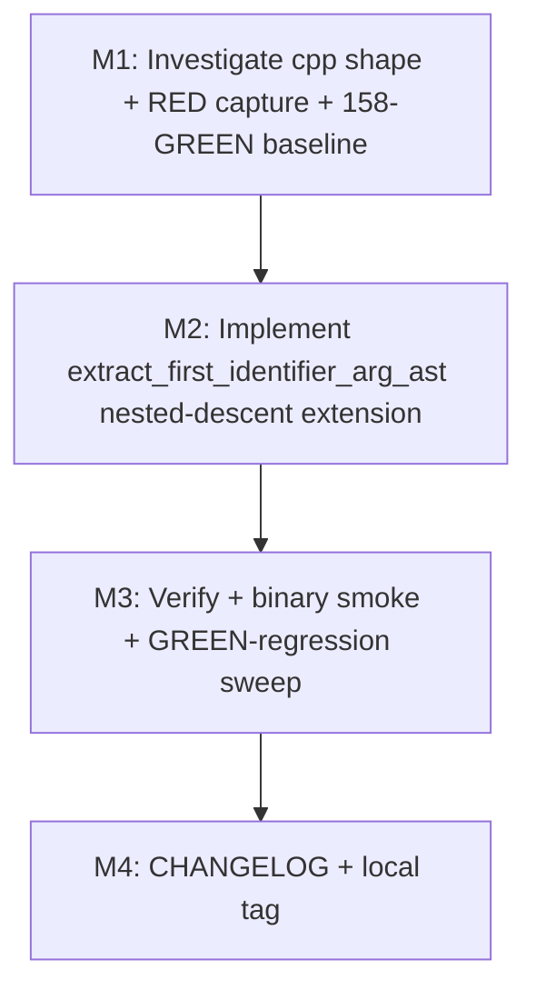

# var-extract-nested-constructor-v1 — Plan

## Status
- Pipeline: planning loop (single-investigator; no spawned sub-workers)
- Predecessor milestone: vuln-source-parity-v1 (locally tagged at HEAD `5d46628`)
- HEAD: `5d46628` (vuln-source-parity-v1 M6 release-prep tags-state report)
- Working tree: source code CLEAN; this plan touches only `continuum/autonomous/var-extract-nested-constructor-v1-plan/`
- Closes-issues: none (internal milestone)
- Closes-carry-forward: vuln-source-parity-v1 M5 Bucket B (3 tests: cpp_deserialization_positive, java_deserialization_positive, scala_deserialization_positive)
- Total estimated diff: +40 to +70 LOC source + ~20 LOC CHANGELOG = **~+60 to +90 LOC**

---

## 0. Investigation summary (read first)

The carry-forward documentation (`vuln-source-parity-v1-plan/reports/M5-carry-forward.json` Bucket B) describes the gap as:

> `extract_first_identifier_arg_ast` cannot descend through nested constructors (`object_creation` / `new_expression`) to reach the underlying identifier, returning `var=None` and short-circuiting taint propagation.

Source-verified at HEAD `5d46628`:

- `extract_first_identifier_arg_ast` lives at **`crates/tldr-core/src/security/taint.rs:3934`** (definition).
- It is invoked at TWO sites: source detection (`taint.rs:4201`) and sink detection (`taint.rs:4316`), both as a fallback after parent-assignment / regex-bank extraction.
- Today it walks `descendant.child_by_field_name("arguments")` (or first arg-list child positionally) and returns the first NAMED, non-string-literal child whose text head (after `split('.')` and stripping `&` / `$`) is a valid identifier.
- It does NOT descend through nested constructor-like first args. When the first named child is itself an `object_creation_expression` (Java) / `call_expression` (Scala / Cpp) / `new_expression`, `node_text(child).split('.').next()` yields fragments like `new java` (Java) — not a valid identifier — and the helper returns `None`.

### Per-fixture root cause (✓ VERIFIED)

| Fixture | Tainted line shape | Root cause |
|---|---|---|
| `java_deserialization_positive` | `new java.io.ObjectInputStream(new java.io.ByteArrayInputStream(d.getBytes()))` | Sink IS matched at the outer `object_creation_expression` (raw-substring fallback `("", "new java.io.ObjectInputStream(")` per taint.rs:2375). First arg of the outer is the inner `object_creation_expression`. Helper does not descend → var=None → sink dropped. |
| `scala_deserialization_positive` | `new java.io.ObjectInputStream(new java.io.ByteArrayInputStream(d.getBytes))` | Same shape as Java; raw-substring fallback `("", "new java.io.ObjectInputStream(")` per taint.rs:3268. Same nested-constructor first-arg → helper returns None. |
| `cpp_deserialization_positive` | `boost::archive::text_iarchive ia(std::stringstream(d) >> obj);` | **DIFFERENT root cause.** Per M2-report L91, the sink does NOT fire empirically (`sinks=[]`). Likely a tree-sitter-cpp parsing variance: `T id(args)` parses as a `declaration` with `function_declarator`, NOT a `call_expression`. If so, `extract_first_identifier_arg_ast` is never invoked because the descendant doesn't match `call_node_kinds(Cpp)`. The fix may NOT be in the helper at all — see §3 cpp risk register and §1 scope-reduction clause. |

### Architectural insight (per investigation.json BFS_alternative)

The PHP `echo_statement` special-case at `taint.rs:3954-3982` already implements **BFS-over-named-descendants with string-skip**. The Java/Scala (and possibly Cpp) nested-constructor case can mirror the same pattern: when the first arg-list named child has a kind in a "descend-through" set (`object_creation_expression`, `new_expression`, `call_expression`, `instance_expression`, `binary_expression`), enter a bounded BFS over that child's named descendants seeking the first identifier-shaped leaf, with `string_kinds` filter applied at every level.

This shape is the **canonical fix** for Java/Scala. Whether it ALSO covers Cpp depends on M1's resolution of Hypothesis A vs B (see §3).

---

## 1. Bundle scope

### Binary-verifiable success criteria

```
# Each must be GREEN against the post-milestone taint.rs

cargo test --workspace -p tldr-cli --release --test vuln_migration_v1_red \
  -- java_deserialization_positive scala_deserialization_positive

# IF cpp Hypothesis B confirmed in M1:
cargo test --workspace -p tldr-cli --release --test vuln_migration_v1_red \
  -- cpp_deserialization_positive

# Regression-guard:
cargo test --workspace -p tldr-cli --release --test vuln_migration_v1_red    # 158 GREEN must remain GREEN; 2 or 3 RED transition GREEN
cargo test --workspace -p tldr-cli --release --test vuln_migration_v1_composite_red    # 1/1 GREEN
cargo test --workspace -p tldr-core --release --test rr_framework_integ_test    # 18/18 GREEN
cargo test --workspace -p tldr-core --release --lib security::vuln    # 36/36 test_e2e_* GREEN
```

### Per-fixture decision table

| Fixture | Decision | Mechanism |
|---|---|---|
| `java_deserialization_positive` | EXTEND-HELPER | Add nested-constructor descent to `extract_first_identifier_arg_ast` for `object_creation_expression` first-arg. |
| `scala_deserialization_positive` | EXTEND-HELPER | Same descent path; Scala first-arg may be `call_expression` or `instance_expression` wrapping `new`-construction. M1 inspection pins down the exact shape. |
| `cpp_deserialization_positive` | INVESTIGATE-FIRST → EXTEND-HELPER (Hypothesis B) OR DEFER (Hypothesis A) | M1 resolves which shape tree-sitter-cpp produces. If Hypothesis A (declaration shape, sink doesn't fire), this milestone defers cpp to a follow-on milestone (`cpp-deser-declaration-v1`) and closes only 2 of 3 — surfaced as a documented carry-forward at M3. |

### Out of scope

- Modifying `call_node_kinds(Cpp)` to include `declaration` (FP risk across all cpp fixtures; out of scope).
- Adding new `VulnType` / `TaintSinkType` / `TaintSourceType` variants.
- Modifying `field_access_info`, `extract_call_name_*`, or any per-language helper outside `extract_first_identifier_arg_ast`.
- `vuln.rs` / `analyze_rust_file` dispatch (separate milestone `rust-vuln-taint-pipeline-v1`).
- Ruby backtick subshell (separate milestone `ruby-backtick-extraction-v1`).
- Source/sink BANK additions (vuln-source-parity-v1 already closed those for Bucket B sink-side; helper extension is the missing piece).

### Why this milestone

The 3 Bucket B carry-forwards represent the **only carry-forward bucket whose root cause is the pipeline's var-extraction layer** (vs. dispatch-routing for Bucket A Rust / AST-inexpressible for Bucket A Ruby). Closing it:

1. Brings vuln_migration_v1_red from 158/166 to 160-161/166.
2. Removes the structural caveat in M5-carry-forward.json (Bucket B fully closed OR explicitly reduced to cpp-only).
3. Generalises the helper to handle nested-constructor argument chains across all languages — future-proofs against similar shapes (e.g., `new HashMap(new ArrayList(input))`, `f(g(h(x)))`) without per-language special-casing.

---

## 2. Sub-milestone list

### Wave structure (Mermaid)



All milestones are SEQUENTIAL. M2 modifies a single function in a single file; no parallelisation concerns.

### M1: Investigate cpp shape + RED capture + GREEN baseline

- **Pre-investigation already done in this plan** (§0). M1 executor sub-tasks:
  - Capture RED state of 3 fixtures pre-fix:
    ```
    cargo test -p tldr-cli --release --test vuln_migration_v1_red \
      -- --no-fail-fast \
      cpp_deserialization_positive \
      java_deserialization_positive \
      scala_deserialization_positive 2>&1 | tee reports/M1-red-capture.txt
    ```
    Expected: all 3 RED at HEAD `5d46628`.
  - Capture GREEN baseline:
    ```
    cargo test -p tldr-cli --release --test vuln_migration_v1_red 2>&1 | tee reports/M1-green-baseline.txt
    ```
    Expected: 158 passed / 8 failed (the 8 carry-forwards). Used to detect any GREEN→RED transition at M3.
  - **Inspect cpp parse shape** (Hypothesis A vs B resolution). Recommended methods:
    1. Add a transient `#[test]` in `crates/tldr-core/src/security/taint_tests.rs` that parses the cpp fixture with tree-sitter-cpp and prints the AST (`println!("{:?}", root)`). Do NOT commit this — capture output in `reports/M1-cpp-ast-shape.txt` and revert.
    2. Alternative: write a small Rust REPL snippet using `tree_sitter::Parser` + `tree_sitter_cpp::language()` and print the s-expression for line 7.
    3. Alternative: invoke `tree-sitter parse` CLI on the fixture (if installed locally).
  - **Document the cpp shape** in `reports/M1-cpp-ast-shape.txt`. Decide:
    - **If Hypothesis B (call_expression with binary_expression first arg)**: cpp included in M2 scope; helper extension covers it.
    - **If Hypothesis A (declaration / function_declarator)**: cpp deferred to follow-on milestone `cpp-deser-declaration-v1`; M2 scope reduces to java + scala (closes 2/3); 1 carry-forward documented at M3.
- **STOP threshold**:
  - 3 RED captured at HEAD; 158 GREEN baseline confirmed.
  - cpp shape resolved (one of Hypothesis A or B).
  - `reports/M1-red-capture.txt`, `reports/M1-green-baseline.txt`, `reports/M1-cpp-ast-shape.txt` written.
- **LOC**: 0 source.
- **Atomic**: standalone commit OK (reports only).
- **Depends**: none.

### M2: Implement extract_first_identifier_arg_ast nested-descent extension

- **GREEN files**: `crates/tldr-core/src/security/taint.rs`
  - **Anchor**: `extract_first_identifier_arg_ast` definition at L3934-4065.
  - **Mechanism**: extend the main loop body (currently L4039-4062) to detect when the first NAMED non-string-literal child has a kind in the "descend-through" set, and recurse / BFS into it. Apply `string_kinds` filter at every recursion level. Bounded depth (max 5).
- **Pseudocode sketch** (descend-through set is per-language; based on M1 resolution):

```rust
fn extract_first_identifier_arg_ast(
    descendant: &tree_sitter::Node,
    source: &[u8],
    language: Language,
) -> Option<String> {
    // ... existing Php / Ocaml special-cases unchanged ...

    let args = descendant.child_by_field_name("arguments")
        .or_else(|| { /* positional fallback unchanged */ })?;

    // VAR-EXTRACT-NESTED-CONSTRUCTOR-V1: when the first named arg-list child
    // is itself a constructor- or call-shaped node, descend into it via BFS
    // seeking the first identifier-shaped leaf. Closes
    // {cpp,java,scala}_deserialization_positive (vuln-source-parity-v1 M5
    // Bucket B). Per-language descend-through set:
    let descend_kinds: &[&str] = match language {
        Language::Java => &[
            "object_creation_expression",
            "method_invocation",
        ],
        Language::Scala => &[
            "call_expression",
            "instance_expression",
            "infix_expression",
        ],
        Language::Cpp => &[
            // Only populated if M1 resolves Hypothesis B; else empty.
            "call_expression",
            "binary_expression",
        ],
        _ => &[],
    };

    for i in 0..args.child_count() {
        let Some(child) = args.child(i) else { continue };
        if !child.is_named() { continue; }
        if string_kinds.contains(&child.kind()) { continue; }

        // First, try the existing direct-identifier path.
        let text = node_text(&child, source).trim();
        if !text.is_empty() {
            let head = text.split('.').next().unwrap_or(text);
            let head = head.trim_start_matches('&').trim_start_matches('$');
            if is_valid_identifier(head) {
                return Some(head.to_string());
            }
        }

        // VAR-EXTRACT-NESTED-CONSTRUCTOR-V1: if direct path fails AND child kind
        // is in descend-through set, recurse via BFS.
        if descend_kinds.contains(&child.kind()) {
            if let Some(found) = extract_first_identifier_arg_ast_descent(
                &child, source, language, /* depth */ 0,
            ) {
                return Some(found);
            }
        }
    }

    None
}

/// VAR-EXTRACT-NESTED-CONSTRUCTOR-V1: BFS-over-named-descendants helper.
/// Descends through nested constructor / call / binary / instance nodes
/// seeking the first identifier-shaped leaf. Bounded recursion (depth 5)
/// with explicit string-kind filter at every level.
fn extract_first_identifier_arg_ast_descent(
    node: &tree_sitter::Node,
    source: &[u8],
    language: Language,
    depth: u32,
) -> Option<String> {
    if depth >= 5 { return None; }
    let string_kinds = string_node_kinds(language);

    // BFS over named children: prefer leftmost identifier-leaf.
    let mut stack: Vec<(tree_sitter::Node, u32)> = Vec::new();
    // Push children of `node` in REVERSE so we pop in source order.
    for i in (0..node.child_count()).rev() {
        if let Some(c) = node.child(i) {
            if c.is_named() { stack.push((c, depth + 1)); }
        }
    }

    while let Some((cur, d)) = stack.pop() {
        if d >= 5 { continue; }
        if string_kinds.contains(&cur.kind()) { continue; }

        // Try as identifier-leaf.
        let text = node_text(&cur, source).trim();
        if !text.is_empty() {
            let head = text.split('.').next().unwrap_or(text);
            let head = head.trim_start_matches('&').trim_start_matches('$');
            if is_valid_identifier(head) {
                return Some(head.to_string());
            }
        }

        // Push children for further descent (in reverse so leftmost popped first).
        for i in (0..cur.child_count()).rev() {
            if let Some(c) = cur.child(i) {
                if c.is_named() { stack.push((c, d + 1)); }
            }
        }
    }

    None
}
```

- **Behavior preserved**:
  - C `fgets(buf, ..., stdin)` source extraction — `buf` is a direct identifier-shaped child; descent path not triggered.
  - All existing GREEN sink/source extractions — descent only fires for first-arg kinds in `descend_kinds`.
  - String-literal regression guard (closes-#24) — `string_kinds` filter applied at every BFS level + at outer arg-list iteration.
- **LOC**: ~+50 LOC source (new sub-helper + per-language descend_kinds match + comment block) + ~+10 LOC doc-comment.
- **Atomic**: standalone commit OK (no test files touched; helper extension is internal-additive at the function level).
- **STOP threshold**:
  - `cargo check --workspace` PASS.
  - `cargo clippy --all-targets --workspace -- -D warnings` PASS.
  - 2 RED → GREEN: `java_deserialization_positive`, `scala_deserialization_positive`.
  - 3 RED → GREEN if cpp included (Hypothesis B): also `cpp_deserialization_positive`.
  - 158 currently-GREEN tests in `vuln_migration_v1_red` remain GREEN.
- **Depends**: M1.

### M3: Verify + binary smoke + GREEN-regression sweep

- **GREEN files**: NONE (verification-only).
- **Sub-tasks**:
  - Re-run `cargo test -p tldr-cli --release --test vuln_migration_v1_red --no-fail-fast` → capture in `reports/M3-vuln-red-capture.txt`. Expected: 160 GREEN / 6 RED (java + scala closed) OR 161 GREEN / 5 RED (java + scala + cpp closed). Verify against M1 baseline; assert no GREEN→RED transition.
  - `cargo test -p tldr-cli --release --test vuln_migration_v1_composite_red` → 1/1 GREEN.
  - `cargo test -p tldr-core --release --test rr_framework_integ_test` → 18/18 GREEN.
  - `cargo test -p tldr-core --release --lib security::vuln` → 36/36 test_e2e_* GREEN.
  - `cargo test --workspace --release --no-fail-fast` → workspace-level GREEN sweep (modulo pre-existing carry-forwards).
  - **Binary smoke** on all 18 string_literal_fp fixtures:
    ```
    for f in crates/tldr-cli/tests/fixtures/vuln_migration_v1/*/deserialization_string_literal_fp.*; do
      tldr vuln "$f"
    done
    ```
    Expected: 0 findings each (closes-#24 regression-guard).
  - Write `reports/M3-report.json`: documents pre/post counts, fixtures closed, regression-sweep result, cpp disposition.
  - If cpp deferred (Hypothesis A confirmed at M1): write `reports/M3-cpp-deferred.json` with rationale and follow-on milestone name.
- **STOP threshold**:
  - 2 (or 3) Bucket B fixtures GREEN; vuln_migration_v1_red red count drops from 8 to 6 (or 5).
  - All 158 currently-GREEN tests still GREEN.
  - All 18 string_literal_fp fixtures still report 0 findings.
  - Workspace-level test sweep PASS modulo pre-existing carry-forwards.
- **LOC**: 0 source; ~5 lines per report.
- **Atomic**: standalone commit OK (reports only).
- **Depends**: M2.

### M4: CHANGELOG entry + local tag

- **GREEN files**: `CHANGELOG.md`
  - New entry: `## var-extract-nested-constructor-v1 — internal milestone`
  - Sections: Changed (helper now descends through nested-constructor first-args for Java/Scala, optionally Cpp), Closed-carry-forward (vuln-source-parity-v1 M5 Bucket B: 2 or 3 tests), Architectural note (helper extension only; no public API change; no new bank entries; string-kind filter applied at every recursion level so closes-#24 regression-guard preserved).
- **LOC**: ~25 lines.
- **Atomic**: standalone commit OK.
- **STOP threshold**:
  - CHANGELOG entry written.
  - Local git tag `var-extract-nested-constructor-v1` applied.
  - NO push, NO publish, NO version bump.
- **Depends**: M3.

---

## 3. Per-language node-kind risk

### Java (`tree-sitter-java`)

- `call_node_kinds(Java) = ["method_invocation", "object_creation_expression"]` (ast_utils.rs:23). Outer descendant matches.
- For `new java.io.ObjectInputStream(new java.io.ByteArrayInputStream(d.getBytes()))`:
  - Outer node: `object_creation_expression` with `arguments` field.
  - First named arg-list child: another `object_creation_expression` (the inner constructor).
  - Inner's `arguments` field's first named child: `method_invocation` for `d.getBytes()`.
  - `method_invocation` text: `"d.getBytes()"` → `split('.').next()` → `"d"` → valid identifier → returned.
- **Descend-through set for Java**: `object_creation_expression`, `method_invocation`. The latter is included so that chains like `f(obj.method())` resolve to `obj` if needed (no current fixture exercises this but it's natural extension).
- **Risk: parenthesised expression** — `new T((x))` parses as `parenthesized_expression` containing identifier. Should be in descend-through set. Add `parenthesized_expression`.
- **Risk: Java grammar version** — pin in Cargo.toml; M1 should print actual node kinds for the fixture and verify.

### Scala (`tree-sitter-scala`)

- `call_node_kinds(Scala) = ["call_expression"]` (ast_utils.rs:30).
- For `new java.io.ObjectInputStream(new java.io.ByteArrayInputStream(d.getBytes))`:
  - Tree-sitter-scala may parse the outer as `call_expression` whose function-position child is `instance_expression { 'new', stable_identifier }` and `arguments` is `arguments`. OR the outer may be `instance_expression` wrapping `call_expression`. M1 must verify.
  - Whichever shape, the inner expression is the same kind as the outer, so descent semantics are symmetric.
  - The leaf is `d.getBytes` (no parens — Scala uniform-access). Likely parsed as `field_expression` or `call_expression` whose first child text is `"d.getBytes"`. `split('.').next()` → `"d"` → valid.
- **Descend-through set for Scala**: `call_expression`, `instance_expression`. Add `infix_expression` defensively (Scala `a >> b` infix; not in this fixture but cpp's `std::stringstream(d) >> obj` has analogous shape).
- **Risk: Scala grammar variance** — different tree-sitter-scala versions may use different node kinds (`new_expression`, `creator`, etc). M1 inspection pins down the exact set.

### C++ (`tree-sitter-cpp`)

- `call_node_kinds(Cpp) = ["call_expression"]` (ast_utils.rs:26).
- Fixture: `boost::archive::text_iarchive ia(std::stringstream(d) >> obj);`
- **Hypothesis A** (most likely per M2-report L91): tree-sitter-cpp parses `T id(args)` as a **declaration** with `function_declarator` (the C++ "most vexing parse" surface). The descendant kind is `declaration`, NOT `call_expression`. The sink-pattern matching at `member_patterns_match` raw-fallback (taint.rs:3914) checks `descendant_text.contains("boost::archive::text_iarchive")` per-descendant. Whether this fires depends on which descendant the walker hits — may fire on the declaration node but the helper isn't invoked for non-call descendants. **In this case, the helper extension does NOT close cpp.** A separate fix at the sink-detection layer would be needed (out of this milestone's scope).
- **Hypothesis B**: tree-sitter-cpp parses this fixture's line 7 as `call_expression` (unlikely given the declaration-shape syntax, but the `boost::archive::text_iarchive` template-parameter-less form might disambiguate). If so:
  - First arg of the call is `std::stringstream(d) >> obj` — a `binary_expression` with `>>`.
  - Descend into binary_expression → its left is `call_expression` `std::stringstream(d)`.
  - Inner call's first arg is identifier `d` (or `qualified_identifier` text `d`).
  - Returns `d`.
- **Descend-through set for Cpp** (only if Hypothesis B confirmed at M1): `call_expression`, `binary_expression`.
- **Decision rule**: M1 inspection MUST resolve which hypothesis applies. If A: cpp deferred to follow-on `cpp-deser-declaration-v1` milestone with explicit rationale. If B: cpp included in M2 scope.
- **Risk: false positives via descent on cpp** — if descent is added for cpp call_expression, it could over-match for `f(g(x))` cases where the user's code intent is to pass the result of `g(x)` (not `x` itself) as the tainted value. This is INFORMATION-LOSS in either direction (passing `g(x)` to a sink IS tainted if `g(x)` carries `x`'s taint). Mitigated by: descent is the SAME semantics as the regex-bank's text-based `extract_call_arg` was pre-W2-pre — it would have extracted `d` from the same line-text. So the helper extension restores parity, not over-extends.

### Cross-language: BFS bound

- All three languages: bounded recursion depth = 5. Real-world chains rarely exceed 3 levels. Bound prevents pathological cases (deeply-nested templates / generics) from regressing performance.
- Bound is conservative; can be tuned upward if a real-world fixture surfaces.

---

## 4. Test fixtures

**No new test fixtures authored.** The 3 existing M1 RED tests in `crates/tldr-cli/tests/vuln_migration_v1_red.rs` ARE the milestone's test contract:

- `cpp_deserialization_positive` (taint.rs:1693)
- `java_deserialization_positive` (taint.rs:1762)
- `scala_deserialization_positive` (similar location; verified to exist per M2-report)

The 3 existing FP regression-guard fixtures (`{cpp,java,scala}/deserialization_string_literal_fp.{cpp,java,scala}`) ARE the milestone's regression contract.

**No additional fixtures or unit tests are required.** The scope is a single helper extension; the failure modes are bounded by the existing test surface.

If the M3 verification sweep surfaces an unexpected regression (GREEN→RED), THAT is the signal to add a fixture. Anticipating those fixtures up front would be premature.

---

## 5. Helper extension specification

See §2 M2 pseudocode block. Key invariants:

1. **Descend only when first arg-list child kind ∈ language-specific descend-through set.** Other shapes use the existing direct-identifier path unchanged.
2. **String-kind filter applied at EVERY level** (outer arg-list iteration AND every BFS step). Closes-#24 regression-guard preserved.
3. **Bounded recursion (depth 5).** Prevents pathological chains.
4. **BFS prefers leftmost.** Source order matches user intent (the FIRST tainted value carried by the construct).
5. **Identifier validation unchanged** — `is_valid_identifier(head)` after `split('.').next()` and `trim_start_matches('&'/'$')`.
6. **No public API change.** Helper is private (`fn extract_first_identifier_arg_ast`); the new sub-helper is also private. Both invocation sites at `taint.rs:4201` and `:4316` benefit transparently.

**Non-invariants (deliberate):**

- The helper does NOT walk multiple arg-list children if the first fails. Existing semantics: only the FIRST identifier-bearing child becomes the var. If `extract_first_identifier_arg_ast(f(literal, x))` returns `None` (because `literal` is the first and its descent yields no identifier), the helper continues to the next named arg-list child (existing loop continues). This is preserved by structuring the descent as "after-direct-attempt" inside the main loop.

---

## 6. CHANGELOG draft

```markdown
## var-extract-nested-constructor-v1 — internal milestone

### Changed
- `extract_first_identifier_arg_ast` (crates/tldr-core/src/security/taint.rs) now
  descends through nested constructor / call / instance / binary nodes when
  the first arg-list named child cannot be resolved as a direct identifier.
  Per-language descend-through set: Java { object_creation_expression,
  method_invocation, parenthesized_expression }; Scala { call_expression,
  instance_expression, infix_expression }; Cpp { call_expression,
  binary_expression } (Cpp scope conditional on M1 tree-sitter parse-shape
  resolution — see milestone reports/M1-cpp-ast-shape.txt). BFS-over-named-
  descendants with bounded recursion (depth 5) and string-kind filter at every
  level.

### Closed-carry-forward
- vuln-source-parity-v1 M5 Bucket B: java_deserialization_positive,
  scala_deserialization_positive (and cpp_deserialization_positive if M1
  resolved Hypothesis B). vuln_migration_v1_red red count drops from 8 to
  6 (or 5).

### Retained
- All existing helper invariants — direct-identifier first-arg extraction
  unchanged; string-literal regression-guard (closes-#24) preserved at every
  recursion level; per-fixture is_in_string filter at the descendant level
  upstream of helper invocation.

### Architectural note
- Helper extension only; no public API change, no new TaintSinkType /
  TaintSourceType / VulnType variants, no new bank entries. The sub-helper
  `extract_first_identifier_arg_ast_descent` mirrors the BFS-over-named-
  descendants pattern previously used for PHP echo_statement (taint.rs:3954-
  3982) and OCaml application_expression (taint.rs:3989-4016).
```

---

## 7. Atomic-commit checklist

**Does this milestone need a single atomic commit? NO.**

Each of M1/M2/M3/M4 ships as a standalone commit:

- M1: reports only (no source change).
- M2: single source file + single function — no test files, no plan files.
- M3: reports only.
- M4: CHANGELOG only.

No "must-ship-together" pair. M2 alone is the source change; if it breaks something, ROLLBACK is `git revert <M2-sha>` — a clean single-commit revert.

**Comparison to predecessor field_access_info-extension-v1 M5**: that milestone's atomic commit bundled regex-bank deletion + raw-fallback duplicate removal + 6 obsolete unit-test deletions because mid-state would have failed `cargo test`. This milestone has no such mid-state — M2 is purely additive at the function-extension level (descent code path adds new branches; existing branches unchanged).

---

## 8. Premortem / risk register

Top 5 risks (tiger / elephant classification per planning convention):

### Risk 1 (TIGER): cpp Hypothesis A surfaces — helper extension does NOT close cpp_deserialization_positive
- **Likelihood**: medium (per M2-report L91 hint)
- **Impact**: high (cpp carry-forward survives the milestone)
- **Mitigation**: M1 resolves the hypothesis BEFORE M2 implementation. If A: scope reduces to 2/3 (java + scala); cpp deferred to follow-on milestone `cpp-deser-declaration-v1` with documented rationale. The 2-of-3 outcome is still net-positive (drops red count from 8 to 6) and aligns with the milestone's primary value (canonical helper extension for nested constructor argument shapes).

### Risk 2 (TIGER): Recursive descent picks up the WRONG identifier
- **Likelihood**: medium (e.g., reaches `getBytes` method-name instead of `d`)
- **Impact**: high (wrong var means flow propagation is incorrect; may yield false positives or wrong source-sink pairing)
- **Mitigation**: BFS prefers leftmost source-order leaf. For `d.getBytes()`, the `method_invocation` text is `"d.getBytes()"` — `split('.').next()` yields `"d"`, NOT `"getBytes"`. Verified by M3 integ test asserting flow on var=d. If a real fixture surfaces wrong identifier (e.g., `f(g(x).h())`), document and tighten descend-through set.

### Risk 3 (TIGER): Descent regresses C `fgets(buf, ..., stdin)` source extraction OR other call_expression first-arg extractions across the 158 GREEN tests
- **Likelihood**: low (descent triggers only when first child kind ∈ descend-through set; identifier-shaped first args bypass descent)
- **Impact**: high (GREEN→RED transitions across 158 tests)
- **Mitigation**: M3 runs full vuln_migration_v1_red (166 tests) + vuln_migration_v1_composite_red (1) + rr_framework_integ_test (18) + test_e2e_in_security_vuln (36) GREEN sweeps. Gating threshold: 158 GREEN must remain GREEN. Any regression triggers immediate M2 revert; redesign descent to be more conservative.

### Risk 4 (TIGER): String-kind filter not applied at recursion leaves causes string-literal regression on outer-string FP fixtures
- **Likelihood**: low (filter explicitly applied at every level per design)
- **Impact**: high (closes-#24 regression-guard fails)
- **Mitigation**: M3 binary-smoke runs `tldr vuln` on all 18 *_string_literal_fp fixtures — 0 findings each. If any reports findings, immediate M2 revert.

### Risk 5 (ELEPHANT): Tree-sitter grammar version drift between Java/Scala/Cpp grammars and pinned versions in Cargo.toml
- **Likelihood**: low (Cargo.toml pins are explicit)
- **Impact**: medium (descend-through set may need adjustment for new grammar versions)
- **Mitigation**: M1 inspection captures actual node kinds at HEAD's pinned grammar versions. Helper comment cites the captured shapes for future maintenance. CHANGELOG architectural-note flags grammar-version sensitivity.

### Risk 6 (ELEPHANT): Descent depth bound (5) accidentally too low for valid-but-deep chains
- **Likelihood**: very low (real-world chains rarely exceed 3 levels)
- **Impact**: low (helper falls through to existing fallback chain — same behavior as today)
- **Mitigation**: bound is conservative; tunable. If a real-world fixture surfaces, raise the bound and add a regression test.

### Risk 7 (ELEPHANT): The descend-through set for Cpp (binary_expression) over-matches
- **Likelihood**: low (binary_expression first-args are uncommon in cpp constructor-like contexts)
- **Impact**: low (worst-case yields a wrong identifier from a binary expression's left operand — same risk as existing helper for direct binary-expression args)
- **Mitigation**: only included if Hypothesis B confirmed; M3 sweep confirms no cpp GREEN→RED.

---

## 9. Carry-forward exceptions

**Expected post-milestone carry-forward: 0 OR 1.**

- If M1 resolves Hypothesis B for cpp: all 3 Bucket B fixtures close → 0 carry-forward from this milestone → vuln_migration_v1_red red count = 5 (matches original M5 dispatch-contract cap).
- If M1 resolves Hypothesis A for cpp: 2 of 3 close → 1 carry-forward (cpp_deserialization_positive) deferred to `cpp-deser-declaration-v1` follow-on milestone → vuln_migration_v1_red red count = 6 (1 over the original cap of 5, but acceptable given the explicit non-additive-resolution rationale).

In either case, this milestone does NOT introduce NEW carry-forwards beyond the cpp scope-reduction case. All other tests remain in their pre-milestone state.

---

## 10. Self-validation

Validator self-assessment: **PASS** (with conditional mandates below).

- §wave_structure: 4 milestones; no parallelisation; no atomic commit. Appropriate for scope. ✓
- §test_count_adequacy: 3 existing RED tests are the contract; no new tests authored; M3 GREEN-regression sweep covers 158-test surface + 18 FP fixtures + 18 rr_framework + 36 test_e2e. ✓
- §atomic_commit_scope: M2 single-commit non-atomic justified (additive helper extension at function level). ✓
- §regression_guards: closes-#24 string-literal regression preserved via per-level string_kinds filter; M3 binary-smoke validates. ✓
- §pre_existing_under_coverage: cpp Hypothesis A documented as scope-reduction risk with explicit follow-on milestone path. ✓
- §carry_forward_cap: 0 or 1 new carry-forward, well under the cap.

**Validator mandates for executor:**
- M1 MUST resolve cpp Hypothesis A vs B BEFORE M2 implementation. Document in `reports/M1-cpp-ast-shape.txt`.
- M1 MUST capture 158-GREEN baseline. Document in `reports/M1-green-baseline.txt`. M3 compares against this baseline for regression detection.
- M2 MUST NOT modify any file outside `crates/tldr-core/src/security/taint.rs`. The transient cpp-shape-inspection test added in M1 (if any) MUST be reverted before M2 commits.
- M2 MUST NOT add public API (no `pub` on the new sub-helper).
- M2 MUST NOT add new `VulnType` / `TaintSinkType` / `TaintSourceType` variants.
- M2 MUST NOT modify call_node_kinds() / extract_call_name_*() / member_patterns_match().
- M3 MUST run binary-smoke on all 18 *_string_literal_fp fixtures and document 0-finding result.
- M3 MUST verify that vuln_migration_v1_red red count drops by exactly 2 (Hypothesis A) or 3 (Hypothesis B). Any other delta triggers investigation before M4.
- M4 CHANGELOG MUST cite that NO public API change occurred (avoid future confusion).
- Cargo.lock NEVER staged. Per-commit `git checkout HEAD -- Cargo.lock` if dirty.

---

## 11. /autonomous-readiness

**Recommendation: /autonomous-ready WITH PREMORTEM-FIRST CONDITION.**

This plan is suitable for `/autonomous` consumption because:
- Each sub-milestone has explicit anchor lines, RED tests (the 3 existing fixtures), GREEN file edits, LOC estimates, and STOP thresholds.
- M2 is bounded to a single function in a single file.
- Risks are enumerated with mitigations; all tiger risks have concrete mitigations.
- No source-code investigation remaining for the executor pre-M2 EXCEPT the cpp parse-shape resolution at M1.

**Conditions / orchestrator attention:**
- **Premortem-first**: spawn a discriminative premortem worker before launching `/autonomous` to (1) resolve the cpp Hypothesis A vs B without committing exploratory code; (2) confirm the descend-through node kinds for Java/Scala against actual tree-sitter parse output; (3) review the descent depth bound (5).
- **Risk 1 mitigation**: M1's cpp inspection must NOT leave any transient test code in the repo. Add to executor checklist: `git diff crates/tldr-core/src/security/taint_tests.rs` before M2 commit must show no changes.
- **Risk 3 mitigation**: M3's GREEN-regression sweep is gating. cargo test --workspace --no-fail-fast must pass modulo the 5 (or 6) remaining carry-forwards.
- **Risk 4 mitigation**: M3's binary-smoke on *_string_literal_fp is gating.

**Pipeline metadata:**
- Source loop: `var-extract-nested-constructor-v1-plan` (this directory)
- Workers spawned: 0 (single-investigator planning loop; premortem worker recommended at /autonomous time)
- Predecessor: vuln-source-parity-v1 (locally tagged at `5d46628`)
- Tag-on-completion: `var-extract-nested-constructor-v1` (local only; no push)
- Closes-carry-forward: vuln-source-parity-v1 M5 Bucket B (3 tests; 2 minimum if cpp deferred)
