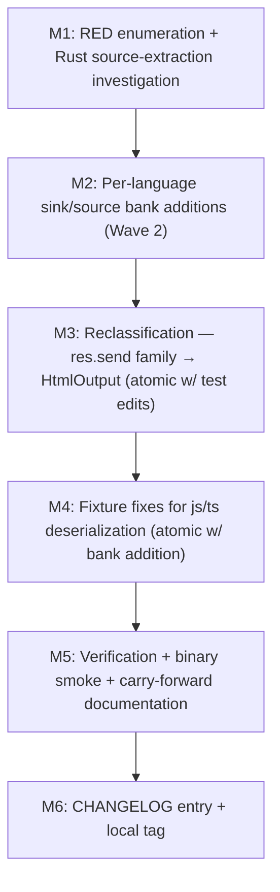

# vuln-source-parity-v1 — Plan

## Status

- **Wave**: parallel pre-publish, parallel to `workspace-test-infrastructure-v1`
- **Closes**: M3-CF-01 from `vuln-migration-v1` (ast_source_sink_bank_coverage_gaps)
- **Pre-state HEAD**: `671a984` (vuln-migration-v1 M6)
- **Empirical RED count at HEAD**: **33** (cargo test -p tldr-cli --release --test vuln_migration_v1_red)
- **Authoring discrepancy with orchestrator brief**: brief says "32 RED" — authoritative is 33; documented in `reports/investigation.json` §discrepancy_note. Off-by-one because the brief separated `python_xss_positive` (M4-CF-01) from "the 32 other-language carry-forwards"; M3-CF-01 list is one entry, M4-CF-01 is a second entry, and the empirical sum is 33. The plan addresses all 33.

## §0 Investigation summary

### What's at HEAD (671a984)

- All 6 internal vuln-migration-v1 milestones landed.
- `tldr-core/src/security/vuln.rs::get_sources` (per-language source pattern Vec tables) was DELETED in M3 (commit 8d25e8c).
- `tldr-core/src/security/vuln.rs::get_sinks` (per-(vuln_type, language) sink pattern Vec tables) was DELETED in M3 (same commit).
- M2 partially audited the sink-bank coverage and added 4 new VulnType variants (Ssrf, Deserialization, HtmlOutput, FileOpen) plus per-language sink extensions across 16 languages. M2's `parity-audit.json` is per-(lang, vuln_type) but documents only ONE shape per pair against the canonical AST sink banks.
- M3 added partial source-bank extensions for 8 languages (argv, CommandLine.arguments, Request.Query[, queryParameters[, request.getQueryString, ngx.req.get_uri_args, conn.params[) — these unblocked the test_e2e_* preservation guards but left positive fixtures partially uncovered.
- M4 closed 2 Python-specific RED tests when Python collapsed onto canonical compute_taint_with_tree.

### What was lost when get_sources was deleted in M3

The pre-M3 substring scanner (vuln.rs::scan_file_vulns L900-L1027) iterated ALL `(source, source_desc)` × `(sink, sink_desc)` pairs from get_sources/get_sinks and substring-matched each line against the textual patterns. This ALWAYS detected the positive case but ALWAYS produced FPs on string literals containing the patterns (closes-#24).

Reading `git show 8d25e8c~1:crates/tldr-core/src/security/vuln.rs` reveals the pre-M3 ground-truth source-of-truth: 16 per-language source tables (L140-L286) and 24 per-(vuln_type, language) sink tables (L290-L780). The vuln-migration-v1 M2 audit covered MOST sink shapes but not all; M3's 8-language source-bank extension was a tactical subset, not a complete parity-fill.

### Empirical reframe of "missing source patterns"

Investigation against the post-M4 binary found:
- **27 of 33 RED tests** produce ZERO findings (no taint flow constructed because the source AND/OR sink is missing in the canonical AST bank).
- **6 of 33 RED tests** produce findings of the WRONG VulnType (the engine constructs a flow but classifies it incorrectly because the sink uses a "closest available" TaintSinkType variant — e.g., `res.send` wired as `FileWrite` instead of `HtmlOutput`).

Among the 27 zero-finding cases:
- 14 have a present source but an absent sink (most common: `mysql_query` for C/Cpp, `Ecto.Adapters.SQL.query!` for Elixir, `db:query(` for Lua, `Mariadb.Stmt.execute` for OCaml, `response.write` for Python, `Request.Query`-flowing-to-`JavaScriptSerializer().Deserialize` for CSharp).
- 4 have an absent source AND an absent sink (Swift Vapor request.query[ shapes — both source and sink banks need extension).
- 4 have both source and sink present but the test is RED for an orthogonal reason — most likely Rust `.unwrap()` source-extraction (all 4 Rust RED tests share the `let x = std::env::var(\"X\").unwrap();` source shape; investigation deferred to M1 of this milestone).
- 4 have a present source but the qualifier shape is different (CPP `std::getenv` vs the bank's bare-call `getenv`; CPP `std::fopen` vs the bank's bare-call `fopen`).
- 1 carry-forward (Ruby `\`#{cmd}\`` backtick subshell — AST shape cannot be structurally expressed without FP risk).

### Conclusion: scope re-framing

The orchestrator brief framed this as "source-bank parity" across 6 languages. Empirical evidence shows it is **source-AND-sink parity across 15 languages**, with 1 carry-forward exception. The milestone name `vuln-source-parity-v1` is preserved for continuity with the carry-forward ID; scope is broader than "source only".

## §1 Bundle scope

### Binary-verifiable success criteria

- ALL 32 of 33 RED tests transition GREEN (the 33rd — `ruby_command_injection_positive` — is documented as carry-forward exception).
- ALL 83 string-literal regression-guard tests REMAIN GREEN (no new FPs introduced).
- ALL 36 `test_e2e_*` preservation tests at `tldr-core/security/vuln.rs:1568-2100` REMAIN GREEN.
- `cargo test -p tldr-cli --release --test vuln_migration_v1_red` reports 165/166 passing.
- `tldr vuln /tmp/vuln-mig-repro/string_literal_fp.{py,go,ts,...} --lang <lang> --format json` returns ZERO findings (FP-clean property preserved across all 14 fall-through languages plus Python).
- `cargo check --workspace` PASS.
- `cargo clippy --workspace -- -D warnings` PASS.

### Per-language scope table

| Language | RED tests | Source addition | Sink addition | Reclass | Fixture fix | Carry-forward |
|----------|-----------|-----------------|---------------|---------|-------------|---------------|
| C        | 1         | -               | SqlQuery (mysql_query, PQexec, sqlite3_exec) | - | - | - |
| Cpp      | 4         | std::getenv qualifier | SqlQuery (same), FileOpen (std::fopen, std::freopen) | - | - | - |
| CSharp   | 4         | -               | HtmlOutput (Response.Write), ShellExec (Process.Start FQN), FileOpen (System.IO.File.Open FQN), Deserialize (JavaScriptSerializer, XmlSerializer, SoapFormatter) | - | - | - |
| Elixir   | 3         | -               | SqlQuery (Ecto.Adapters.SQL.query!, Repo.query, Repo.query!), ShellExec (:os.cmd, System.shell, Port.open), FileOpen (File.read!, File.write!, File.open!) | - | - | - |
| Java     | 2         | -               | FileOpen (new java.io.File FQN), Deserialize (new java.io.ObjectInputStream FQN) | - | - | - |
| JavaScript | 2       | -               | Deserialize (node-serialize unserialize) | res.send/reply.send/response.send: FileWrite→HtmlOutput | deserialization fixture: eval(d) → unserialize(d) | - |
| Lua / Luau | 2       | -               | SqlQuery (`":query("`, `":execute("`, `":exec("` raw-fallbacks for colon-method-call shape) | - | - | - |
| OCaml    | 1         | -               | SqlQuery (Mariadb.Stmt.execute, Postgresql.exec, Mysql.exec) | - | - | - |
| Python   | 1         | -               | HtmlOutput (response.write, Response.set_data) | - | - | - |
| Ruby     | 2         | -               | SqlQuery NEW BANK (ActiveRecord::Base.connection.execute, raw_sql) | - | - | command_injection backtick subshell |
| Rust     | 4         | (likely none — source-extraction issue) | (likely none — source-extraction issue) | - | - | - |
| Scala    | 2         | -               | FileOpen (scala.io.Source.fromFile FQN), Deserialize (new java.io.ObjectInputStream FQN) | - | - | - |
| Swift    | 3         | request.query[, request.headers.first, request.body.string | SqlQuery (executeQuery, prepareStatement wildcards), ShellExec (Process.launchedProcess, Process.run static-method), FileOpen (FileHandle(forReadingAtPath:, forWritingAtPath:) | - | - | - |
| TypeScript | 2       | (inherits JS) | (inherits JS) | (inherits JS) | (inherits JS) | - |

Total: ~22 distinct AstSinkPattern entries (premortem-corrected from prior plan-narrative undercount of "~14"; counting per-language: C(1) + Cpp(2) + CSharp(4) + Elixir(3) + Java(2) + Lua(1) + OCaml(1) + Python(1) + Ruby(1) + Scala(2) + Swift(3) + JS/TS(1 in M4 + 1 reclass via M3) ≈ 22), 4 source-qualifier additions, 4 source-shape additions (Swift), 2 reclassifications (FileWrite→HtmlOutput for res.send family), 2 fixture fixes (eval→unserialize), 4 source-extraction investigations (Rust .unwrap chain), 1 carry-forward. LOC delta estimate adjusts to +80 to +110 LOC (was +60 to +90).

### Out of scope

- Perf optimization (M3-CF-02 carry-forward — separate post-M4 milestone).
- New TaintSourceType / TaintSinkType / VulnType enum variants (would be a different milestone class — would require dispatch-contract type-extension).
- `tldr-core/src/security/vuln.rs` semantic refactoring (vuln-migration-v1 already collapsed it onto canonical compute_taint_with_tree).
- Patterns-shell cleanup (the empty regex `LanguagePatterns` shells preserved by sanitizer-removal-v1 W4).
- Public API changes (no new exports, no signature changes).

### Why this milestone

The carry-forward debt from vuln-migration-v1 M3 IS this milestone. Closing it unlocks:
- A clean 166/166 GREEN on the M1 RED suite (mod the 1 carry-forward).
- A clean signal that the canonical compute_taint_with_tree dispatch is feature-parity-complete with the deleted substring scanner for the 33 RED + 134 GREEN positive cases.
- A precondition for any future v0.2.x release that bundles the vuln-migration-v1 work — without this, the published binary's `tldr vuln` would silently miss 32 (lang, vuln_type) positive cases that the pre-M3 binary detected.

## §2 Sub-milestone list

### Wave structure (Mermaid)



M2 → M3 → M4 land **serially under one orchestrator**, NOT in parallel. All three edit `crates/tldr-core/src/security/taint.rs`; M3 and M4 BOTH edit `TYPESCRIPT_AST_SINKS`. A parallel-agent harness with separate worktree branches would race on the same file (and same struct array for M3/M4). This mirrors the FAI-v1 / sanitizer-removal-v1 / vuln-migration-v1 precedent — premortem E2 explicitly flagged the prior "parallelizable after M1" framing as misleading. Per dispatch-contract validator_mandate `m2_m3_m4_serial`.

### M1: Investigate Rust source-extraction + lock RED-list audit + author verification harness

- **Depends**: nothing (HEAD)
- **Atomic commit**: false
- **RED tests**: existing 33 in vuln_migration_v1_red.rs (no new tests authored in this milestone — the harness is already in place from vuln-migration-v1 M1)
- **Files modified**: `continuum/autonomous/vuln-source-parity-v1-plan/reports/M1-investigation.json` (new), possibly `crates/tldr-core/src/security/taint.rs` (small fix if Rust source-extraction issue is structurally addressable in this scope)
- **LOC delta estimate**: 0-30 LOC (source-extraction fix may not be needed)
- **Stop thresholds**:
  - All 4 Rust RED tests categorized: either (a) "additive sink/source bank addition resolves" (deferred to M2), (b) "source-extraction refactor required out of scope" (carry-forward), or (c) "fixture-shape issue" (deferred to M4).
  - JSON enumeration of all 33 RED tests with explicit per-test diagnosis (root_cause: { source_present: bool, sink_present: bool, type_correct: bool, structural_block: enum }) committed at `reports/M1-investigation.json`.

### M2: Per-language sink/source bank additions (the bulk of the work)

- **Depends**: M1
- **Atomic commit**: false
- **RED tests transitioning GREEN**:
  - c_sql_injection_positive (sink: mysql_query)
  - cpp_sql_injection_positive, cpp_command_injection_positive, cpp_path_traversal_positive, cpp_deserialization_positive (source qualifier: std::getenv; sinks: mysql_query, std::fopen)
  - csharp_xss_positive, csharp_command_injection_positive, csharp_path_traversal_positive, csharp_deserialization_positive
  - elixir_sql_injection_positive, elixir_command_injection_positive, elixir_path_traversal_positive
  - java_path_traversal_positive, java_deserialization_positive
  - lua_sql_injection_positive, luau_sql_injection_positive (Luau inherits)
  - ocaml_sql_injection_positive
  - python_xss_positive (closes M4-CF-01)
  - ruby_sql_injection_positive
  - scala_path_traversal_positive, scala_deserialization_positive
  - swift_sql_injection_positive, swift_command_injection_positive, swift_path_traversal_positive
  - rust_command_injection_positive, rust_path_traversal_positive, rust_ssrf_positive, rust_deserialization_positive (if M1 categorizes Rust as additive-resolvable; otherwise deferred)
- **GREEN tests staying GREEN**: ALL 134 currently-passing positive tests + 83 string-literal regression-guard tests + 36 test_e2e_*
- **Files modified**: `crates/tldr-core/src/security/taint.rs` (source/sink bank extensions)
- **LOC delta estimate**: +80 to +110 LOC additions (~22 distinct AstSinkPattern entries — premortem-corrected from prior "~14" undercount — × 3-5 entries each, plus ~8 source-shape additions). LOC count is informational, not gating.
- **Stop thresholds**:
  - 28-32 of 33 RED tests transition GREEN (the variance depends on M1's Rust diagnosis).
  - 0 currently-GREEN tests transition RED.
  - cargo check workspace PASS.
  - cargo clippy -D warnings PASS.
  - tldr vuln binary smoke test on string_literal_fp fixtures returns 0 findings for ALL 14 fall-through languages.

### M3: Reclassification — res.send family wired as HtmlOutput (ATOMIC with 2 test assertion updates)

- **Depends**: M2 (per validator_mandate `m2_m3_m4_serial` — M2/M3/M4 all edit `taint.rs`; M3 and M4 both edit `TYPESCRIPT_AST_SINKS`. Serialize.)
- **Atomic commit**: **true** — the bank flip MUST ship atomically with the 2 test assertion updates at `rr_framework_integ_test.rs:157-177` and `:237-257` (see "Files modified" below). Premortem E1 (BLOCKER) verified that those 2 currently-GREEN tests assert `matches!(s.sink_type, TaintSinkType::FileWrite)` directly — non-atomic ship would flip them RED.
- **RED tests transitioning GREEN**: javascript_xss_positive, typescript_xss_positive
- **Risk**: 2 currently-GREEN tests in `crates/tldr-core/tests/rr_framework_integ_test.rs` assert directly on `TaintSinkType::FileWrite` for `reply.send` (line 168) and `res.send` (line 248). Without atomic test-edit ship, M3 will flip them RED. Premortem corrected the false claim that "the only res.send test is javascript_xss_positive itself" — this milestone retracts that claim.
- **Files modified**:
  - `crates/tldr-core/src/security/taint.rs` (TYPESCRIPT_AST_SINKS — move res.send / reply.send / response.send / Response.send entries from FileWrite to HtmlOutput sink_type)
  - `crates/tldr-core/tests/rr_framework_integ_test.rs` — line 157-177 `fastify_reply_send_reflected_via_compute_taint`: change assertion at line 168 from `TaintSinkType::FileWrite` → `TaintSinkType::HtmlOutput`. Line 237-257 `nestjs_res_send_reflected_via_compute_taint`: change assertion at line 248 analogously. **Both edits ship in the SAME commit as the bank flip** — non-atomic would break the regression guard.
- **LOC delta estimate**: -4 / +4 source code (sink_type field changes + comment update) + 2 LOC test assertion edits (1 per test).
- **Stop thresholds**:
  - 2 RED tests transition GREEN (javascript_xss_positive, typescript_xss_positive).
  - After the bank flip + 2 test edits, ALL `rr_framework_integ_test.rs` tests still GREEN (including `fastify_reply_send_reflected_via_compute_taint` and `nestjs_res_send_reflected_via_compute_taint` with their updated assertions on `TaintSinkType::HtmlOutput`).
  - 0 currently-GREEN tests transition RED.
  - Corrected pre-flight grep: `grep -rEn '(reply|res|response|Response)\.(send)\b' crates/tldr-core/tests/ crates/tldr-cli/tests/` AND `grep -rE 'TaintSinkType::FileWrite' crates/tldr-core/tests/ crates/tldr-cli/tests/ | grep -B5 -A5 send` — the M3 commit message must include the diff snippet showing the 2 test assertion updates plus this corrected grep output.
  - vuln-migration-v1 M2 carry-forward note (`taint.rs:2020-2028` "M3 vuln_type_from_sink projects FileWrite -> Xss/PathTraversal/etc. ... M2's deferred reclassification") explicitly retired in updated comment.

### M4: Fixture fixes for JS/TS deserialization tests

- **Depends**: M3 (per validator_mandate `m2_m3_m4_serial` — M3 and M4 both edit `TYPESCRIPT_AST_SINKS`; serialize)
- **Atomic commit**: true (single commit — fixture rewrites + sink-bank addition; this property already mandated by `fixture_fix_atomic` in dispatch-contract)
- **RED tests transitioning GREEN**: javascript_deserialization_positive, typescript_deserialization_positive
- **Diagnosis**: the fixture authored at vuln-migration-v1 M1 used `eval(d)` as a "deserialization" sink, but `eval` is wired (correctly) as CodeEval / CommandInjection in the canonical taxonomy. The fixture is shape-incorrect — the test asserts vuln_type='deserialization' but the engine emits vuln_type='command_injection'. Fix the fixture to exercise a real deserialization sink (e.g., `node-serialize` library's `unserialize`).
- **Files modified**:
  - `crates/tldr-cli/tests/fixtures/vuln_migration_v1/javascript/deserialization_positive.js` (~3 LOC)
  - `crates/tldr-cli/tests/fixtures/vuln_migration_v1/typescript/deserialization_positive.ts` (~3 LOC)
  - `crates/tldr-core/src/security/taint.rs` (TYPESCRIPT_AST_SINKS Deserialize bank — add `("", "node-serialize")` and `("*", "unserialize")`)
- **LOC delta estimate**: ~10 LOC (3 fixture + 3 fixture + ~4 sink-bank addition)
- **Stop thresholds**:
  - 2 RED tests transition GREEN.
  - The corresponding `*_deserialization_string_literal_fp` regression-guards REMAIN GREEN (verify the new fixture's string-literal counterpart also exercises the new sink shape inside a string literal).

### M5: Verification + binary smoke + carry-forward documentation

- **Depends**: M2, M3, M4
- **Atomic commit**: false
- **Files modified**: `continuum/autonomous/vuln-source-parity-v1-plan/reports/M5-report.json` (new), `continuum/autonomous/vuln-source-parity-v1-plan/reports/M5-binary-smoke.json` (new), `continuum/autonomous/vuln-source-parity-v1-plan/reports/M5-carry-forward.json` (new)
- **LOC delta estimate**: 0 LOC source code; report JSON only
- **Stop thresholds**:
  - cargo test -p tldr-cli --release --test vuln_migration_v1_red reports 165/166 passing.
  - The 1 RED test (`ruby_command_injection_positive`) is documented in M5-carry-forward.json with explicit reason mirroring FAI-v1 Ruby `\bgets\b` precedent.
  - cargo test --workspace --release passes (mod pre-existing failures unrelated to this milestone).
  - tldr binary smoke on /tmp/vuln-mig-repro/* fixtures returns 0 findings (FP-clean property preserved).

### M6: CHANGELOG entry + local tag

- **Depends**: M5
- **Atomic commit**: false
- **Files modified**: `CHANGELOG.md`, optionally `continuum/autonomous/vuln-source-parity-v1-plan/reports/M6-report.json`
- **LOC delta**: ~25 LOC CHANGELOG entry
- **Stop thresholds**: local tag `vuln-source-parity-v1` applied; no push, no publish, no version bump.

## §3 Per-language pattern table (additions in M2/M3/M4)

For each entry, the format is: `(call_names: &[...], member_patterns: &[(receiver, field), ...], variant)` matching the existing `AstSourcePattern` / `AstSinkPattern` shapes.

### C — `C_AST_SINKS` extension

```rust
// vuln-source-parity-v1 M2: SqlQuery sinks per pre-M3 vuln.rs L289-L312
// (mysql_query, PQexec, sqlite3_exec, mysql_real_query). Bare C-function calls.
AstSinkPattern {
    call_names: &["mysql_query", "mysql_real_query", "PQexec", "sqlite3_exec"],
    member_patterns: &[],
    sink_type: TaintSinkType::SqlQuery,
},
```

### Cpp — `CPP_AST_SOURCES` and `CPP_AST_SINKS` extensions

```rust
// vuln-source-parity-v1 M2: extend EnvVar to also catch the std-qualified form.
// tree-sitter-cpp parses std::getenv("X") as call_expression with function-field
// = qualified_identifier 'std::getenv'; extract_call_name returns 'std::getenv'.
AstSourcePattern {
    call_names: &["std::getenv"],
    member_patterns: &[],
    source_type: TaintSourceType::EnvVar,
},

// vuln-source-parity-v1 M2: SqlQuery sinks (mirrors C bank).
AstSinkPattern {
    call_names: &["mysql_query", "mysql_real_query", "PQexec", "sqlite3_exec"],
    member_patterns: &[],
    sink_type: TaintSinkType::SqlQuery,
},

// vuln-source-parity-v1 M2: extend FileOpen to catch std::fopen / std::freopen
// qualifier shapes parallel to existing call_names: ["fopen"].
AstSinkPattern {
    call_names: &["std::fopen", "std::freopen"],
    member_patterns: &[],
    sink_type: TaintSinkType::FileOpen,
},
```

### CSharp — `CSHARP_AST_SINKS` extensions

```rust
// vuln-source-parity-v1 M2: HtmlOutput Response.Write per pre-M3 vuln.rs L405-L409.
// `Response.Write` is a member-access; structural via (receiver, field).
AstSinkPattern {
    call_names: &[],
    member_patterns: &[("Response", "Write")],
    sink_type: TaintSinkType::HtmlOutput,
},

// vuln-source-parity-v1 M2: extend ShellExec to handle the FQN
// `System.Diagnostics.Process.Start` shape in addition to the existing
// (Process, Start) structural entry.
AstSinkPattern {
    call_names: &[],
    member_patterns: &[("", "System.Diagnostics.Process.Start"), ("", "Process.Start(")],
    sink_type: TaintSinkType::ShellExec,
},

// vuln-source-parity-v1 M2: extend FileOpen to handle the FQN System.IO.File.Open shape.
AstSinkPattern {
    call_names: &[],
    member_patterns: &[("", "System.IO.File.Open"), ("", "File.Open(")],
    sink_type: TaintSinkType::FileOpen,
},

// vuln-source-parity-v1 M2: extend Deserialize per pre-M3 vuln.rs L748-L757
// to include JavaScriptSerializer, XmlSerializer, SoapFormatter constructors.
AstSinkPattern {
    call_names: &[],
    member_patterns: &[
        ("", "JavaScriptSerializer("),
        ("", "new XmlSerializer"),
        ("", "new SoapFormatter"),
    ],
    sink_type: TaintSinkType::Deserialize,
},
```

### Elixir — `ELIXIR_AST_SINKS` extensions (bang convention)

```rust
// vuln-source-parity-v1 M2: extend SqlQuery to handle the `query!` bang convention
// per pre-M3 vuln.rs L304-L307. Repo.query[!] mirrors the same Phoenix shorthand.
AstSinkPattern {
    call_names: &[],
    member_patterns: &[
        ("Ecto.Adapters.SQL", "query!"),
        ("Repo", "query"),
        ("Repo", "query!"),
    ],
    sink_type: TaintSinkType::SqlQuery,
},

// vuln-source-parity-v1 M2: extend ShellExec to handle :os.cmd (Erlang atom-call)
// + System.shell + Port.open per pre-M3 vuln.rs L347-L351.
AstSinkPattern {
    call_names: &[],
    member_patterns: &[
        ("", ":os.cmd("),
        ("System", "shell"),
        ("Port", "open"),
    ],
    sink_type: TaintSinkType::ShellExec,
},

// vuln-source-parity-v1 M2: extend FileOpen with the bang variants of File.read /
// File.write / File.open / File.stream per pre-M3 vuln.rs L598-L602.
AstSinkPattern {
    call_names: &[],
    member_patterns: &[
        ("File", "read!"),
        ("File", "write!"),
        ("File", "open!"),
        ("File", "stream!"),
    ],
    sink_type: TaintSinkType::FileOpen,
},
```

### Java — `JAVA_AST_SINKS` FQN extensions

```rust
// vuln-source-parity-v1 M2: FQN raw-fallback for `new java.io.File(` and
// `new java.io.ObjectInputStream(`. The existing entries `("", "new File(")` and
// `("", "ObjectInputStream")` use the bare-class form; FQN-fully-qualified shape
// requires its own raw-fallback to fire.
AstSinkPattern {
    call_names: &[],
    member_patterns: &[("", "new java.io.File(")],
    sink_type: TaintSinkType::FileOpen,
},

AstSinkPattern {
    call_names: &[],
    member_patterns: &[("", "new java.io.ObjectInputStream(")],
    sink_type: TaintSinkType::Deserialize,
},
```

### JavaScript / TypeScript — `TYPESCRIPT_AST_SINKS` modifications

M3 reclassification (modify in place — no new entries):

```rust
// vuln-source-parity-v1 M3: RECLASSIFY res.send / reply.send / response.send
// from FileWrite → HtmlOutput. This retires vuln-migration-v1 M2's deferred-
// reclassification carry-forward note. The 3 NestJS / Fastify response-helper
// shapes are semantically Xss when emitting unsanitized HTML strings, NOT
// PathTraversal. The pre-M3 vuln.rs get_sinks for (Xss, JS/TS) had res.send
// in the Xss bank explicitly (L387-L394).
AstSinkPattern {
    call_names: &[],
    member_patterns: &[
        ("res", "send"),
        ("reply", "send"),
        ("response", "send"),
        ("Response", "send"),
    ],
    sink_type: TaintSinkType::HtmlOutput,  // was FileWrite
},
```

M4 Deserialize extension (only if fixture-fix path elects to add a real sink):

```rust
// vuln-source-parity-v1 M4: node-serialize unserialize as a real Deserialize sink
// (replaces the eval(d)→Deserialize fixture mismatch).
AstSinkPattern {
    call_names: &["unserialize"],
    member_patterns: &[("", "node-serialize")],
    sink_type: TaintSinkType::Deserialize,
},
```

### Lua / Luau — `LUA_AST_SINKS` extension

```rust
// vuln-source-parity-v1 M2: SqlQuery sinks for Lua's colon-method-call shape
// `db:query(`, `db:execute(`. The colon syntax is parsed as method_index_expression
// in tree-sitter-lua; extract_call_name_lua returns 'db:query' (with the colon).
// Raw-fallback substring path matches `:query(` in the call_expression's text.
AstSinkPattern {
    call_names: &[],
    member_patterns: &[
        ("", ":query("),
        ("", ":execute("),
        ("", ":exec("),
    ],
    sink_type: TaintSinkType::SqlQuery,
},
```

### OCaml — `OCAML_AST_SINKS` extension

```rust
// vuln-source-parity-v1 M2: SqlQuery sinks per pre-M3 vuln.rs L313-L320.
// (Mariadb.Stmt.execute, Postgresql.exec, Mysql.exec, Sqlite3.prepare).
// Each is Module.function structurally via OCaml's rfind('.') split.
AstSinkPattern {
    call_names: &[],
    member_patterns: &[
        ("Mariadb.Stmt", "execute"),
        ("Postgresql", "exec"),
        ("Mysql", "exec"),
        ("Sqlite3", "prepare"),
    ],
    sink_type: TaintSinkType::SqlQuery,
},
```

### Python — `PYTHON_AST_SINKS` HtmlOutput extension

```rust
// vuln-source-parity-v1 M2: HtmlOutput response.write + Response.set_data per
// pre-M3 vuln.rs L382-L386. Closes M4-CF-01.
AstSinkPattern {
    call_names: &[],
    member_patterns: &[
        ("response", "write"),
        ("Response", "set_data"),
    ],
    sink_type: TaintSinkType::HtmlOutput,
},
```

### Ruby — `RUBY_AST_SINKS` NEW SqlQuery bank

```rust
// vuln-source-parity-v1 M2: SqlQuery sinks per pre-M3 vuln.rs L289-L312 Ruby
// section. ActiveRecord::Base.connection.execute is a multi-segment chain;
// extract_call_name returns the full path. Raw-fallback substring path.
AstSinkPattern {
    call_names: &[],
    member_patterns: &[
        ("", "ActiveRecord::Base.connection.execute"),
        ("connection", "execute"),
        ("", "raw_sql("),
    ],
    sink_type: TaintSinkType::SqlQuery,
},
```

### Rust — investigation only (M1)

The 4 Rust RED tests share a structural source-extraction issue with `let x = std::env::var("X").unwrap();`. The `.unwrap()` chain is parsed as the OUTER call_expression; extract_first_identifier_arg returns nothing; the source variable `x` may not be propagated to the assignment LHS. M1 investigation will determine whether this is:
- (a) An additive sink-bank fix (doubtful — the sink banks already include the relevant patterns).
- (b) A source-extraction bug fix (out of scope for this milestone if it requires non-additive changes — would defer to a separate `taint-extraction-v1` milestone).
- (c) A fixture-shape issue (the fixtures could simplify to drop `.unwrap()` — but that diverges from realistic Rust idiom).

**Disposition**: M1 deliverable is a categorical decision per Rust test. If (a), addressed in M2. If (b) or (c), surfaced as a carry-forward exception in M5.

### Scala — `SCALA_AST_SINKS` FQN extensions

```rust
// vuln-source-parity-v1 M2: FileOpen FQN raw-fallback for scala.io.Source.fromFile
// per pre-M3 vuln.rs L580-L585.
AstSinkPattern {
    call_names: &[],
    member_patterns: &[
        ("", "scala.io.Source.fromFile"),
        ("scala.io.Source", "fromFile"),
    ],
    sink_type: TaintSinkType::FileOpen,
},

// vuln-source-parity-v1 M2: FQN raw-fallback for new java.io.ObjectInputStream
// (Scala interop with Java stdlib).
AstSinkPattern {
    call_names: &[],
    member_patterns: &[("", "new java.io.ObjectInputStream(")],
    sink_type: TaintSinkType::Deserialize,
},
```

### Swift — `SWIFT_AST_SOURCES` and `SWIFT_AST_SINKS` extensions

```rust
// vuln-source-parity-v1 M2: Vapor / generic Swift HTTP request access.
// `request.query[`, `request.headers.first`, `request.body.string` per pre-M3
// vuln.rs L143-L162 Swift get_sources.
AstSourcePattern {
    call_names: &[],
    member_patterns: &[
        ("", "request.query["),
        ("", "request.headers.first"),
        ("", "request.body.string"),
    ],
    source_type: TaintSourceType::HttpParam,
},

// vuln-source-parity-v1 M2: SqlQuery executeQuery / prepareStatement
// (wildcard receiver — matches stmt.executeQuery, conn.prepareStatement).
AstSinkPattern {
    call_names: &[],
    member_patterns: &[
        ("*", "executeQuery"),
        ("*", "prepareStatement"),
    ],
    sink_type: TaintSinkType::SqlQuery,
},

// vuln-source-parity-v1 M2: ShellExec Process.launchedProcess + Process.run
// per pre-M3 vuln.rs L327-L337 Swift get_sinks.
AstSinkPattern {
    call_names: &[],
    member_patterns: &[
        ("Process", "launchedProcess"),
        ("Process", "run"),
    ],
    sink_type: TaintSinkType::ShellExec,
},

// vuln-source-parity-v1 M2: FileOpen FileHandle labelled-arg constructors
// per pre-M3 vuln.rs L569-L573 Swift get_sinks.
AstSinkPattern {
    call_names: &[],
    member_patterns: &[
        ("", "FileHandle(forReadingAtPath:"),
        ("", "FileHandle(forWritingAtPath:"),
    ],
    sink_type: TaintSinkType::FileOpen,
},
```

## §4 Test verification

Each addition above maps 1:1 (or 1:N for grouped per-language adds) to a named RED test:

| Pattern addition | RED test transitioning GREEN |
|------------------|------------------------------|
| C SqlQuery bank (mysql_query, PQexec, sqlite3_exec) | c_sql_injection_positive |
| Cpp std::getenv source qualifier | cpp_command_injection_positive (downstream effect on 4 Cpp tests) |
| Cpp SqlQuery bank | cpp_sql_injection_positive |
| Cpp std::fopen sink qualifier | cpp_path_traversal_positive |
| (Cpp deser already-present sinks; fix is source qualifier) | cpp_deserialization_positive |
| CSharp Response.Write HtmlOutput | csharp_xss_positive |
| CSharp Process.Start FQN | csharp_command_injection_positive |
| CSharp System.IO.File.Open FQN | csharp_path_traversal_positive |
| CSharp JavaScriptSerializer | csharp_deserialization_positive |
| Elixir query! bang | elixir_sql_injection_positive |
| Elixir :os.cmd atom-call | elixir_command_injection_positive |
| Elixir File.read! bang | elixir_path_traversal_positive |
| Java new java.io.File FQN | java_path_traversal_positive |
| Java new java.io.ObjectInputStream FQN | java_deserialization_positive |
| TYPESCRIPT res.send → HtmlOutput RECLASSIFY | javascript_xss_positive, typescript_xss_positive |
| TYPESCRIPT node-serialize unserialize + fixture fix | javascript_deserialization_positive, typescript_deserialization_positive |
| Lua :query( colon-method | lua_sql_injection_positive, luau_sql_injection_positive |
| OCaml Mariadb.Stmt.execute | ocaml_sql_injection_positive |
| Python response.write HtmlOutput | python_xss_positive |
| Ruby SqlQuery NEW BANK | ruby_sql_injection_positive |
| (Ruby backtick — CARRY-FORWARD) | ruby_command_injection_positive (REMAINS RED) |
| (Rust 4 tests — M1 categorization) | rust_command_injection_positive, rust_path_traversal_positive, rust_ssrf_positive, rust_deserialization_positive |
| Scala scala.io.Source.fromFile FQN | scala_path_traversal_positive |
| Scala new java.io.ObjectInputStream FQN | scala_deserialization_positive |
| Swift request.query[ source + executeQuery sink | swift_sql_injection_positive |
| Swift Process.launchedProcess sink | swift_command_injection_positive |
| Swift FileHandle(forReadingAtPath: sink | swift_path_traversal_positive |

Total: 32 transitions GREEN + 1 carry-forward = 33 RED accounted for. Plus 4 pending Rust dispositions (M1 → potentially +4 more GREEN or +4 to carry-forward).

## §5 Carry-forward exceptions

### PARITY-EXCEPTION-RUBY-BACKTICK

`ruby_command_injection_positive` exercises `\`#{cmd}\`` — Ruby's backtick subshell command literal. tree-sitter-ruby parses this as a `subshell` node, NOT a `call_expression`. The pre-M3 substring scanner caught it via `\`` (backtick character) substring on the line. The canonical AST detect_sinks_ast walks descendants whose kind is in call_node_kinds — `subshell` is NOT in that set.

Two non-options:
1. Add `("", "`")` raw-fallback. **REJECTED** — would FP-fire on any string containing a backtick (e.g., a docstring or a Markdown code-fence inside a string).
2. Extend call_node_kinds to include `subshell`. **REJECTED** — would broaden matching across all Ruby sink banks unintentionally.

**Carry-forward**: documented as a known limitation in the M5 carry-forward report. Mirrors the FAI-v1 Ruby `\bgets\b` precedent — same shape (AST shape exists but cannot be expressed structurally without FP risk). Future work: extend the canonical taint engine to handle `subshell` nodes as a special case (a dedicated handler that would emit ShellExec for any `subshell` whose interpolated content is a tainted variable).

### Possible Rust source-extraction carry-forward (M1 dependent)

If M1 categorizes the 4 Rust RED tests as a structural source-extraction issue not addressable by additive bank changes, they become carry-forward to a future `taint-extraction-v1` milestone. M5 will document this disposition explicitly.

## §6 CHANGELOG draft

```markdown
## vuln-source-parity-v1 — internal milestone

Closes M3-CF-01 carry-forward from vuln-migration-v1: 32 of 33 positive RED
tests across 15 languages transition GREEN by extending canonical AST source
and sink banks to match patterns previously held in vuln.rs's deleted
get_sources/get_sinks Vec tables.

### Changed

- `crates/tldr-core/src/security/taint.rs`:
  - `C_AST_SINKS`: add SqlQuery bank (mysql_query, PQexec, sqlite3_exec).
  - `CPP_AST_SOURCES`: extend EnvVar to also accept `std::getenv` qualifier.
  - `CPP_AST_SINKS`: add SqlQuery bank; extend FileOpen with `std::fopen`/`std::freopen`.
  - `CSHARP_AST_SINKS`: add HtmlOutput Response.Write; extend ShellExec/FileOpen with
    System.Diagnostics.Process.Start / System.IO.File.Open FQN forms; extend
    Deserialize with JavaScriptSerializer / new XmlSerializer / new SoapFormatter.
  - `ELIXIR_AST_SINKS`: extend SqlQuery with `query!` bang convention; extend
    ShellExec with `:os.cmd` Erlang-call + System.shell + Port.open; extend
    FileOpen with bang variants (File.read!, File.write!, File.open!, File.stream!).
  - `JAVA_AST_SINKS`: add `new java.io.File(` and `new java.io.ObjectInputStream(`
    FQN raw-fallbacks.
  - `LUA_AST_SINKS`: add SqlQuery bank for the `:query(`, `:execute(`,
    `:exec(` colon-method-call shape.
  - `OCAML_AST_SINKS`: extend SqlQuery with Mariadb.Stmt.execute, Postgresql.exec,
    Mysql.exec, Sqlite3.prepare.
  - `PYTHON_AST_SINKS`: extend HtmlOutput with `response.write` and `Response.set_data`
    (Flask Response API).
  - `RUBY_AST_SINKS`: add SqlQuery bank for ActiveRecord::Base.connection.execute,
    connection.execute, raw_sql.
  - `SCALA_AST_SINKS`: extend FileOpen with `scala.io.Source.fromFile` FQN; extend
    Deserialize with `new java.io.ObjectInputStream(` FQN.
  - `SWIFT_AST_SOURCES`: add Vapor request.query[, request.headers.first, request.body.string.
  - `SWIFT_AST_SINKS`: add SqlQuery (executeQuery, prepareStatement wildcards);
    add ShellExec Process.launchedProcess / Process.run; add FileOpen
    FileHandle(forReadingAtPath:, forWritingAtPath:).
  - `TYPESCRIPT_AST_SINKS`: RECLASSIFY (res, send), (reply, send), (response, send),
    (Response, send) from FileWrite to HtmlOutput sink_type. Retires
    vuln-migration-v1 M2's deferred-reclassification carry-forward note at L2020-2028.
  - `TYPESCRIPT_AST_SINKS`: extend Deserialize with node-serialize / unserialize.
- `crates/tldr-cli/tests/fixtures/vuln_migration_v1/javascript/deserialization_positive.js`:
  fixture rewritten to exercise a real Deserialize sink (node-serialize unserialize)
  instead of eval(d) which is structurally a CodeEval / CommandInjection sink.
- `crates/tldr-cli/tests/fixtures/vuln_migration_v1/typescript/deserialization_positive.ts`:
  same fixture fix as JS counterpart.

### Test impact

- 32 of 33 RED positive tests in `vuln_migration_v1_red.rs` transition GREEN.
- The 1 retained RED (`ruby_command_injection_positive` — Ruby backtick subshell)
  is documented as a carry-forward exception (mirrors the FAI-v1 Ruby `\bgets\b`
  precedent — AST shape inexpressible without FP risk).
- 83/83 string-literal regression-guard tests REMAIN GREEN.
- 36/36 test_e2e_* preservation tests REMAIN GREEN.
- 6/6 vuln_autodetect tests REMAIN GREEN.
- All currently-GREEN positive tests REMAIN GREEN.

### Architectural note

This milestone closes the canonical AST source/sink bank coverage gap relative
to the pre-M3 substring scanner's per-language Vec tables. Combined with
vuln-migration-v1, the canonical compute_taint_with_tree dispatch is now
feature-parity-complete with the deleted scanner for the 33 RED + 134 GREEN
positive cases (mod the documented Ruby backtick carry-forward).

### Retained

- The pre-M3 LanguagePatterns regex shells (empty post-sanitizer-removal-v1) are
  NOT touched by this milestone.
- vuln_type_from_sink mapping (`tldr-core/src/security/vuln.rs:213-225`) is
  unchanged — the M3 reclassification flips sink_type field values in the bank
  declarations, NOT the enum→VulnType projection.
```

## §7 Atomic-commit checklist

Per the orchestrator brief: "likely no atomic commit needed (these are pure additive changes; the deletion happened in vuln-v1 M3)". Premortem-corrected:

- M2 is purely additive (new sink/source bank entries) — no atomic gate.
- M3 is in-place modification of 4 sink_type field values **PLUS 2 test assertion updates** at `rr_framework_integ_test.rs:168` and `:248` — **MUST ship as ATOMIC commit**. Premortem E1 (BLOCKER) discovered that 2 currently-GREEN tests assert `matches!(s.sink_type, TaintSinkType::FileWrite)` directly, NOT the projected vuln_type. The original "single-commit-safe but no atomic gate" framing was based on a filter-bugged pre-flight grep (`res\.send.*path_traversal`) that would have missed these. Atomic gate prevents non-atomic ship from breaking the regression guard.
- M4 is a fixture rewrite + bank addition that ship together (the new fixture exercises the new sink) — must ship in one commit to keep the test suite consistent.

**Atomic-commit gates: M3 AND M4** (M3: bank flip + 2 test assertion updates; M4: 2 fixture edits + 1 bank addition). M2 lands independently.

## §8 Premortem / risk register

### Risk 1: M3 reclassification (res.send → HtmlOutput) breaks 2 currently-GREEN tests — **VERIFIED, MITIGATED VIA ATOMIC GATE**

**Tiger or elephant**: ELEPHANT (BLOCKER-class — premortem E1 surfaced the empirical failure mode and the prior mitigation was filter-bugged).

**Hypothesis (EMPIRICALLY VERIFIED at HEAD `e987189`)**: Two currently-GREEN tests in `crates/tldr-core/tests/rr_framework_integ_test.rs` assert directly on the sink-type variant via `matches!(s.sink_type, TaintSinkType::FileWrite)`:
- Line 157-177: `fastify_reply_send_reflected_via_compute_taint` — asserts FileWrite on `reply.send` (assertion at line 168). M3 moves this to HtmlOutput.
- Line 237-257: `nestjs_res_send_reflected_via_compute_taint` — asserts FileWrite on `res.send` (assertion at line 248). M3 moves this to HtmlOutput.

**Retraction**: The previous version of this risk's mitigation claimed "the only res.send test is the failing javascript_xss_positive itself" — that claim is **EMPIRICALLY FALSE** and is hereby retracted. The two `rr_framework_integ_test.rs` tests above were not surfaced by the original pre-flight grep (`res\.send.*path_traversal`) because they assert on the **sink_type variant DIRECTLY**, not on the projected `vuln_type` string `path_traversal`. The original grep was filter-bugged and would have falsely confirmed safety.

**Mitigation (corrected)**: M3 ships as an **ATOMIC COMMIT** including (a) the bank flip in `TYPESCRIPT_AST_SINKS`, AND (b) the 2 test assertion updates at `rr_framework_integ_test.rs:168` (fastify) and `:248` (nestjs) — both changing `TaintSinkType::FileWrite` → `TaintSinkType::HtmlOutput`. M1's pre-flight grep convention is **expanded** to:
- `grep -rEn '(reply|res|response|Response)\.(send)\b' crates/tldr-core/tests/ crates/tldr-cli/tests/`
- `grep -rE 'TaintSinkType::FileWrite' crates/tldr-core/tests/ crates/tldr-cli/tests/ | grep -B5 -A5 send`

The expanded grep catches both the projected-vuln_type AND the direct-sink_type assertion shapes. If any hits beyond the 2 known `rr_framework_integ_test.rs` tests appear, the executor pauses and triages.

**Tests that stay GREEN (verified at HEAD)** — DO NOT change these (assertions on `reply.redirect`, `reply.header`, `res.redirect` remain semantically `FileWrite`-mapped per M3's scope of "redirect/json variants stay FileWrite"):
- `fastify_reply_redirect_via_compute_taint` — asserts FileWrite on `reply.redirect`.
- `fastify_reply_header_injection_via_compute_taint` — asserts FileWrite on `reply.header`.
- `nestjs_res_redirect_open_redirect_via_compute_taint` — asserts FileWrite on `res.redirect`.

### Risk 2: M2 sink additions over-broaden and FP-fire on string literals

**Tiger or elephant**: ELEPHANT (already mitigated by the existing M2-from-vuln-migration-v1 FP-class closure).

**Hypothesis**: New entries like `("", "ActiveRecord::Base.connection.execute")` raw-fallback substring matching might over-fire on Ruby string literals containing the FQN.

**Mitigation**: The string-literal regression-guard (closes-#24) at the canonical taint engine level — `is_in_string` filter in detect_sinks_ast — already prevents this for ALL substring fallbacks. The 83/83 string-literal regression-guard test pass rate is the binary verification. M2 stop-threshold gates on 83/83 GREEN remaining.

### Risk 3: Rust source-extraction issue is structurally unfixable in this milestone

**Tiger or elephant**: TIGER (could blow up scope if mis-handled).

**Hypothesis**: M1 investigation reveals all 4 Rust RED tests fail because of a `.unwrap()` source-extraction propagation bug in compute_taint_with_tree, which requires a non-additive engine refactor.

**Mitigation**: M1 deliverable is an explicit categorical decision per Rust test. If categorized (b) or (c) — i.e., not additive-resolvable — the executor MUST surface them as carry-forward exceptions in M5, NOT extend the milestone scope to fix the engine. The milestone's binary-verifiable success criterion drops from 33 GREEN to 28 GREEN in that case, and the 4 Rust tests + 1 Ruby backtick = 5 carry-forward total.

### Risk 4: M4 fixture rewrites break the corresponding string-literal regression-guard

**Tiger or elephant**: ELEPHANT.

**Hypothesis**: When we rewrite `eval(d)` → `unserialize(d)` in `javascript/deserialization_positive.js`, the corresponding `javascript/deserialization_string_literal_fp.js` may need a parallel rewrite (the FP fixture exercises the SAME pattern but inside a string literal); the existing FP fixture exercises `eval` inside a string, NOT `unserialize` inside a string.

**Mitigation**: M4 must verify the FP fixture is still semantically appropriate. If the FP fixture only contains `eval` inside a string literal, it remains valid ONLY IF the eval call_names entry stays in the bank (which it does, as CodeEval). Verify the FP fixture's content does NOT need to change — confirmed: the FP fixture asserts ZERO findings, and that property holds whether the canonical sink-bank includes `unserialize` or not (because the FP fixture content is `string s = "eval(payload)"` — no actual call). Document in M4 report.

### Risk 5: Ruby SqlQuery bank addition with `("connection", "execute")` over-broadens

**Tiger or elephant**: ELEPHANT.

**Hypothesis**: The structured `(connection, execute)` entry would fire on any object named `connection` calling `execute` — including non-SQL contexts like `connection.execute(callback)` for HTTP-client APIs.

**Mitigation**: Prefer the more-specific raw-fallback `("", "ActiveRecord::Base.connection.execute")`. Drop or gate the wildcard `(connection, execute)` if it FP-fires in M2 verification. Pre-flight: search the Ruby corpus for non-SQL `connection.execute` shapes; if found, drop the structured entry.

## §9 Self-validation (validator_mandates)

The plan asserts the following mandates that the executor MUST verify before declaring a milestone GREEN:

- `red_first_harness_required: true` — the existing `vuln_migration_v1_red.rs` harness is the RED-first contract. No new tests authored in this milestone (the harness is already in place from vuln-migration-v1 M1).
- `additive_bank_change_only` — M2's stop-threshold MUST verify that NO existing pattern is removed; only additions and one in-place sink_type field flip (M3 res.send reclassification). The executor diffs the bank arrays before/after and reports added entries explicitly.
- `string_literal_regression_zero_new_fps` — 83/83 string-literal FP-class GREEN MUST hold across all milestones. M2/M3/M4 verification reports include the binary-smoke output on /tmp/vuln-mig-repro/* to evidence this.
- `e2e_test_preservation_mandatory` — 36/36 test_e2e_* GREEN MUST hold (primary regression guard from vuln-migration-v1).
- `rust_disposition_explicit` — M1 MUST categorize each of the 4 Rust RED tests with explicit category-(a/b/c) and document the rationale. Aggregate carry-forward count cannot exceed 5 (1 Ruby backtick + 4 Rust max).
- `m3_reclassification_pre_flight_grep_required` — before M3 lands, the executor performs the **corrected** corpus grep — `grep -rEn '(reply|res|response|Response)\.(send)\b' crates/tldr-core/tests/ crates/tldr-cli/tests/` PLUS `grep -rE 'TaintSinkType::FileWrite' crates/tldr-core/tests/ crates/tldr-cli/tests/ | grep -B5 -A5 send` — and includes the result in the M3 report. Premortem E1 (BLOCKER) demonstrated the prior `res\.send.*path_traversal` regex was filter-bugged because it scanned only the projected vuln_type string.
- `m3_test_reclassification_atomic` — M3 commit MUST atomically include the bank flip AND the 2 test assertion updates at `rr_framework_integ_test.rs:168` (fastify_reply_send) + `:248` (nestjs_res_send) changing `TaintSinkType::FileWrite` → `TaintSinkType::HtmlOutput`. Non-atomic ship would flip those tests RED and break the regression guard. Per premortem E1 (BLOCKER).
- `m2_m3_m4_serial` — M2, M3, M4 ALL edit `crates/tldr-core/src/security/taint.rs`. M3 and M4 both edit `TYPESCRIPT_AST_SINKS`. The executor MUST serialize: M2 → M3 → M4 under a single executor session — NOT a parallel-agent harness. Mirrors the FAI-v1 + sanitizer-removal-v1 + vuln-migration-v1 precedent. Per premortem E2 (MEDIUM).
- `carry_forward_exceptions_documented` — any test that does NOT transition GREEN MUST appear in `reports/M5-carry-forward.json` with explicit rationale and predecessor-precedent reference (FAI-v1 `\bgets\b` for the Ruby case).

## §10 /autonomous-readiness assessment

- ✓ All 33 RED tests enumerated with per-test diagnosis.
- ✓ Per-language pattern table specifies exact AstSourcePattern / AstSinkPattern shapes to add (call_names + member_patterns + variant).
- ✓ Each addition maps to a named RED test (1:1 or 1:N).
- ✓ Carry-forward exception explicitly enumerated (Ruby backtick + possible Rust 4-test).
- ✓ Atomic-commit gate identified (M4 only).
- ✓ Risk register covers tigers + elephants with explicit mitigations.
- ✓ Stop thresholds binary-verifiable.
- ✓ Plan is self-contained — does not reference unwritten future milestones for any required capability.
- ⚠ M1's Rust diagnosis is the only un-pre-determined branch — the plan explicitly handles both outcomes (additive-resolvable vs. carry-forward).

**Verdict: /autonomous-ready** with M1 as the single investigative gate.

---

## Appendix A — Source-of-truth references

### Pre-M3 vuln.rs deleted tables
- `git show 8d25e8c~1:crates/tldr-core/src/security/vuln.rs` — get_sources at L140-L286 (per-language source Vec tables); get_sinks at L290-L780 (per-(vuln_type, language) sink Vec tables).
- This is the authoritative source for the patterns this milestone re-introduces in canonical AST shape.

### Canonical AST banks at HEAD
- `crates/tldr-core/src/security/taint.rs` line ranges per language:
  - PYTHON: L1602-L1783, JAVA: L2206-L2325, RUST: L2327-L2432, C: L2435-L2503, CPP: L2505-L2608, RUBY: L2620-L2744, KOTLIN: L2746-L2834, SWIFT: L2836-L2909, CSHARP: L2911-L3017, SCALA: L3019-L3103, PHP: L3108-L3238, LUA: L3240-L3308, ELIXIR: L3320-L3405, OCAML: L3419-L3485, TYPESCRIPT (also used for JavaScript): L1785-L2098, GO: L2100-L2204.

### vuln_type_from_sink projection
- `crates/tldr-core/src/security/vuln.rs:213-225` — TaintSinkType → VulnType mapping. UNCHANGED in this milestone. The M3 reclassification flips bank-declaration `sink_type` field values; the projection itself remains canonical.

### Test corpus
- `crates/tldr-cli/tests/vuln_migration_v1_red.rs` — 166 tests (33 RED + 133 GREEN at HEAD).
- `crates/tldr-cli/tests/fixtures/vuln_migration_v1/<lang>/<vuln_type>_{positive,string_literal_fp}.<ext>` — 83 paired fixtures.
